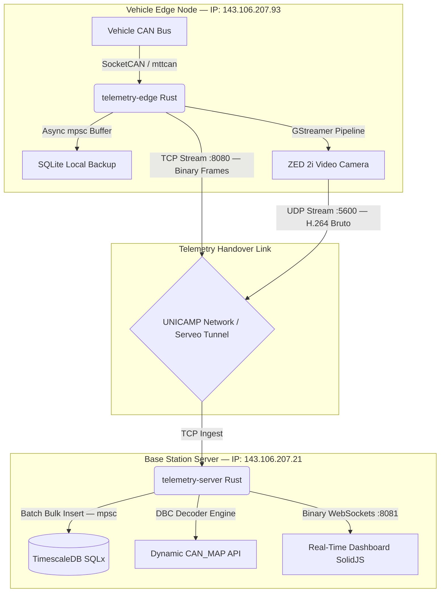

# 🏎️ Unicamp E-Racing Telemetry V2.0 (Rust Core)


## 🚀 Overview

This repository contains the source code for the **V2.0 Telemetry System** ecosystem of the Unicamp E-Racing Formula Student team.

Designed for the first **Autonomous Electric Vehicle** in South America, this system migrates our legacy Python pipeline to a high-performance, memory-safe architecture built entirely in **Rust**. It addresses critical challenges in high-speed data acquisition (processing 1000+ frames/sec), dealing with extreme EMI (Electromagnetic Interference) environments, mitigating network jitter, and ensuring zero data loss during competitive racing.

---

## 📋 Table of Contents
* [Key Features](#-key-features)
* [Architecture & Network Topography](#%EF%B8%8F-architecture--network-topography)
* [Tech Stack](#%EF%B8%8F-tech-stack)
* [Repository Structure](#-repository-structure)
* [Installation & Run](#-installation--run)
* [Critical Mechanisms & Version Status](#-critical-mechanisms--current-version-status)
* [🤖 AI & Claude Code Environment Context](#-ai--claude-code-environment-context)

---

## ⚡ Key Features

- **Rust-Based Core:** Rewritten from scratch using `Tokio` for asynchronous I/O, ensuring millisecond latency and memory safety.
- **Hybrid Architecture (Edge + Cloud):**
  - **Edge (Car — Jetson AGX Xavier):** Performs raw SocketCAN capture, local backup (SQLite in WAL mode), and efficient binary streaming.
  - **Base (Server — Ubuntu Box):** Handles complex DBC decoding, real-time binary WebSocket broadcasting, and time-series historical ingestion.
- **Starlink & Campus Network Ready:** Optimized via backpressure controls to handle jitter, high-latency, and packet drop scenarios typical of satellite connections or university campus handovers.
- **Protocol Buffering:** Custom binary protocol with Framing (`[Length: 4B][CAN ID: 4B][Timestamp: 8B][Payload: 8B]`) for high-efficiency TCP communication.
- **Hypertable Storage:** Utilizes TimescaleDB (PostgreSQL) for high-frequency time-series data ingestion with batch writers.

---

## 🏗️ Architecture & Network Topography



---

## 🛠️ Tech Stack

* **Language & Runtime:** Rust (2021 Edition), Tokio Async Runtime.
* **Connectivity & Protocols:** SocketCAN (`can-interfaces.service` with a `100ms restart-ms` auto-recovery kernel mechanism), `TcpStream` (Tokio), `tokio-tungstenite` (Binary WebSockets).
* **Database Management:**
* **Edge:** SQLite (`rusqlite`) in Write-Ahead Logging (**WAL Mode**) acting as a failsafe buffer absorbing bursts of up to 100k frames without blocking the core loop.
* **Server:** TimescaleDB (`sqlx`) running on PostgreSQL 14 with `sqlx::QueryBuilder` performing non-blocking **Bulk Inserts** every 500 signals or 2 seconds, completely removing SQLite from the hot path to avoid `database is locked` errors.


* **Hardware Environment:** NVIDIA Jetson AGX Xavier, Custom Can-Replay nodes, and Ubuntu 22.04 LTS central server box.

---

## 📂 Repository Structure

```
📂 TelemetriaV2.0
├── 📂 docs/                     # Engineering specs, track checklists, and roadmap logs
│   ├── 📂 Doc/                  # Configuration files and versions planning (V2.2/V2.3)
│   └── 📂 Implementacao/         # Technical daily reports of implementation logs
├── 📂 Services/                 # Systemd service unit files (.service)
│   ├── 📂 servicosJetson/       # Edge configs (can-interfaces, telemetry-edge, zed-stream)
│   └── 📂 servicosServidor/     # Server configs (postgresql, telemetry, rtsp-relay, video-backup)
├── 📂 telemetry-edge/           # Embedded Rust firmware for raw CAN acquisition
└── 📂 telemetry-server/         # Central Rust Server ingestion engine
    ├── 📂 dbc_data/             # Dynamic vehicular network definition files (.dbc)
    ├── 📂 csv_data/             # Legacy sensor maps sheet files (2025 season)
    ├── 📂 src/                  # Axum HTTP api handlers, core parser, and .ld MoTeC generator
    └── 📂 static/               # Real-time Web UI Dashboard compiled with Vite 8 & SolidJS

```

---

## 🚀 Installation & Run

### Prerequisites

* Rust Toolchain (`cargo`)
* Docker & Docker Compose
* SocketCAN Drivers (Linux Kernel native)

### 1. Start Database & Infrastructure (Base Station Server — 143.106.207.21)

```bash
cd telemetry-server
docker-compose up -d

```

### 2. Run the Telemetry Server (Delivers API, Ingestion & Static UI)

```bash
cd telemetry-server
cargo run --release

```

### 3. Run the Edge Node (On the Jetson AGX Xavier — 143.106.207.93)

Configure environment flags in `/etc/eracing/config.env` and initialize:

```bash
cd telemetry-edge
cargo run --release

```

---

## ⚡ Critical Mechanisms & Current Version Status

### 1. Dynamic `CAN_MAP` Mutation (Vite 8 / Rolldown)

To eliminate manual static map synchronization on the frontend, `static/public/worker.js` queries `/api/can-map` at startup. Due to strict scope assignment checks in **Rolldown/Vite 8**, global constants cannot be reassigned (`ILLEGAL_REASSIGNMENT`). Synchronization is solved via **In-place mutation**, resetting keys under the same object reference:

```javascript
for (const key of Object.keys(CAN_MAP)) delete CAN_MAP[key];
for (const [key, val] of Object.entries(dynamicMap)) CAN_MAP[Number(key)] = val;

```

### 2. Time Synchronization (Chrony Engine)

To clear out cumulative *Clock Drift* that corrupts telemetry latency logs between the car and the box, **Chrony** is deployed. The Server acts as a `local stratum 10` master and the Jetson synchronizes over HTTP dispatcher curl loops to enforce an exact network clock synchronization of `±0.1ms`.

### 3. J1939 Extended Frames & Emergency Stop (Kill/Resume)

The vehicle uses 29-bit identifiers (*Extended Frames*) required by the VCU. In `decoder.rs`, bit 31 (extended format flag from DBC files) is masked out (`id_bus = id_dbc & 0x1FFFFFFF`) before mapping bar signals.
The **Emergency Stop** button triggers a dedicated parallel task. The server splits the incoming stream via `into_split()` on the `TcpStream` using an `Arc<Mutex<OwnedWriteHalf>>` to push immediate `ExtendedId::new(0x67)` cut-off frames with a `[0x00; 8]` payload directly into both `can0` and `can1` networks.

### 4. Target Versions Status

* **V2.2 (MoTeC .ld Generation) — 🔄 IN PROGRESS:** Binary reverse engineering parser structure completed (Header and Session chunks inject real raw template signatures). Dynamic floating-point math alignment and list offsets are being validated inside MoTeC i2 Pro software.
* **V2.3 (Dashboard Blue Team) — 🔄 IN PROGRESS:** Secure token routing (JWT) is active, system infrastructure is under UFW constraints, and a parallel Emergency Stop dual-can broadcast route is operational.

---

## 🏎️ Context: Unicamp E-Racing

Unicamp E-Racing is a student-run engineering team from the University of Campinas, Brazil. We design and build high-performance electric racing cars to compete in Formula Student events worldwide.

* **Achievements:** World Champions (Lincoln, USA), Top 10 World Ranking.
* **Innovation:** Developers of the first autonomous formula racing car in South America.

---

## 🤖 AI & Claude Code Environment Context

> ⚠️ **CRITICAL RULES FOR LLM / CLAUDE CODE EXECUTION IN THIS REPOSITORY:**
> 1. **Current Machine:** You are running locally on the development machine named `Oltado`.
> 2. **Hardware IP Map:**
> * **Jetson AGX Xavier (Vehicle Edge Node):** `143.106.207.93`
> * **Central Base Station (Ubuntu Server Box):** `143.106.207.21`
> 
> 
> 3. **Network Constraints:** When the developer is physically at the UNICAMP workshop, direct SSH access is active for both nodes. When outside, connectivity relies on reverse SSH tunnels (Serveo) or pending EDORUAM port forwarding configurations.
> 4. **Pre-flight Check:** BEFORE suggesting any systemd service restart, deployment command, log inspections (`journalctl`), or networking script, you **MUST** ask the user: *"Are you currently connected to the UNICAMP workshop network or active VPN?"* to tailor the exact network interface or IP routing needed.
> 5. **Frontend Core Path:** The UI codebase is not isolated; it is fully embedded as a static application within `telemetry-server/static/`.
> 
> 

---

*Technical Engineering Document — Unicamp E-Racing Telemetry and Embedded Division 2026*
