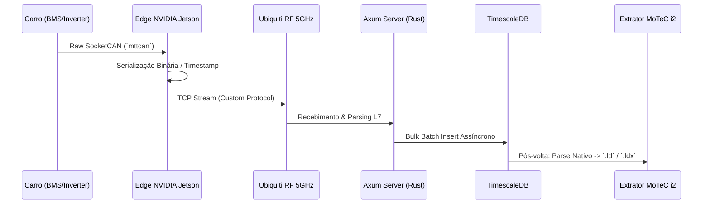
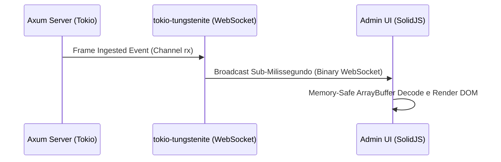
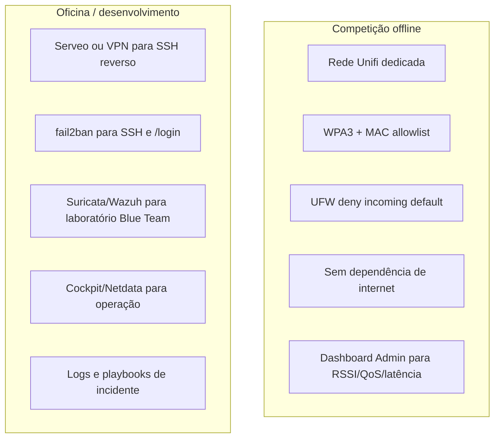

# 🏎️ DESIGN HANDBOOK: TELEMETRY & EMBEDDED SYSTEMS (V2.3)
**Equipe:** E-Racing (Fórmula Universitário Elétrico e Autônomo)  
**Sistema:** TelemetriaV2.0 Core Infrastructure  
**Foco:** Baixa latência, Segurança da Informação, Robustez e Praticidade na Aquisição de Dados (MoTeC)  

---

## 1. PROJECT OBJECTIVES

A fundação do ecossistema de telemetria V2.3 foi construída para atender diretamente às restrições de *timing* e precisão impostas pela dinâmica de um protótipo de alta performance nas provas da SAE. 

- **Missão de Engenharia:** Garantir aquisição de dados em altíssima velocidade (>1000 frames/s), com latência mínima, segurança máxima da informação e praticidade absoluta para a equipe de *Data Acquisition* (Dinâmica/Suspensão). O engenheiro precisa do log nativo `.ld` imediatamente após o carro cruzar a linha de chegada.
- **Justificativa da Arquitetura de Borda Discreta (Edge NVIDIA Jetson):** A arquitetura legada centralizada sofria gargalos. A transição para processamento de *Edge* separa estritamente a aquisição do barramento CAN (no carro) do processamento analítico (no Box). Se o enlace de rádio for rompido transitoriamente, a Jetson retém a carga no *buffer* local (SQLite WAL) e descarrega (*burst backpressure*) assim que a visada for restabelecida, anulando perdas catastróficas de dados da volta.
- **Justificativa do Servidor 100% Offline (Rede OT):** Eventos da SAE abrigam milhares de pessoas gerando um *Noise Floor* severo com hotspots Wi-Fi de terceiros. Optamos por uma blindagem industrial (Rede OT - *Operational Technology*), segregada de redes corporativas/internet. O servidor atua como roteador fechado, estritamente gerenciando os IPs, isolando o tráfego de anomalias externas e mitigando ataques e *broadcast storms*.

---

## 2. PROJECT DESIGN (MODELAGEM MATEMÁTICA E PROTOCOLOS)

O design de comunicações transcende a simples integração COTS (*Commercial Off-The-Shelf*), fundamentando-se rigorosamente na modelagem matemática de canais de rádio e priorização OSI de tráfego concorrente.

### 2.1. Parâmetros Físicos do Enlace RF
A operação ocorre intencionalmente na banda de **5500 MHz (Canais DFS)** para evadir o esgotamento espectral de 2.4 GHz e otimizar o *Link Budget*.
- **Transmissor Edge (Carro - UAP-AC-M):** Potência $P_{TX} = 20$ dBm. Ganho da antena $G_{TX} = 4$ dBi. O uso de uma antena omnidirecional no veículo assegura irradiação em formato toroidal, evitando zonas cegas independente do *Yaw Rate* (ângulo de curva) do monoposto na pista.
- **Receptor Base (Box - UMA-D):** Ganho da antena $G_{RX} = 15$ dBi. Antena altamente direcional focada no traçado. Sensibilidade do Receptor $Rx_{Sens} = -90$ dBm para modulação avançada MCS7 (802.11ac).

### 2.2. Modelagem do Link Budget (Cálculo Literal para $D = 300$m)
Para validar empiricamente o enlace na reta oposta de provas como o *Endurance*, o circuito foi modelado para $D = 300$ metros ($0.3$ km).

A atenuação pelo espaço livre (FSPL) é dada pela Equação de Friis:
$$ L_{fs} \text{ (dB)} = 32.45 + 20 \log_{10}(D_{km}) + 20 \log_{10}(f_{MHz}) $$
$$ L_{fs} = 32.45 + 20 \log_{10}(0.3) + 20 \log_{10}(5500) $$
$$ L_{fs} = 32.45 - 10.457 + 74.807 \approx 96.8 \text{ dB} $$

A equação de Balanço de Potência na Recepção, assumindo perda em cabos $L_{cabos} = 1.0$ dB:
$$ P_{RX} = P_{TX} + G_{TX} + G_{RX} - L_{fs} - L_{cabos} $$
$$ P_{RX} = 20 + 4 + 15 - 96.8 - 1.0 = -58.8 \text{ dBm} $$

Cálculo final da Margem de Fading (FM) de proteção do link:
$$ FM = P_{RX} - Rx_{Sens} $$
$$ FM = -58.8 \text{ dBm} - (-90 \text{ dBm}) = 31.2 \text{ dB} $$
*Justificativa de Engenharia:* Uma $FM$ de **$31.2$ dB** excede vastamente o limiar conservador de infraestrutura (15 a 20 dB). Isso anula *link drops* causados pelo Efeito Doppler do carro em alta velocidade e interferências de *Multipath* (reflexões de asfalto/grade).

### 2.3. Capacidade de Canal (Shannon-Hartley)
Modelamos a capacidade real do meio para transmissão massiva paralela aplicando o limite de Shannon-Hartley:
$$ C = BW \cdot \log_2(1 + \text{SNR}) $$
Considerando $BW = 20$ MHz e uma relação sinal-ruído (SNR linear) aproximada de $4168$ baseada no *Noise Floor*:
$$ C = 20 \times 10^6 \cdot \log_2(1 + 4168) \approx 240.4 \text{ Mbps} $$
*Justificativa:* O teorema comprova $240.4$ Mbps teóricos contra a nossa carga real exigida de $\sim4.24$ Mbps (Telemetria CAN TCP a $240$ kbps + Stream H.264 acelerado via NVENC a $4$ Mbps). O link RF absorve o gargalo com >98% de banda livre.

### 2.4. Comparação Crítica de Protocolos

**A. Transporte de Borda: TCP vs UDP (Telemetria Automotiva)**
| Critério Técnico | Protocolo Custom V2.3 (TCP_NODELAY) | Vídeo H.264 (UDP) |
| :--- | :--- | :--- |
| **Integridade (Dinâmica de Veículo)** | Obrigatório. Perder datagramas prejudica as derivadas e integrais (ex: Jerk, Pitch) dos sensores de inércia dentro do MoTeC. | Transiente. Perda de 1 macrobloco de vídeo é compensada pelo *I-Frame* seguinte. |
| **Jitter e Algoritmo de Nagle** | Desativar o Nagle (`TCP_NODELAY`) evita acúmulo temporário em buffer L4, despachando eventos instantâneos vitais do Inversor (BMS). | Aceita variações temporais. Jitter buffer absorve a flutuação. |

**B. Renderização Real-Time do Box: WebSockets vs HTTP Polling**
| Parâmetro | WebSockets (Binary via `tokio-tungstenite`) | HTTP Polling Clássico |
| :--- | :--- | :--- |
| **Arquitetura de Conexão** | Conexão Persistente, *Full-duplex*. Handshake único. | Repetitivo, *Half-duplex*. TLS handshake contínuo. |
| **Latência End-to-End** | **< 2 ms** (Imediato no Admin do Box). | **> 50 ms** (Estrangulamento de requisições iterativas). |

---

## 3. PROJECT MANUFACTURING (ARQUITETURA DE SOFTWARE E BIT-A-BIT)

### 3.1. Concorrência Assíncrona em Rust vs Tradicional
| Atributo (I/O Bound) | Threads do SO (C++ / Python Clássico) | Async Rust (Tokio Epoll V2.3) |
| :--- | :--- | :--- |
| **Context Switching** | Alto impacto (Gargalo do GIL, consumo de RAM da Stack ~2MB/thread). | Quase zero. Tarefas assíncronas *single-thread* usam structs em Heap minimalistas. |
| **Segurança e Deadlocks** | *Race conditions* suscetíveis no parse do barramento. | *Memory safety* absoluto em tempo de compilação (*borrow checker* previne *segfaults*). |

### 3.2. Formato do Pacote Binário Customizado v2.3 (Alocação de Memória)
O empacotamento descarta *overhead* (XML/JSON) para uma estrutura byte-densa C-like, com CRC-32 avançado contra o EMI do Inversor de Tração. Mecânica de borda injeta dados físicos de rádio (QoS/RSSI) junto dos frames mecânicos da CAN, unificando rede corporativa e automotiva.

```text
Offset (Bytes)
0                   1                   2                   3
0 1 2 3 4 5 6 7 8 9 0 1 2 3 4 5 6 7 8 9 0 1 2 3 4 5 6 7 8 9 0 1
+-+-+-+-+-+-+-+-+-+-+-+-+-+-+-+-+-+-+-+-+-+-+-+-+-+-+-+-+-+-+-+-+
|       PREAMBLE (0xAA55 - 2B)  |   LENGTH (1B) | CAN ID_MSB(1B)|
+-+-+-+-+-+-+-+-+-+-+-+-+-+-+-+-+-+-+-+-+-+-+-+-+-+-+-+-+-+-+-+-+
|                       CAN_ID_LSB (3B)                         |
+-+-+-+-+-+-+-+-+-+-+-+-+-+-+-+-+-+-+-+-+-+-+-+-+-+-+-+-+-+-+-+-+
|                                                               |
+       TIMESTAMP_EPOCH (Chrony NTP ±0.1ms) (64-bit / 8B)       +
|                                                               |
+-+-+-+-+-+-+-+-+-+-+-+-+-+-+-+-+-+-+-+-+-+-+-+-+-+-+-+-+-+-+-+-+
|                                                               |
+               PAYLOAD_SENSORES (Máximo de 8B)                 +
|                                                               |
+-+-+-+-+-+-+-+-+-+-+-+-+-+-+-+-+-+-+-+-+-+-+-+-+-+-+-+-+-+-+-+-+
| QoS_RSSI (1B) |           CRC32 Polinômio 0x04C11DB7 (4B)     |
+-+-+-+-+-+-+-+-+-+-+-+-+-+-+-+-+-+-+-+-+-+-+-+-+-+-+-+-+-+-+-+-+
```

### 3.3. Pipeline de Dados End-to-End

**A. Arquitetura Sequencial Base de Ingestão e Geração MoTeC:**


**B. Arquitetura de Distribuição de Monitoramento Real-Time (UI):**


### 3.4. Cybersecurity e Observabilidade de Rede (Rede OT + Blue Team)

A camada de segurança da telemetria não pode ser tratada como "colocar senha no dashboard". O sistema opera em uma rede OT (*Operational Technology*) em que disponibilidade e integridade dos dados são tão importantes quanto confidencialidade. Em uma competição, o risco prático não é apenas alguém "ver" a tela; é alguém degradar o enlace, injetar tráfego, ocupar banda de vídeo, derrubar o WebSocket ou contaminar a origem dos frames CAN.

**Tese de segurança:** a telemetria precisa defender três superfícies ao mesmo tempo:

| Superfície | Ativo protegido | Vetor de risco | Controle V2.3/V3.0 |
| :--- | :--- | :--- | :--- |
| **Enlace RF 5 GHz** | Continuidade carro → box | RSSI baixo, interferência, cliente rogue, saturação | Unifi, RSSI/PER/PDR, canal DFS, MAC allowlist, WPA3 |
| **Servidor de telemetria** | Ingestão CAN, DB e dashboard | IP não autorizado em `:8080`, brute force em `/login`, token vazado | UFW, fail2ban, JWT, role admin, Suricata |
| **Operação em pista** | Decisão da equipe | Latência alta, jitter, queda de QoS, serviço reiniciado | Dashboard Admin, QoS HTB, logs systemd, Netdata/Cockpit |

O objetivo não é transformar o carro em um datacenter corporativo pesado. A lógica é **segurança proporcional ao risco de pista**: bloquear o que não precisa existir, observar o que pode degradar a volta e ter resposta rápida quando algo sai da curva normal.

#### 3.4.1. Por que RSSI, PDR e PER são dados de cybersecurity

RSSI costuma ser tratado como métrica de rádio, mas no contexto da telemetria ele também é métrica de segurança operacional. Um RSSI degradando pode indicar:

- o carro está entrando em zona de sombra ou multipath severo;
- uma antena foi mal orientada ou perdeu visada;
- o canal sofreu interferência externa;
- há cliente/dispositivo próximo gerando contenção;
- a rede está próxima de um ponto em que TCP vai acumular retransmissão e burst.

Por isso, o dashboard de rede não deve mostrar apenas "conectado/desconectado". Ele deve expor a saúde física do enlace:

| Métrica | Leitura | Interpretação |
| :--- | :--- | :--- |
| **RSSI (dBm)** | Potência recebida | Acima de `-65 dBm` tende a ser saudável; abaixo disso cresce risco de jitter e perda |
| **SNR (dB)** | Sinal sobre ruído | Indica margem real contra interferência |
| **PDR (%)** | Packet Delivery Ratio | Percentual de pacotes entregues sem perda observada |
| **PER (%)** | Packet Error Rate | Erros/retransmissões no enlace |
| **Jitter (ms)** | Variação de latência | Piora leitura em tempo real mesmo quando média parece boa |
| **Frames/s CAN** | Vazão lógica | Queda súbita pode indicar problema de rede ou edge |

**Dor resolvida:** sem essas métricas, uma falha de telemetria parece "bug do software". Com elas, a equipe separa rapidamente falha de aplicação, falha de RF, saturação de rede e problema de autenticação.

#### 3.4.2. QoS HTB: segurança contra auto-DOS

O sistema carrega pelo mesmo ecossistema tráfego com prioridades muito diferentes: CAN, WebSocket, HTTP, vídeo RTSP/WebRTC, SSH e serviços administrativos. O risco mais comum não é um ataque externo sofisticado; é o próprio vídeo ou uma sessão administrativa consumir banda/CPU e degradar a telemetria. Isso é um *self-denial-of-service*.

A mitigação planejada é QoS HTB em três classes:

| Classe HTB | Tráfego | Por quê |
| :--- | :--- | :--- |
| `1:10` | CAN Telemetria (`:8080`) | Caminho mais crítico; não pode esperar vídeo |
| `1:20` | WebSocket/Dashboard (`:8081`) | Precisa ser responsivo para o box |
| `1:30` | Geral: vídeo, SSH, updates, tráfego auxiliar | Pode ceder banda sob contenção |

O serviço `eracing-qos.service` chama `/etc/eracing/setup_qos.sh` no boot para aplicar essas classes. O backend já expõe os contadores de classe por `/api/admin/network`, lendo `tc -s class show dev <iface>`. Isso transforma QoS em algo verificável na UI, não em uma configuração invisível que "talvez esteja ativa".

#### 3.4.3. Segurança por cenário: competição vs. oficina



Na competição, segurança é principalmente **contenção e previsibilidade**: rede fechada, portas mínimas, telemetria priorizada, visibilidade de RF. Na oficina, segurança também vira aprendizado: brute force controlado, IDS, SIEM, hardening e resposta a incidente.

#### 3.4.4. Controles implementados e pendentes

| Controle | Estado no repositório | Observação |
| :--- | :--- | :--- |
| **JWT + roles** | Implementado | `/api/admin/*` exige `role == admin` |
| **Admin stats** | Implementado | `/api/admin/stats` retorna `latency_us` e `msg_per_sec` |
| **Admin network** | Implementado parcial | `/api/admin/network` retorna interface, RX/TX, HTB e `rssi:null` |
| **QoS HTB service** | Serviço systemd versionado | `Services/servicosJetson/eracing-qos.service` |
| **Serveo tunnel** | Serviço systemd versionado | Útil em oficina; deve ser controlado em competição |
| **RSSI Unifi** | Pendente | UI já possui card "RSSI — Sinal Wi-Fi" como placeholder |
| **UFW/fail2ban/Suricata/Wazuh** | Planejado | Detalhado em `planejamento_v22_v23_eracing.md` |

**Próximo passo técnico:** integrar o RSSI real das antenas Unifi ao endpoint `/api/admin/network`, seja por API local Unifi, SSH/API da antena, SNMP ou coleta ativa por script no servidor. A UI já está preparada para receber esse dado; falta ligar a fonte de verdade.

---

## 4. PROJECT VALIDATION (TABELAS DE SITE SURVEY EM PISTA)

Procedimento empírico mandatário: As tabelas abaixo representam os testes executados durante o *Track Day* para provar a consistência teórica com o comportamento em pista.

**Tabela 4.1. Correlacionamento de Propagação RF e Eficiência L2**
| Distância Real (Pista) | RSSI Teórico FSPL | RSSI Medido ($P_{RX}$) | SNR Acumulada | PDR (%) | PER (%) |
| :---: | :---: | :---: | :---: | :---: | :---: |
| **50 m** (Tangência Curva 1) | **-43.2 dBm** | *[Em Branco]* | *[Em Branco]* | *[Em Branco]* | *[Em Branco]* |
| **150 m** (Meio da Reta Oposta) | **-52.7 dBm** | *[Em Branco]* | *[Em Branco]* | *[Em Branco]* | *[Em Branco]* |
| **300 m** (Curva de Fundo Máx) | **-58.8 dBm** | *[Em Branco]* | *[Em Branco]* | *[Em Branco]* | *[Em Branco]* |

**Tabela 4.2. Estresse de Latência e Vazão (Throughput)**
| Carga de Rede Simulatória | Latência Média de Loop | Jitter Absoluto | Taxa Efetiva (Hz) |
| :--- | :---: | :---: | :---: |
| **Apenas Telemetria CAN** (TCP 240 kbps) | *[Em Branco]* | *[Em Branco]* | *[Em Branco]* |
| **CAN + Stream H.264** (Carga Plena 4.2 Mbps) | *[Em Branco]* | *[Em Branco]* | *[Em Branco]* |
| **CAN + Vídeo + Limite RF** (No Handoff 300m) | *[Em Branco]* | *[Em Branco]* | *[Em Branco]* |

**Tabela 4.3. Pipeline Integrado MoTeC**
| Volta Cronometrada | Amostras Geradas | Tamanho do Arquivo | Tempo Execução Script (s) | Integridade |
| :--- | :---: | :---: | :---: | :---: |
| **Sessão_Shakedown_01** | *[Em Branco]* | *[Em Branco]* | *[Em Branco]* | *[Em Branco]* |
| **Sessão_Endurance_01** | *[Em Branco]* | *[Em Branco]* | *[Em Branco]* | *[Em Branco]* |

---

## 5. FUTURE PROJECTS

A transição para a Arquitetura Edge unificando telemetria em alta frequência fomenta o desenvolvimento direto das inovações abaixo para a próxima geração (V3.0):

### 5.1. Virtual Pit Engineer (IA de Engenharia de Pista)

O próximo salto da Telemetria V3.0 não é apenas medir mais sinais; é transformar cada sessão em aprendizado acumulado sobre **performance veicular**. A visão do *Virtual Pit Engineer* é criar uma camada de inteligência pós-sessão que leia o log recém-gerado, compare voltas, setores, pilotos e configurações, e traduza massa de dados em hipóteses de engenharia para o debrief.

Hoje a equipe enxerga RPM, torque, temperatura, tensão, aceleração, estado de VCU, mapa e vídeo. Na V3.0, esses canais deixam de ser ilhas e passam a formar uma narrativa técnica depois da sessão:

```text
"A volta 4 foi 1.2 s mais lenta que a volta 2.
A maior perda veio na retomada do setor 3:
menos aceleração longitudinal, mais oscilação de pedal
e torque traseiro menos consistente na saída."
```

Essa é a ambição: uma IA que não substitui o engenheiro, mas atua como um segundo par de olhos depois que o carro volta para o box. Ela não precisa decidir sozinha nem competir com o julgamento humano em tempo real; seu valor inicial está em organizar evidências, apontar padrões que merecem discussão e acelerar o trabalho de pessoas com conhecimentos complementares.

**Engenharia de performance:** o gargalo não é só encontrar falha; é entender por que o carro andou daquele jeito. O sistema já consegue adquirir centenas de sinais. O desafio V3.0 é transformar logs em perguntas melhores para dinâmica, powertrain, elétrica, controle e piloto. O Virtual Pit Engineer deve responder perguntas como:

- "Onde a volta rápida ganhou tempo em relação à volta lenta?"
- "A perda veio de frenagem, contorno, retomada, tração ou entrega de torque?"
- "O piloto repetiu o mesmo padrão de pedal e volante?"
- "A aceleração longitudinal esperada apareceu quando o acelerador abriu?"
- "O carro ficou limitado por energia, temperatura, grip, controle ou pilotagem?"
- "Esse comportamento já apareceu em outro treino com outro setup?"

**Pipeline visionário:** ao fim de cada coleta, o TimescaleDB, os logs exportáveis, o mapa de pista, o vídeo e *Math Channels* inspirados no MoTeC serão cruzados em uma análise automática de sessão. A IA poderá segmentar voltas, comparar setores, destacar trechos de perda de tempo e gerar um relatório técnico inicial para guiar o debrief:

```text
"Resumo pós-sessão:
Melhor volta: volta 2.
Maior perda recorrente: setor 3, saída de baixa velocidade.
Hipótese: aplicação de acelerador antes de estabilizar yaw,
gerando controle de torque mais conservador e menor aceleração longitudinal."
```

O objetivo não é criar um "chatbot de telemetria", mas um **analista virtual de performance**: explicável, auditável, treinado com a história do próprio carro e integrado ao fluxo real da equipe. Ele deve aprender o que é normal para o nosso protótipo, reconhecer padrões de ganho/perda de tempo e transformar cada sessão em memória acumulada para a próxima.

**Valor V3.0:** sair de uma telemetria que mostra curvas isoladas para uma telemetria que ajuda a explicar performance.

### 5.2. Antenas Patch/Microstrip Customizadas In-House
* **Engenharia RF Aerodinâmica:** Antenas COTS tipo Haste/Chicote destroem a fluidez aerodinâmica (arrasto parasita) e perdem seu padrão ótimo de impedância VSWR devido à resistividade da fibra de carbono do chassi, que atua como condutor anisotrópico mitigando o sinal.
* **Pipeline L1 (Física):** Co-design extremo utilizando ANSYS HFSS. As antenas planas de fita (*microstrip/patch antennas*) serão embutidas conformalmente na estrutura do bico não-condutivo em Kevlar, alinhando a eficiência de irradiação diretiva eletromagnética com a neutralidade do *drag* aerodinâmico absoluto.

## 6. FRONTEND ARCHITECTURE (CAMADA DE APRESENTAÇÃO)

**Repositório de referência:** `telemetry-server/static/` — SolidJS 1.9 + Vite 8 + uPlot 1.6, Web Worker dedicado para ingestão.

O frontend não é tratado como "só a tela". Ele herda a mesma restrição de *timing* que motivou a arquitetura de borda na Seção 1: o navegador recebe um fluxo binário de até ~1000 frames/s vindo do WebSocket (Seção 2.4-A) e precisa decodificar, bufferizar e desenhar sem competir consigo mesmo pela *main thread*. Cada decisão abaixo existe para proteger um orçamento físico fixo — o *frame budget* de 60 Hz ($16.\overline{6}$ ms por frame) — contra três fontes de contenção: parsing de rede, coleta de lixo (GC) e re-layout de DOM/canvas.

### 6.0. Dor operacional que o frontend resolve

O problema original não era "mostrar telemetria em tempo real" de forma genérica. A dor real era que, em teste de pista, três pessoas diferentes precisam ler o mesmo fluxo de dados sob pressões diferentes:

1. **Engenheiro de pista:** precisa saber rapidamente se o carro está saudável para continuar a volta, sem abrir MoTeC nem esperar o fim da sessão.
2. **Engenheiro de dados:** precisa comparar tendência, forma de curva e eventos transientes enquanto o log ainda está sendo construído.
3. **Operador do servidor:** precisa iniciar/parar coletas, nomear sessão, baixar logs e acionar comandos administrativos sem depender de terminal.

Sem essa camada, o sistema até poderia gravar dados, mas continuaria sofrendo com quatro dores operacionais:

| Dor anterior | Sintoma em pista | Decisão no frontend | Valor entregue |
| :--- | :--- | :--- | :--- |
| Leitura só pós-sessão | Problema de BMS/inversor só aparecia depois de descarregar log | StatusBar + Cockpit em tempo real | Decisão durante a volta, não depois dela |
| Excesso de sinais crus | Operador precisava procurar sinal por sinal no meio de centenas de canais | `dashboardConfig.js`, agrupamento e sinais fixos | Superfície de decisão com prioridade explícita |
| Log sem fronteira operacional clara | Início/fim de arquivo dependiam de interpretação posterior | `telemetryCollectionEnabled`, start/stop e bounds Unix | Sessão rastreável, nomeada e alinhada ao relógio dos frames |
| Interface travando sob carga | Gráfico, rede e DOM competiam na mesma thread | Worker + buffers circulares + LTTB + throttle | UI continua legível mesmo com burst de frames |

**Valor arquitetural:** a UI virou parte do pipeline de aquisição. Ela não substitui o MoTeC; ela reduz o tempo entre "o carro gerou um sintoma" e "a equipe percebeu e decidiu". Esse delta de tempo é o valor do frontend.

### 6.0.1. Separação entre superfícies: cada tela responde uma pergunta

O frontend foi separado em superfícies porque "um dashboard gigante" mistura perguntas com tempos de resposta diferentes:

| Superfície | Pergunta respondida | Horizonte temporal | Arquivos principais |
| :--- | :--- | :--- | :--- |
| **StatusBar** | "O carro está saudável agora?" | Último valor + estatística acumulada da sessão UI | `StatusBar.jsx`, `SignalCard.jsx`, `useSignalStats.js` |
| **SignalSelector** | "Qual canal eu quero investigar?" | Inventário vivo de sinais recebidos | `SignalSelector.jsx`, `signalGrouping.js` |
| **MotecChart** | "Qual foi a forma da curva nos últimos N segundos?" | Janela móvel ou histórico congelado | `MotecChart.jsx`, `useChartData.js`, `chartOptions.js` |
| **Cockpit** | "O que precisa ser lido em um olhar?" | Instantâneo operacional | `Cockpit.jsx`, `Gauge.jsx`, `TrackMapPanel.jsx` |
| **Downloads** | "Qual log posso entregar para análise offline?" | Sessão encerrada/processada | `DownloadsPage.jsx`, `logDownloads.js` |

Isso evita uma armadilha comum em telemetria: tentar fazer a mesma visualização servir para diagnóstico, operação e auditoria. Cada superfície é otimizada para uma latência cognitiva diferente. O cockpit sacrifica profundidade para leitura instantânea; o gráfico sacrifica atualização a 60 Hz para preservar forma de curva; downloads sacrifica "tempo real" para rastreabilidade.

### 6.0.2. Contrato de baixo nível entre backend, worker e UI

O frontend depende de três contratos, cada um com uma razão de existir:

```text
HTTP /login + JWT
    -> autoriza sessão e define permissões de UI

GET /api/can-map
    -> sincroniza o mapa de decodificação com o backend Rust

WebSocket /ws?token=...
    -> entrega frames CAN binários de 20 bytes e eventos JSON esparsos
```

O `store.js` é a fronteira entre mundo assíncrono e mundo reativo:

```text
worker.postMessage({ cmd })
        │
        ▼
worker.js decodifica / bufferiza / reduz
        │
        ▼
worker.onmessage({ type })
        │
        ▼
Solid store (`signals`, `status`, `trackState`, `telemetrySession`)
        │
        ▼
componentes reativos
```

**Por que existe esse intermediário:** componentes não falam diretamente com WebSocket, `DataView`, `CircularBuffer` ou endpoints administrativos. Isso reduz o acoplamento: se o protocolo mudar, a zona de impacto fica concentrada no Worker/store/service, não em cada card ou gráfico.

### 6.1. Por que SolidJS e não um framework com Virtual DOM

| Critério | React (Virtual DOM) | SolidJS (Reatividade Fina, usado em V2.3) |
| :--- | :--- | :--- |
| **Unidade de atualização** | Componente inteiro. Uma mudança de estado agenda reconciliação (diff) da subárvore, mesmo que só um número tenha mudado. | Nó de efeito individual. `signals[name].value` muda → só o `fillText`/nó DOM que lê aquele sinal é re-executado. |
| **Custo por frame CAN decodificado** | O(subárvore) — cresce com a complexidade da tela, não com o que mudou. | O(1) amortizado — independe de quantos componentes existem na tela. |
| **Motivo da escolha** | Inviável a >100 atualizações de sinal/s: o *reconciler* competiria pela mesma *main thread* que o Worker tenta liberar. | Como cada `postMessage('signal')` do Worker (Seção 6.3) já chega granular por sinal, a reatividade fina do SolidJS é a contraparte natural no lado da UI — sem camada de diffing entre o dado e o DOM. |

*Justificativa de engenharia:* a arquitetura de telemetria já paga o custo de granularidade uma vez, no protocolo binário (Seção 3.2). Usar um framework com VDOM jogaria esse ganho fora reintroduzindo *batching* e *diffing* na camada seguinte. SolidJS mantém a granularidade ponta a ponta: CAN ID → sinal → nó DOM.

### 6.2. Isolamento em Web Worker: por que a ingestão não roda na thread de UI

O navegador tem uma única *main thread* para layout, paint e execução de JS de UI. Se o WebSocket também vivesse ali, dois cenários de contenção mútua apareceriam:

1. Um recálculo de gráfico (uPlot re-layout) atrasando o processamento de um frame CAN que chegou no meio do redesenho — atraso que se acumula porque o *socket buffer* do SO ainda entrega os frames seguintes.
2. Um *burst* de dados (ex.: handoff de RF em 300 m, Seção 2.2) saturando a thread principal e travando a animação dos gauges — o pior momento possível para perder atualização visual, já que é justamente quando o enlace está sob estresse.

`worker.js` resolve isso rodando em thread separada (Seção 4.2 do documento de implementação): abre o próprio WebSocket, decodifica os sinais (`extractBits`/`decodeSignal`, ver 6.6) e mantém os buffers circulares. A UI só recebe o resultado já processado via `postMessage`. Isso não é paralelismo de CPU (Worker de módulo único, single-threaded internamente) — é **isolamento de contenção**: um pico de trabalho em uma thread não rouba *frame budget* da outra.

### 6.3. Estrutura de memória: `CircularBuffer` com TypedArrays

```js
this.ts  = new Float64Array(size)
this.val = new Float64Array(size)
```

**Por que `Float64Array` e não `Array` comum:**

- Um `Array` JS de números é, na prática, um array de referências a objetos `Number` *boxed* (heap-allocated, com *hidden class* variável). Um `Float64Array` é um bloco contíguo de memória sem *boxing* — leitura/escrita é acesso direto a offset, sem *pointer chasing* nem possibilidade de o motor JS "deoptimizar" o array por causa de tipos mistos.
- Para um `push()` executado potencialmente >100×/s por sinal, isso elimina alocação por amostra: o buffer é alocado uma vez (`new Float64Array(size)`) e a inserção é apenas `this.ts[this.head] = timestamp`, sobrescrevendo a posição mais antiga (`head = (head + 1) % size`). **Complexidade O(1) por amostra, sem crescimento de heap, sem trabalho para o coletor de lixo.**

**Por que circular e não um array que cresce indefinidamente:**

Uma sessão de *Endurance* pode durar dezenas de minutos. Um array que só cresce (`push` sem limite) significa: (a) uso de memória crescente sem cota — risco real de o *tab* do navegador ser encerrado pelo SO em hardware limitado (ex. painel de box em laptop antigo); (b) pressão de GC crescente conforme o array precisa ser realocado internamente pelo motor JS quando excede sua capacidade reservada. O buffer circular fixa o teto de memória **antes** da sessão começar.

**Dimensionamento do buffer (`DEFAULT_BUFFER_SIZE = 3900`):**

O tamanho define uma troca direta entre memória e profundidade de histórico disponível para replay/análise, e essa profundidade depende da taxa de atualização do sinal específico:

$$ T_{hist} \text{(s)} = \frac{3900}{f_{sinal} \text{(Hz)}} $$

- Sinal a 100 Hz (ex. velocidade de roda): histórico de ~39 s — cobre uma volta típica de autocross.
- Sinal a 10 Hz (ex. temperatura de célula BMS): histórico de ~390 s (6,5 min) — cobre praticamente um stint de Endurance.

Custo de memória por sinal:

$$ M_{sinal} = 2 \times 3900 \times 8 \text{ bytes} = 62{,}4 \text{ KB} $$

Com a matriz de sinais atual (`csv_data/`: ~96 `vcell_N` + 96 `tcell_N` de BMS, mais RPM/torque/aceleração/estado ≈ 220 sinais), o teto de memória fica em:

$$ M_{total} \approx 220 \times 62{,}4 \text{ KB} \approx 13{,}7 \text{ MB} $$

Valor desprezível frente ao heap disponível em um navegador moderno — a decisão de dimensionamento aqui não é "caber na memória", é **limitar o histórico ao que é operacionalmente relevante** sem depender de tuning por sinal.

### 6.4. Redução de série temporal: LTTB antes de qualquer render

`uPlot` (Seção 6.7) precisa desenhar uma polilinha por ponto recebido. Enviar os 3900 pontos brutos de um buffer para um gráfico de ~800px de largura significa desenhar, em média, ~5 pontos por pixel — trabalho de renderização que não se traduz em nenhuma informação visual adicional (os pontos colidem no mesmo pixel).

`lttb.js` implementa *Largest-Triangle-Three-Buckets*: divide a série em `threshold` baldes e, em cada balde, mantém o ponto que forma o **maior triângulo de área** com o ponto já escolhido anteriormente e a média do balde seguinte:

$$ \text{Área} = \frac{1}{2} \left| (x_a - x_{avg})(y_j - y_a) - (x_a - x_j)(y_{avg} - y_a) \right| $$

**Por que área de triângulo e não decimação uniforme (pegar 1 a cada N pontos):** decimação uniforme é *aliasing* puro — pode descartar exatamente o pico de um evento transiente (ex. um espículo de `Jerk` na suspensão, ou um *dropout* de tensão de célula) só porque ele caiu num índice não amostrado. LTTB é *loss-aware*: pontos que preservam a forma visual da curva (picos, vales, mudanças de inclinação) têm maior probabilidade de sobreviver à redução porque geram triângulos de maior área. Isso importa especialmente para os canais citados na Seção 2.4-A como "obrigatórios íntegros" (derivadas/integrais de sensores inerciais) — a *forma* da curva, não só o valor pontual, é o que o engenheiro de dinâmica lê.

**Complexidade:** O(n) — um único passe pela série, sem ordenação. Com n = 3900 e threshold = 500 (default em `requestBuffer`), o custo por requisição de gráfico é irrelevante frente ao *frame budget*, mesmo replicado por múltiplos sinais em paralelo (`Promise.all` em `useChartData.js`).

**Por que threshold = 500 especificamente:** um gráfico típico ocupa algo entre 500–1000px de largura útil de desenho. 500 pontos aproxima a densidade de amostragem à densidade de pixels disponível — não há ganho visual em enviar mais pontos que a tela consegue diferenciar, e há custo real (mais segmentos de linha para o *rasterizer* do Canvas 2D interno do uPlot processar).

### 6.5. Zero-copy: `Transferable` ArrayBuffers entre Worker e UI

```js
self.postMessage(
  { type: 'buffer', reqId, name, ts: reduced.ts, val: reduced.val },
  [reduced.ts.buffer, reduced.val.buffer]
)
```

Por padrão, `postMessage` faz *structured clone* — uma cópia profunda do objeto antes de cruzar a fronteira de thread. Para um `Float64Array` de 500 pontos (4 KB por array), isso não seria caro isoladamente, mas em uma tela com múltiplos `MotecChart` requisitando buffers a cada 200 ms (Seção 6.7), a cópia repetida gera trabalho e lixo de GC evitável. Passar o `.buffer` na lista de *transferables* transfere a **posse** da memória em vez de copiá-la — custo O(1) independente do tamanho, e o Worker perde acesso àquele buffer específico (que de qualquer forma já foi descartado após o `lttb()`).

### 6.6. Decodificação de bits no cliente: replicando a semântica do `decoder.rs`

`canDecode.js` extrai um valor físico de um payload CAN de 8 bytes a partir de `start_bit`, `length` e ordem de bytes (`Intel`/`Motorola`), da mesma forma que o backend Rust:

- **Intel (LSB-first):** bit global `= start_bit + i`; acumula `value += bit * 2^i` — trivial porque o LSB do sinal coincide com o bit de menor peso do byte.
- **Motorola (MSB-first):** a posição do próximo bit segue a regra de "andar 15 posições ao cruzar byte" (`bitPos = bitIdx === 0 ? bitPos + 15 : bitPos - 1`), replicando a contagem de bits do padrão SAE J1939/DBC para sinais *big-endian* dentro de um frame *little-endian* de bytes.
- **Complemento de dois:** para sinais `signed`, se o valor bruto excede `2^(len-1)` (bit de sinal setado), subtrai-se `2^len` — reconstrução padrão de inteiro com sinal a partir de N bits.

**Por que decodificar no frontend em vez de só consumir sinais físicos já prontos do backend:** o transporte (Seção 3.2) já carrega `CAN_ID` + `raw_data` cru — o frontend decodifica localmente para não depender de o backend re-serializar cada sinal individualmente por WebSocket (o que multiplicaria o *overhead* de framing por sinal em vez de por mensagem CAN). O custo é a necessidade de manter `CAN_MAP` (mapa `can_id → sinais`) sincronizado com o `decoder.rs` do backend — hoje resolvido carregando o mapa em runtime via `GET /api/can-map` (`loadCanMap()`), eliminando duplicação estática de fonte de verdade entre backend e frontend.

**Dor eliminada pelo `GET /api/can-map`:** antes, o mapa do browser era uma segunda cópia manual dos sinais do backend. Toda mudança em DBC/CSV virava uma tarefa de sincronização: alterar Rust, alterar JS, rebuildar frontend e torcer para os dois extratores de bits continuarem semanticamente iguais. O endpoint desloca a fonte de verdade para o servidor: o browser ainda decodifica localmente por performance, mas carrega a tabela de sinais gerada pelo backend. Assim, o risco restante deixa de ser "mapa divergente" e passa a ser só "algoritmo de extração divergente", que é menor, testável e isolado em `canDecode.js`.

**Por que `CAN_MAP` é mutado in-place e não reatribuído:** o Worker mantém `const CAN_MAP = {}` e, ao carregar o mapa remoto, apaga e recria as chaves dentro do mesmo objeto. Isso existe por causa do Vite 8/Rolldown: reatribuir uma constante de módulo no Worker dispara erro de análise estática (`ILLEGAL_REASSIGNMENT`). A mutação preserva a identidade do objeto, mantém o lookup O(1) por `canId` e evita uma classe de falha de build que só apareceria tarde no ciclo de deploy.

### 6.7. `uPlot` para os gráficos, Canvas 2D puro para os gauges — dois motores de render, dois motivos diferentes

| Superfície | Tecnologia | Justificativa |
| :--- | :--- | :--- |
| **MotecChart** (análise, múltiplas séries, zoom/seleção) | `uPlot` | Biblioteca de ~45 KB minificada, renderiza direto em `<canvas>` sem abstração de cena (diferente de Chart.js/Recharts, que mantêm uma árvore de objetos por elemento visual). Para séries de centenas de pontos atualizando a alguns Hz, o custo de manter e invalidar uma árvore de objetos supera o ganho de abstração. |
| **Cockpit Gauges** | Canvas 2D manual (`gaugeCanvas.js`) | Geometria fixa e conhecida (arco, ponteiro, ticks) — não há necessidade de uma biblioteca de *charting* genérica para desenhar um mostrador. Desenho direto via `arc()`/`stroke()`/`fillText()` é o caminho de menor *overhead* possível para esse caso. |

**Throttle de 200 ms (5 Hz) nos gráficos — por que não 60 Hz:**

`useChartData.js` limita a frequência de `setData()` do uPlot a uma atualização a cada 200 ms, mesmo que sinais cheguem a >100 Hz:

$$ f_{chart} = 5 \text{ Hz} \ll f_{sinal} \le 100+ \text{ Hz} $$

*Justificativa:* redesenhar o gráfico a 60 Hz custaria um novo `Promise.all` de `requestBuffer` (que já inclui LTTB) por sinal, a cada 16,6 ms — trabalho redundante, já que o olho humano não distingue atualização de gráfico acima de ~10–12 Hz como "descontínua", e o engenheiro está lendo tendência/forma de curva, não o último bit do último frame (isso já é coberto pelos cards/gauges, que atualizam por sinal individual via reatividade fina do SolidJS, não pelo gráfico). Throttlar o gráfico libera *frame budget* de CPU para o que realmente precisa de latência mínima: o *WebSocket handler* no Worker e os gauges do cockpit.

**Por que os gauges rodam em `requestAnimationFrame` puro (não throttlados) e ainda assim são baratos:**

```js
function tick() {
  rafHandle = requestAnimationFrame(tick)
  ...
  const frameKey = hasSignal ? value : '__empty__'
  if (frameKey === lastValue) return   // early-out: valor idêntico ao último frame
  lastValue = frameKey
  ...
}
```

O gauge roda a cada *vsync* (~60 Hz), mas faz *early-return* se o valor não mudou desde o último frame — o desenho custoso (`drawDynamic`: arco, ponteiro, hub, `fillText` do valor e da unidade) só executa quando o valor efetivamente muda. `fillText` é uma das operações mais caras do Canvas 2D (envolve *shaping* de fonte); evitar chamá-la em frames "parados" é o que torna viável ter múltiplos gauges com RAF independente sem competir entre si.

**Camada estática vs. dinâmica (dois `<canvas>` sobrepostos por gauge):**

`drawStatic` (arcos de fundo, zonas de alerta/crítico, ticks e labels) só é redesenhado em `createEffect` quando `min`/`max`/`warnMax`/`critMax` mudam — ou seja, praticamente nunca durante a operação normal. `drawDynamic` (ponteiro + valor central) é o único elemento redesenhado a cada frame. Separar as duas camadas em canvases distintos evita repetir, 60×/s, o trabalho geométrico de desenhar arco de fundo + 6 ticks + labels — que é conteúdo estático por definição.

### 6.8. Domínio fixo vs. dinâmico do eixo Y — por que essa decisão não é estética

```js
const FIXED_DOMAINS = {
  rpm: [0, 10000], acceleration: [-15, 15],
  temperature: [0, 120], voltage: [0, 500], power: [-100, 100],
}
```

Para famílias de sinal com faixa física conhecida a priori, o domínio do eixo Y é fixo. Para sinais desconhecidos, o domínio é calculado a partir dos dados reais com margem de 10%:

$$ [Y_{min}, Y_{max}] = [d_{min} - 0.1r,\; d_{max} + 0.1r], \quad r = d_{max} - d_{min} $$

**Por que isso importa em baixo nível, não só visualmente:** com domínio *auto* recalculado a cada novo lote de dados (o que `uPlot` faria por padrão), o eixo Y "respira" a cada atualização — cada pequena variação no mínimo/máximo da janela visível desloca a escala inteira, forçando o `uPlot` a recalcular todas as posições Y de todos os pontos e re-renderizar eixo + grade a cada *tick*. Fixar o domínio para famílias conhecidas elimina esse recálculo de escala por completo (`range: () => [fixedMin, fixedMax]` é uma função constante) e, no lado humano, elimina o efeito de "escala pulando" que torna comparação visual entre voltas impossível — o mesmo pico de RPM precisa ocupar a mesma altura de tela em qualquer sessão para ser comparável.

### 6.9. Protocolo binário no cliente: `DataView` em vez de JSON

```js
const view = new DataView(arrayBuffer)
const canId = view.getUint32(0, true)
const timestamp = view.getFloat64(4, true)
const rawData = new Uint8Array(arrayBuffer, 12, 8)
```

O frame de 20 bytes (Seção 3.2) chega como `ArrayBuffer` puro (`ws.binaryType = 'arraybuffer'`) e é lido por offset fixo com `DataView`, que garante leitura *alignment-safe* de multi-byte (`u32`, `f64`) independente do alinhamento de memória do buffer subjacente — diferente de tentar reinterpretar o buffer diretamente como `Uint32Array`/`Float64Array`, que exige alinhamento de offset múltiplo do tamanho do tipo.

**Por que não JSON para o hot path:** `JSON.parse` sobre um objeto por frame, a >1000 frames/s, soma dois custos que `DataView` não tem: (a) *parsing* de texto (tokenização + construção de árvore de objeto) em vez de leitura direta de offset binário; (b) alocação de objeto JS por frame, criando pressão de GC proporcional à taxa de chegada. O protocolo mantém JSON apenas para mensagens de baixa frequência e não latência-crítica (`track_status`, `track_map`, `track_pose`), tratadas em `handleTextMessage` — separação deliberada entre **hot path binário** (frames CAN) e **cold path textual** (eventos esparsos de estado).

### 6.10. Por que esses parâmetros específicos aparecem na tela, e não outros

A tela não expõe "tudo que existe no CAN" — expõe o que é operacionalmente ou diagnosticamente decisivo, com justificativa por superfície:

- **StatusBar (cards fixos):** `RPM_0A/0B/13A/13B` e `TORQUE_0A/0B/13A/13B` aparecem **por motor individual**, não agregados — porque o veículo é AWD com controle independente por roda; um agregado (ex. RPM médio) mascararia exatamente o sintoma mais crítico de diagnóstico em pista: assimetria entre motores (derrapagem, torque vectoring mal calibrado, falha isolada de um inversor).
- **`CELL_TEMP_MIN/MAX` e `CELL_VOLTAGE_MIN/MAX` são extremos, não médias.** Um BMS opera por regra de pior caso: a célula mais fraca do pack (menor tensão, maior temperatura) é o fator limitante de performance e segurança térmica, não a média das 96 células. Mostrar a média esconderia justamente a célula que dispara uma falha de segurança.
- **Gauges do cockpit (RPM 0A/13A, Acelerador):** limitados a 3 elementos deliberadamente — o cockpit é lido pelo piloto/engenheiro sob carga cognitiva alta durante a prova; `warnMax`/`critMax` (8500/9500 rpm) existem para permitir leitura por **cor do ponteiro**, sem exigir leitura numérica precisa em movimento (Seção 6.7, `pointerColor()`).
- **Clamp de valor antes do desenho (`clampGaugeValue`):** um sinal fora de faixa (erro de leitura, *glitch* de CAN) é limitado visualmente a `[min, max]` antes de calcular o ângulo do ponteiro — sem isso, um valor espúrio giraria o ponteiro além do arco físico do gauge, produzindo uma leitura sem sentido geométrico.

Esses critérios (extremos vs. médias, individual vs. agregado, cor vs. número) ainda dependem de validação formal com a equipe técnica — ver `frontend-telemetry-decisions.md` no repositório, que documenta como decisão pendente, por sinal, se os limites atuais (defaults de interface) refletem a faixa operacional real do carro 2025.

### 6.11. Ciclo de vida da coleta: a UI define o recorte do log, não só o estado visual

O botão de iniciar/parar telemetria não é cosmético. Ele controla duas coisas separadas:

1. **Backend:** endpoints `/telemetry/collection/start`, `/telemetry/collection/stop` e `/telemetry/log-session-bounds` dizem ao servidor quando uma sessão operacional começou/terminou e qual nome humano ela recebeu.
2. **Worker local:** `telemetryCollectionEnabled` decide se frames recebidos pelo WebSocket entram ou não nos buffers da UI.

Fluxo real de início:

```text
TopBar -> handleStartTelemetry()
       -> POST /telemetry/collection/start
       -> resetTelemetryData()
       -> worker: setTelemetryCollectionEnabled(true)
       -> primeiro frame recebido define sessionStartTimestamp
```

Fluxo real de parada:

```text
TopBar -> modal exige nome da sessão
       -> POST /telemetry/collection/stop
       -> worker: setTelemetryCollectionEnabled(false)
       -> worker devolve log_start_unix/log_stop_unix
       -> POST /telemetry/log-session-bounds
       -> UI entra em modo stopped
```

**Por que o start real usa o timestamp do primeiro frame e não `Date.now()`:** `Date.now()` mede o relógio do navegador; `timestamp` do frame mede o relógio da telemetria. Persistir bounds no mesmo relógio dos frames evita desalinhamento quando o log for recortado, comparado ou exportado. Na prática, isso preserva a relação temporal com o dado que realmente veio do carro.

**Por que parar coleta não fecha necessariamente o WebSocket:** o socket pode continuar conectado para estado, permissões, mapa e futuras sessões. O que muda é a aceitação local de frames no Worker. Isso reduz custo de reconexão e evita que uma operação administrativa derrube a camada de comunicação inteira.

**Valor para a equipe:** cada log deixa de ser "um arquivo gerado em algum momento" e vira uma sessão nomeada, com início/fim rastreáveis, associável a treino, piloto, volta ou condição de pista. Isso encurta o caminho até o MoTeC e reduz ambiguidade depois do evento.

### 6.12. Autenticação, permissões e comandos críticos

O frontend implementa permissões por experiência de uso, mas não se coloca como fonte de verdade de segurança. O padrão é:

```text
JWT no login
    -> frontend monta sessão local (`username`, `role`, `mode`, permissões)
    -> UI esconde/desabilita controles não autorizados
    -> backend valida novamente cada POST sensível
```

Controles impactados:

- **Start/stop de coleta:** dependem de `PERMISSIONS.telemetryStart` e `PERMISSIONS.telemetryStop`.
- **Downloads de log:** dependem de `PERMISSIONS.logsDownload`.
- **Emergency stop/resume:** usam chamadas HTTP explícitas para `/telemetry/emergency-stop` e `/telemetry/emergency-resume`.

**Dor resolvida:** antes, tarefas administrativas exigiam terminal, SSH ou conhecimento de endpoint. Isso é lento e perigoso em pista: a pessoa sob pressão pode rodar comando no host errado, esquecer token, ou derrubar algo que não queria. A UI transforma essas ações em fluxos transacionais: botão, estado pendente, erro legível e validação do backend.

**Por que ainda validar no backend:** esconder botão no frontend melhora UX, mas não é segurança. Um usuário técnico pode chamar endpoint manualmente. Por isso a UI é uma camada de prevenção de erro humano, enquanto o servidor continua sendo a camada de autorização.

### 6.13. Downloads: fechamento do ciclo entre tempo real e análise offline

A aba Downloads existe porque a telemetria em tempo real e o MoTeC têm propósitos diferentes:

- Tempo real responde: "posso continuar rodando agora?"
- MoTeC responde: "o que aconteceu exatamente nessa volta/sessão?"

O frontend lista logs, aplica filtros e baixa artefatos prontos sem presumir se o backend gerou CSV, JSON, binário, `.ld` ou outro formato. O contrato de download fica encapsulado em `logDownloads.js`; a tela só sabe que existe uma lista de sessões e uma ação de download autorizada.

**Valor operacional:** o engenheiro não precisa sair do fluxo da aplicação para buscar arquivo no servidor. Isso diminui a chance de baixar log errado, perder sessão por nome genérico, ou depender de alguém com acesso ao filesystem do host.

### 6.14. Mapa, vídeo e cockpit: contexto físico para números

O cockpit junta três tipos de informação que isoladamente são incompletos:

1. **Gauges:** estado numérico instantâneo.
2. **Vídeo onboard/RTSP:** evidência visual do que o piloto/carro estavam fazendo.
3. **Mapa de pista:** posição relativa e progresso da volta.

O `TrackMapPanel` usa o mapa aprendido pelo backend (`track_map`) e poses (`track_pose`) para desenhar a polilinha e o ponto do carro no mesmo SVG. Manter marcador e traçado no mesmo sistema de coordenadas elimina *drift* visual por proporção/responsividade: se ambos usam o mesmo `viewBox`, o ponto não "escapa" do traçado quando a tela muda de tamanho.

Quando a coleta pausa, a posição do carro congela em vez de continuar seguindo `track_pose`. Essa decisão parece pequena, mas protege semântica: uma sessão parada deve mostrar o último estado da sessão, não a posição atual de um carro que talvez já esteja em outro contexto. Isso evita interpretar uma pose pós-coleta como dado pertencente ao log encerrado.

### 6.15. Observabilidade de frontend: debug de CAN no browser

O Worker possui modo de debug controlado por `localStorage`:

```text
CAN_FRONT_DEBUG=1
CAN_FRONT_DEBUG_IDS=0x123,419365610
CAN_FRONT_DEBUG_SIGNALS=RPM_0A,TORQUE_0A
CAN_FRONT_DEBUG_UNMAPPED=1
CAN_FRONT_DEBUG_SECONDS=19
```

Esse recurso existe para uma dor muito específica: quando um sinal não aparece na UI, existem várias causas possíveis:

1. frame não chegou no browser;
2. `CAN_ID` chegou mas não existe no `CAN_MAP`;
3. sinal existe, mas o bit extraction está errado;
4. sinal decodificou, mas componente não está lendo a chave certa;
5. coleta local está pausada (`telemetryCollectionEnabled=false`).

Sem logs no Worker, todas essas hipóteses parecem iguais para o operador: "não apareceu". O debug separa as camadas. Ele imprime RX bruto, match de mapa, sinais decodificados, contagem de IDs sem mapa e estatística agregada por janela. Isso encurta diagnóstico de integração CAN sem precisar abrir DevTools do backend ou recompilar Rust.

### 6.16. Dashboard Admin de rede: latência, QoS, RSSI e cybersecurity operacional

A aba `Admin` do frontend é a ponte entre engenharia de software, rádio e cybersecurity. Ela não existe para substituir Wazuh, Netdata ou Unifi Controller; ela existe para responder rapidamente, dentro da própria aplicação de telemetria:

```text
"O problema está no carro, no link RF, no servidor ou na rede?"
```

O frontend consome dois endpoints administrativos, ambos protegidos por JWT e `role == admin` no backend Rust:

| Endpoint | Dados | Uso operacional |
| :--- | :--- | :--- |
| `GET /api/admin/stats` | `latency_us`, `msg_per_sec` | Saber se frames CAN estão chegando e com qual atraso |
| `GET /api/admin/network` | `iface`, `rx_bytes`, `tx_bytes`, `htb_classes`, `rssi` | Saber interface ativa, tráfego total, QoS e sinal RF |

O polling ocorre a cada `3000 ms`, o suficiente para painel administrativo: rápido para perceber degradação, lento o bastante para não virar carga extra relevante no servidor.

#### 6.16.1. Latência CAN → Servidor

O backend calcula a latência em `ingest.rs`:

```text
latency_ms = agora_servidor - timestamp_corrigido_da_jetson
latency_us = latency_ms * 1000
```

No `AdminPage.jsx`, a latência vira badge:

| Faixa | Badge | Interpretação |
| :--- | :--- | :--- |
| `<= 0` | OFFLINE | Sem frame recente ou sem dado |
| `< 5 ms` | OK | Caminho saudável |
| `< 20 ms` | ATENÇÃO | Possível jitter, fila ou RF degradando |
| `>= 20 ms` | ALTO | Investigar rede, CPU, RF ou clock |

**Valor:** separa queda de dado de queda de render. Se o gráfico não atualiza mas `msg_per_sec` e `latency_us` estão bons, o problema está mais perto da UI/worker. Se `latency_us` sobe junto com RSSI ruim, o problema está mais perto do enlace.

#### 6.16.2. Frequência de mensagens

`msg_per_sec` é contador lógico de frames chegando ao servidor. Ele é uma métrica simples, mas muito poderosa:

- `> 0`: edge conectado e enviando;
- queda súbita: edge, CAN, TCP ou RF;
- taxa instável: possível jitter, reconexão, saturação ou perda intermitente.

Isso também ajuda na segurança: um IP não autorizado tentando mandar frames na porta `8080` pode alterar o padrão esperado de taxa, e deve ser cruzado com firewall/Suricata.

#### 6.16.3. QoS HTB no dashboard

O endpoint `/api/admin/network` executa:

```text
tc -s class show dev <iface>
```

e parseia as classes:

| Handle | Label na UI | Significado |
| :--- | :--- | :--- |
| `1:10` | CAN Telemetria | Prioridade máxima |
| `1:20` | WebSocket Dashboard | Interface operacional |
| `1:30` | Geral | Vídeo/SSH/tráfego auxiliar |

A UI mostra bytes e pacotes enviados por classe, além de `rx_bytes` e `tx_bytes` totais lidos de `/proc/net/dev`.

**Por que isso é cybersecurity:** QoS é defesa contra degradação. Se vídeo, SSH reverso ou tráfego auxiliar cresce demais, a equipe consegue ver se a classe crítica de CAN continua protegida. Sem esse painel, a rede pode estar "funcionando" enquanto a prioridade real está errada.

#### 6.16.4. RSSI — Sinal Wi-Fi

O card de RSSI já existe no frontend, mas está marcado como `PENDENTE`. O contrato do backend também já reserva o campo:

```json
{
  "ok": true,
  "iface": "enp4s0f1",
  "rx_bytes": 0,
  "tx_bytes": 0,
  "htb_classes": [],
  "rssi": null
}
```

A integração ideal deve preencher `rssi` e, se possível, expandir para:

```json
{
  "rssi_dbm": -58,
  "snr_db": 31,
  "tx_rate_mbps": 240,
  "rx_rate_mbps": 240,
  "pdr_pct": 99.2,
  "per_pct": 0.8,
  "ap_box_ip": "143.106.207.101",
  "ap_car_ip": "143.106.207.49",
  "station_name": "AC_carro_laranja"
}
```

**Fontes possíveis:**

- API local do Unifi Controller;
- SSH/API direta nas antenas Ubiquiti;
- SNMP, se habilitado;
- script periódico no servidor gravando snapshot em arquivo/SQLite;
- coleta manual de fallback durante site survey.

**Leitura operacional sugerida:**

| RSSI | Estado | Ação |
| :--- | :--- | :--- |
| `>= -60 dBm` | Excelente | Operação normal |
| `-60..-65 dBm` | Bom | Monitorar durante setores distantes |
| `-65..-75 dBm` | Atenção | Ajustar antena/canal/visada; risco de jitter |
| `< -75 dBm` | Crítico | Esperar perda, burst TCP e atraso de dashboard |

#### 6.16.5. Painel Admin como SOC mínimo de pista

O painel Admin é o "SOC mínimo" da telemetria em pista: uma visão curta, operacional e acionável. Ele deve reunir:

- estado do caminho CAN (`msg_per_sec`);
- latência fim-a-fim (`latency_us`);
- saúde da interface (`rx_bytes`, `tx_bytes`);
- QoS (`htb_classes`);
- rádio (`rssi`, SNR, PDR/PER);
- futuro: eventos de segurança (`login_failed`, IP bloqueado, MAC desconhecido).

Isso cria uma linha de raciocínio rápida:

```text
Dashboard travou?
  msg_per_sec = 0        -> edge/CAN/TCP/RF
  latency_us alto        -> RF/jitter/fila/clock
  RSSI ruim              -> antena/canal/distância/interferência
  QoS sem classes        -> setup_qos.sh/eracing-qos.service
  login/admin negado     -> JWT/role/permissão
```

---

## 7. VALIDAÇÃO DE FRONTEND (BANCADA + PISTA)

Mesma lógica da Seção 4: valores teóricos aqui só têm valor depois de confirmados com o app rodando contra dado real, na mesma rede OT usada em pista.

**Tabela 7.1. Orçamento de frame (Worker + UI)**
| Cenário | Frames CAN/s recebidos | Tempo decode+buffer por frame (Worker) | Tempo até refletir na UI (signal → DOM) | Frames descartados/atrasados |
| :--- | :---: | :---: | :---: | :---: |
| **Carga nominal** (~130 fps agregados) | *[Em Branco]* | *[Em Branco]* | *[Em Branco]* | *[Em Branco]* |
| **Burst pós-handoff RF** (300 m) | *[Em Branco]* | *[Em Branco]* | *[Em Branco]* | *[Em Branco]* |

**Tabela 7.2. Custo de render por superfície**
| Superfície | Frequência de redesenho | Tempo médio de paint | p95 | Long tasks (>50ms) observadas |
| :--- | :---: | :---: | :---: | :---: |
| **Gauge (Canvas 2D, RAF)** | *[Em Branco]* | *[Em Branco]* | *[Em Branco]* | *[Em Branco]* |
| **MotecChart (uPlot, 200ms throttle)** | *[Em Branco]* | *[Em Branco]* | *[Em Branco]* | *[Em Branco]* |

**Tabela 7.3. Memória do Worker ao longo de uma sessão**
| Duração da sessão | Sinais ativos | Memória do Worker (heap) | Memória esperada (13,7 MB teórico) | Divergência |
| :--- | :---: | :---: | :---: | :---: |
| **Shakedown (curto)** | *[Em Branco]* | *[Em Branco]* | *[Em Branco]* | *[Em Branco]* |
| **Endurance (longo)** | *[Em Branco]* | *[Em Branco]* | *[Em Branco]* | *[Em Branco]* |
