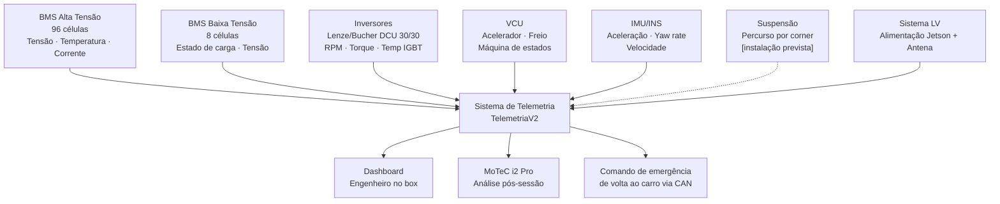
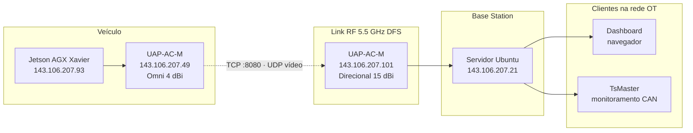
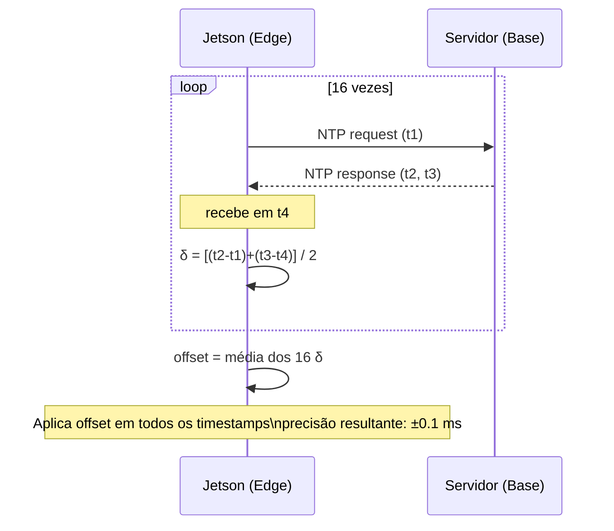
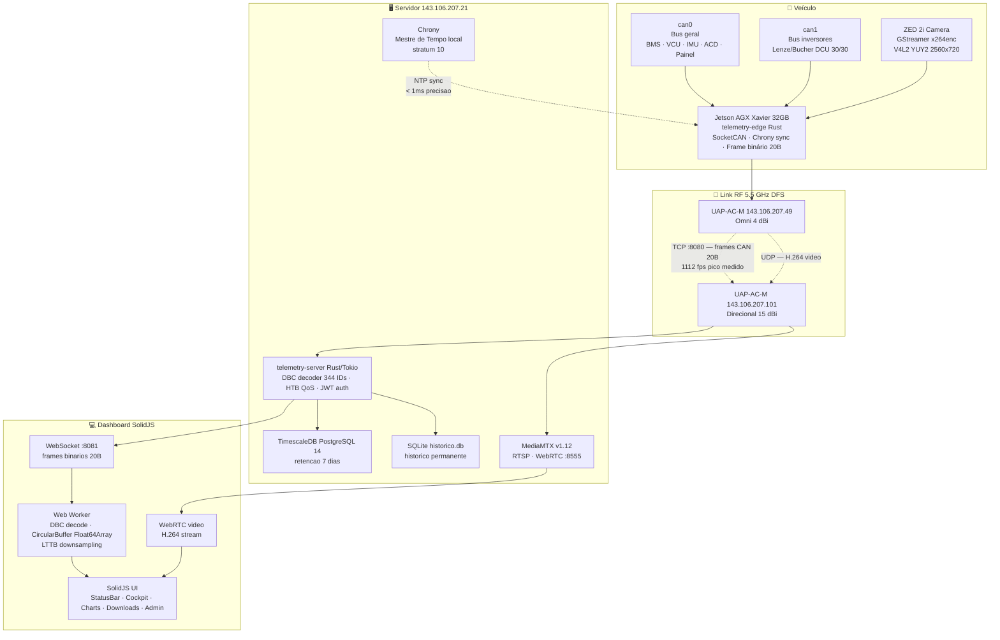
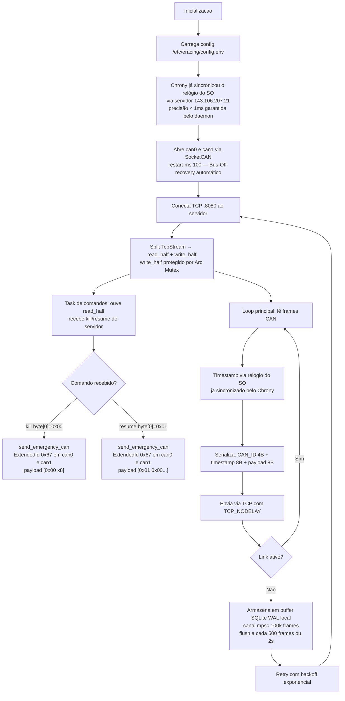
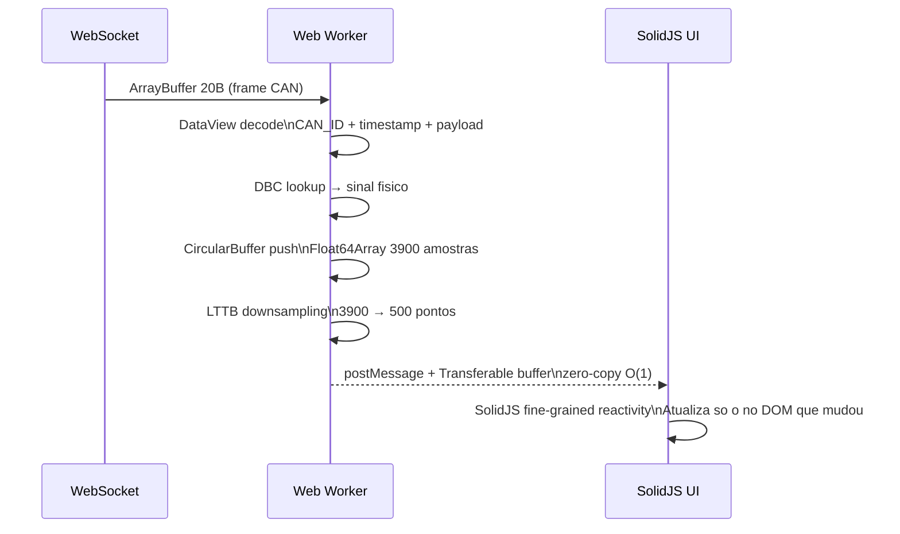
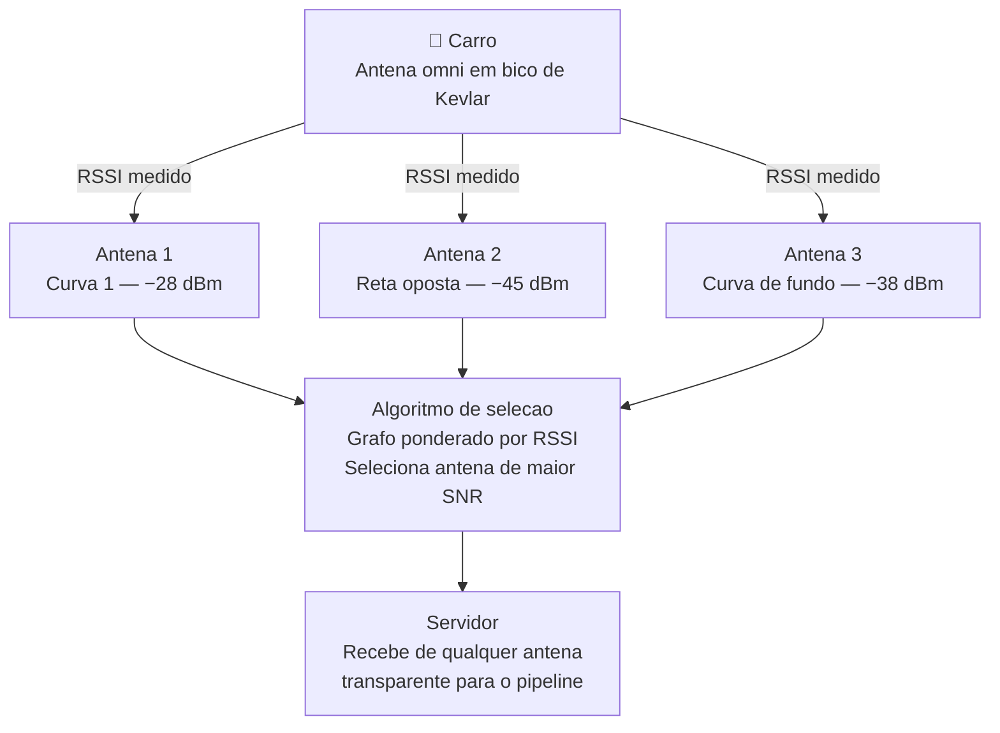

# 🏎️ DESIGN HANDBOOK: TELEMETRIA & AQUISIÇÃO DE DADOS (V2.3)

**Equipe:** E-Racing Ultra Blaster — Fórmula Universitário Elétrico e Autônomo
**Sistema:** TelemetriaV2 — Infraestrutura Central de DAQ
**Versão do documento:** V2.3
**Última atualização:** 10/07/2026

> **Como usar este documento:** Campos marcados com **[DADO]** devem ser preenchidos após os testes de pista. Campos marcados com `[IMAGEM]` indicam onde inserir figuras, fluxogramas ou capturas de tela.

---

## 1. PROJECT OBJECTIVES

### 1.1 Missão de Engenharia
O sistema de telemetria da E-Racing tem como missão central **transformar dados brutos do barramento CAN em decisões de engenharia acionáveis**, com o menor intervalo de tempo possível entre o evento no carro e a percepção do engenheiro no box.

Essa missão se desdobra em três objetivos operacionais:
* **Segurança em tempo real:** monitorar continuamente os parâmetros críticos do veículo — tensão mínima de célula, temperatura máxima de célula, estado da VCU — com latência suficientemente baixa para que uma decisão de box possa ser tomada antes que o carro complete mais meia volta. Com latência nominal de 1–2 ms, o engenheiro vê o dado no mesmo instante em que ele é gerado no carro.
* **Análise pós-sessão com precisão profissional:** gerar arquivos `.ld` e `.ldx` compatíveis com MoTeC i2 Pro imediatamente ao fim de cada sessão, permitindo análise de voltas, comparação de setups e correlação de sinais com a mesma profundidade de um sistema comercial — sem custo de licença.
* **Base histórica para desenvolvimento contínuo:** acumular logs estruturados de cada sessão de teste em banco de dados persistente, construindo uma memória técnica do comportamento do carro que informa o desenvolvimento do próximo protótipo.

### 1.2 Como esta área suporta os objetivos gerais da equipe
A temporada 2026 da E-Racing é marcada por três diretrizes estratégicas: **retorno conservador à competição após anos de ausência**, **redução de custos** e **foco em segurança**. A telemetria responde diretamente às três:

| Diretriz da equipe | Resposta da telemetria |
|---|---|
| **Retorno conservador** | Sistema priorizou confiabilidade e simplicidade operacional sobre features experimentais. Stack 100% open-source, sem dependência de fornecedores externos. |
| **Redução de custos** | Toda a stack (Rust, TimescaleDB, SQLite, SolidJS, MediaMTX) é open-source e sem licença por assento. Elimina necessidade de sistema DAQ comercial. |
| **Foco em segurança** | Monitoramento em tempo real de BMS, inversores e VCU com latência de 1–2 ms. Comando de parada de emergência via dashboard sem acesso físico ao carro. |

Além disso, a padronização da comunicação CAN — com documentação completa em arquivos DBC para todos os subsistemas — melhora o debug em pista e cria um legado técnico para os próximos carros.

### 1.3 Como esta área influencia a performance do veículo
A telemetria não modifica o carro durante a prova, mas determina a velocidade com que a equipe interpreta o que aconteceu e toma a próxima decisão. Isso se manifesta em três níveis:
* **Nível de segurança:** visibilidade em tempo real de parâmetros críticos permite intervenção antes de uma falha. Um pico de temperatura de inversor ou uma queda abrupta de tensão de célula são visíveis no dashboard em menos de 2 ms — tempo suficiente para acionar o box antes que o limite de segurança seja atingido.
* **Nível de setup:** a análise pós-sessão no MoTeC permite comparar configurações de mola, distribuição de torque e comportamento de frenagem entre voltas. Por exemplo, comparando o percurso de suspensão dianteira contra a aceleração lateral em uma determinada faixa de velocidade, é possível identificar se o carro está subvirando ou sobrevirando em uma curva específica — e ajustar a configuração de mola para a sessão seguinte.
* **Nível de desenvolvimento:** os logs acumulados constroem uma base histórica do comportamento do carro que informa o desenvolvimento do próximo protótipo, incluindo validação de modelos térmicos de motor e estudo para futura aplicação de regeneração.

### 1.4 Dependências com outros subsistemas

`[IMAGEM: Renderizar diagrama acima e inserir aqui]`

A telemetria depende do sistema LV para alimentação — uma falha de LV derruba a telemetria inteiramente. Por isso, a estabilidade da LV é um requisito de confiabilidade para o sistema de dados.

### 1.5 Trade-offs e compromissos
* **Alcance vs. latência:** para reduzir latência, operamos com a base mais próxima do traçado. Maior distância RF aumenta retransmissões de link layer, que são a principal causa dos picos de latência observados (39–49 ms nos extremos do traçado). Em competição, o posicionamento da antena direcional do box prioriza linha de visada direta com o traçado.
* **Complexidade vs. robustez:** a V2 é significativamente mais complexa que a V1 — Rust assíncrono, dois bancos de dados, QoS HTB, autenticação JWT, painel admin. Essa complexidade foi introduzida deliberadamente para resolver problemas reais da V1. O risco de mais pontos de falha foi mitigado pelo buffer local na Jetson e pelo design de reconexão automática.
* **Dois barramentos CAN vs. harness mais simples:** a separation em can0 (geral) e can1 (inversores) aumenta a complexidade do harness, mas foi necessária para evitar que a alta frequência de broadcast dos inversores saturasse o barramento compartilhado e introduzisse jitter nos dados dos demais subsistemas.

---

## 2. PROJECT DESIGN

### 2.1 Requisitos do sistema e como foram definidos
Os requisitos foram definidos a partir de três fontes: regras FSAE, dores operacionais da V1, e necessidades das subáreas consumidoras de dados.
* **Das regras FSAE:** isolamento elétrico, fusíveis, montagem segura da Jetson no veículo.
* **Das dores da V1:** latência crescente e ausência de histórico persistente definiram os dois requisitos técnicos mais importantes da V2 — latência estável independente da duração da sessão, e armazenamento dual (TimescaleDB para tempo real, SQLite para histórico permanente).
* **Das subáreas:**

| Subárea | Requisito solicitado |
|---|---|
| Dinâmica/Suspensão | Percurso de suspensão a 100 Hz, correlacionável com IMU |
| Powertrain | Temperatura de motor e inversor com resolução para validar modelos térmicos |
| Elétrica | Todos os 96 canais de tensão e temperatura do BMS HV em tempo real |
| Segurança | Latência máxima tolerável para monitoramento: < 100 ms |

### 2.2 Arquitetura de rede e topologia
**Topologia fixa de IPs:**

| Dispositivo | IP Fixo | Função |
|---|---|---|
| Servidor Ubuntu | 143.106.207.21 | Ingestão, banco de dados, dashboard |
| Jetson AGX Xavier | 143.106.207.93 | Edge node, aquisição CAN |
| AP Box (direcional) | 143.106.207.101 | Ponto de acesso pit lane |
| AP Carro (omni) | 143.106.207.49 | Ponto de acesso veículo |

A rede segue arquitetura OT (Operational Technology) isolada — sem conexão à internet durante operação. O servidor Ubuntu assume todas as funções lógicas de rede: DHCP via dnsmasq, DNS interno, roteamento de requisições. O roteador físico opera em modo bridge, responsável apenas pela criação do meio físico.


`[IMAGEM: Renderizar diagrama acima e inserir aqui]`

### 2.3 Parâmetros físicos do enlace RF
O link RF opera em **5.5 GHz em canais DFS**, evitando o congestionamento severo de 2.4 GHz típico de eventos FSAE com milhares de espectadores e dezenas de equipes.

**Equipamento:**
* **Veículo (TX):** Ubiquiti UAP-AC-M, antena omnidirecional toroidal
* **Box (RX):** Ubiquiti UAP-AC-M, antena direcional

**Parâmetros do datasheet Ubiquiti UAP-AC-M — confirmar os seguintes valores:**

| Parâmetro | Valor a confirmar no datasheet |
|---|---|
| Potência TX | **[PTX — buscar em "Max TX Power" no datasheet]** |
| Ganho antena omni | **[GTX — buscar em "Antenna Gain" para a banda 5 GHz]** |
| Ganho antena direcional | **[GRX — buscar em "Antenna Gain" para a banda 5 GHz]** |
| Sensibilidade RX (MCS7) | **[Rxsens — buscar em "Receiver Sensitivity" para 802.11ac MCS7]** |
| Perda em cabos estimada | 1.0 dB |

> **Nota:** Os valores utilizados no artigo IEEE (PTX = 20 dBm, GTX = 4 dBi, GRX = 15 dBi, Rxsens = −90 dBm) foram confirmados como corretos. Substituir pelas referências exatas do datasheet quando disponível.

### 2.4 Modelagem do link budget (Friis)
A atenuação pelo espaço livre (FSPL) segue a equação de Friis:
$$L_{fs} \text{ (dB)} = 32.45 + 20\log_{10}(D_{km}) + 20\log_{10}(f_{MHz})$$

Para D = 300 m, f = 5500 MHz:
$$L_{fs} = 32.45 - 10.457 + 74.807 \approx 96.8 \text{ dB}$$
$$P_{RX} = P_{TX} + G_{TX} + G_{RX} - L_{fs} - L_{cabos}$$
$$P_{RX} = 20 + 4 + 15 - 96.8 - 1.0 = -58.8 \text{ dBm}$$
$$FM  = P_{RX} - Rx_{Sens} = -58.8 - (-90) = 31.2 \text{ dB}$$

Para D = 900 m (competição FSAE Brasil 2026):
$$L_{fs} = 32.45 + 20\log_{10}(0.9) + 20\log_{10}(5500) \approx 103.5 \text{ dB}$$
$$P_{RX} = 20 + 4 + 15 - 103.5 - 1.0 = -65.5 \text{ dBm}$$
$$FM  = -65.5 - (-90) = 24.5 \text{ dB}$$

Mesmo a 900 m, a margem de 24.5 dB excede o limiar conservador de infraestrutura (15–20 dB).

**Tabela de link budget por distância:**

| Distância | FSPL (dB) | PRX (dBm) | FM (dB) | Viável? |
|---|---|---|---|---|
| 50 m  | 83.5  | −45.5 | 44.5 | ✅ |
| 150 m | 93.0  | −55.0 | 35.0 | ✅ |
| 300 m | 96.8  | −58.8 | 31.2 | ✅ |
| 600 m | 102.8 | −64.8 | 25.2 | ✅ |
| 900 m | 103.5 | −65.5 | 24.5 | ✅ |

### 2.5 Capacidade de canal (Shannon-Hartley)
$$C = BW \cdot \log_2(1 + SNR) = 20 \times 10^6 \cdot \log_2(1 + 4168) \approx 240.4 \text{ Mbps}$$

Carga real do sistema:
* Telemetria CAN (TCP): ~240 kbps
* Vídeo H.264 (UDP, previsto): ~4 Mbps
* **Total: ~4.24 Mbps — menos de 2% da capacidade disponível**

### 2.6 Comparação de protocolos de transporte
**CAN → Servidor (TCP vs UDP):**

| Critério | TCP com TCP_NODELAY (V2) | UDP |
|---|---|---|
| Integridade dos dados | Garantida — nenhum frame perdido | Sem garantia — frames podem ser descartados |
| Latência nominal | 1–2 ms | < 1 ms |
| Adequação para telemetria | Obrigatório — perda de frame invalida derivadas (jerk, pitch) no MoTeC | Inaceitável para dados de dinâmica veicular |
| Adequação para vídeo | Desnecessário | Ideal — perda de macrobloco é imperceptível |

**Dashboard (WebSocket vs HTTP Polling):**

| Critério | WebSocket binário (V2) | HTTP Polling |
|---|---|---|
| Latência | < 2 ms (push imediato) | > 50 ms (pull periódico) |
| Overhead por frame | Mínimo — handshake único | Alto — TLS handshake repetido |
| Adequação para telemetria em tempo real | Ideal | Inviável acima de 10 Hz |

### 2.7 Protocolo binário customizado — formato do frame
Cada frame transmitido pela rede tem exatamente **20 bytes**:

```
Offset (Bytes)
0       1       2       3       4       5       6       7
+-------+-------+-------+-------+-------+-------+-------+-------+
|           CAN_ID (4B, uint32, little-endian)                  |
+-------+-------+-------+-------+-------+-------+-------+-------+
|           TIMESTAMP (8B, float64, little-endian, ±0.1ms)      |
+-------+-------+-------+-------+-------+-------+-------+-------+
|           CAN PAYLOAD (8B, dados brutos do barramento)         |
+-------+-------+-------+-------+-------+-------+-------+-------+
```
Essa estrutura elimina o overhead de serialização JSON (V1 usava ~120–200 bytes por frame em JSON) e permite leitura por offset fixo no cliente com `DataView`, sem parsing de texto.

### 2.8 Sincronização de clock — Chrony como solução definitiva
A sincronização de relógio entre a Jetson e o servidor é crítica para que os timestamps dos frames CAN sejam comparáveis entre si no MoTeC. Um erro de clock de 10 ms significa que um evento de torque e uma resposta de aceleração lateral aparecerão desalinhados nos gráficos — invalidando análises de dinâmica veicular.

**O problema identificado em campo (Dia 11 de implementação):**
O dashboard relatava latência crescente dos pacotes TCP — de ~14.5 ms no início da sessão para 60 ms+ após 13 minutos. A investigação revelou que a causa não era degradação de rede, mas **clock drift**: o cristal oscilador da Jetson divergia gradualmente do relógio do servidor. Como o timestamp dos frames é gerado na Jetson e a latência é calculada no servidor como `t_recebimento - t_frame`, o drift acumulativo aparecia como aumento artificial de latência.


`[IMAGEM: Renderizar diagrama acima e inserir aqui]`

**Por que o NTP interno da aplicação não era suficiente:**
A versão anterior usava um servidor NTP customizado na porta UDP 9999, com 16 trocas de pacote na inicialização para calcular o offset δ. Esse offset era aplicado uma única vez e mantido fixo durante toda a sessão. O problema é que cristais de quartzo derivam continuamente — tipicamente ±20–100 ppm — o que acumula erro ao longo do tempo:
$$	ext{Drift de } 50 	ext{ ppm} 	imes 13 	ext{ minutos} = 50 	imes 10^{-6} 	imes 780	ext{s} pprox 39 	ext{ ms de erro acumulado}$$

Esse erro crescente era exatamente o padrão observado.

**Solução definitiva — Chrony como gestor de tempo do SO:**
O Chrony é um daemon NTP de alta precisão que ajusta o relógio do SO continuamente, compensando o drift do cristal em tempo real. A arquitetura final:
```
Servidor (143.106.207.21)
  chrony configurado como Mestre de Tempo local
  → allow 143.106.207.0/24   (aceita clientes da rede OT)
  → local stratum 10          (funciona sem internet)

Jetson (143.106.207.93)
  chrony configurado como cliente
  → server 143.106.207.21 iburst trust
  → ajuste contínuo do relógio do kernel
```

O NTP interno da aplicação foi desativado (`--ntp-port 0` no serviço da Jetson), delegando toda a responsabilidade de sincronização ao Chrony. Com isso:
* O drift acumulativo é eliminado — Chrony corrige o relógio continuamente.
* Os timestamps dos frames refletem o relógio real do servidor dentro de < 1 ms.
* A latência medida no dashboard é estável ao longo de toda a sessão.

**Resultado medido:** latência estável entre 1–49 ms ao longo de sessões completas, sem crescimento temporal.

**Persistência da configuração na Jetson:**
Um script legado do NetworkManager (`99-eracing-route.sh`) sobrescrevia configurações de rede a cada boot. O `/etc/resolv.conf` também era sobrescrito pelo `systemd-resolved`. A solução em três camadas:

```bash
# Script de rota corrigido para infraestrutura atual:
if [ "$IFACE" = "eth0" ] && [ "$ACTION" = "up" ]; then
    ip route del default 2>/dev/null
    ip route add default via 143.106.207.21 dev eth0 metric 50
    echo -e "nameserver 143.106.207.21\nnameserver 8.8.8.8" > /etc/resolv.conf
    (sleep 2; /usr/bin/chronyc -a makestep) &  # força sincronização imediata
fi
```
O `systemd-resolved` foi desativado e o `/etc/resolv.conf` bloqueado contra modificação com `chattr +i`.

---

## 3. PROJECT MANUFACTURING

### 3.1 Visão geral da arquitetura de software
O sistema é dividido em camadas de responsabilidade estrita. Cada camada tem uma única função e se comunica com as adjacentes por interfaces bem definidas — canais Tokio, WebSocket binário, ou HTTP/JWT.


`[IMAGEM: Renderizar diagrama acima e inserir aqui]`

### 3.2 Pipeline completa: do sensor ao MoTeC

```mermaid
flowchart LR
    subgraph FISICO["Fisico — dentro do carro"]
        SENSOR["Sensor fisico\nEx: encoder de roda, celula de carga, NTC"]
        RC["Filtro RC ativo\nSupressao de EMI dos inversores"]
        NODE["No CAN do subsistema\nEx: VCU, BMS, IMU"]
        SENSOR --> RC --> NODE
    end
    subgraph BARRAMENTO["Barramento CAN"]
        CAN["can0 / can1\n500 kbps\nJ1939 ExtendedId nos inversores"]
        NODE --> CAN
    end
    subgraph EDGE["Edge — Jetson AGX Xavier"]
        SOCK["SocketCAN\nmttcan kernel driver\nrestart-ms 100 Bus-Off recovery"]
        CHRONY["Chrony clock sync\nrelógio SO ajustado continuamente\n< 1ms drift"]
        SERIAL["Serializacao binaria\n20 bytes por frame\nCAN_ID + timestamp + payload"]
        CAN --> SOCK
        CHRONY --> SOCK
        SOCK --> SERIAL
    end
    subgraph REDE["Rede RF 5.5 GHz"]
        TCP["TCP stream :8080\nTCP_NODELAY ativo\nlatencia 1-49ms medida"]
        SERIAL --> TCP
    end
    subgraph SERVIDOR["Servidor Base"]
        INGEST["Ingestao Rust/Tokio\ndecodificacao DBC 344 IDs"]
        TSDB["TimescaleDB\ntempo real — 7 dias"]
        SQLDB["SQLite\nhistorico permanente"]
        TCP --> INGEST --> TSDB
        INGEST --> SQLDB
    end
    subgraph EXPORTACAO["Exportacao pos-sessao"]
        EXPORT["Gerador .ld/.ldx\nbinario MoTeC"]
        TSDB --> EXPORT
    end
    subgraph ANALISE["Analise — MoTeC i2 Pro"]
        LD["Arquivo .ld\ncanais fisicos com timestamp"]
        LDX["Arquivo .ldx\nindice de voltas"]
        MOTEC["MoTeC i2 Pro\nOverlay de voltas · Math channels\nAnalise de setup"]
        EXPORT --> LD --> MOTEC
        EXPORT --> LDX --> MOTEC
    end
    subgraph DECISAO["Decisao de engenharia"]
        SETUP["Ajuste de setup\nEx: configuracao de mola\nbaseado em suspensao vs aceleracao lateral"]
        MOTEC --> SETUP
    end
```

`[IMAGEM: Renderizar diagrama acima e inserir aqui]`

### 3.3 Edge node — Jetson AGX Xavier 32GB
**Hardware:**
* CPU: 8-core ARM Carmel v8.2 64-bit
* GPU: 512-core Volta
* RAM: 32 GB LPDDR4x
* CAN: mttcan kernel driver, duas interfaces (can0 e can1) a 500 kbps
* OS: Ubuntu 20.04 LTS (L4T 35.x)

**Fluxo de operação do edge agent (telemetry-edge, Rust):**

`[IMAGEM: Renderizar diagrama acima e inserir aqui]`

### 3.4 Emergency Stop e Resume — arquitetura de comandos bidirecionais
O sistema implementa comunicação bidirecional pelo mesmo TCP da telemetria. Esta foi uma das decisões de engenharia mais importantes da V2.2, resolvida no Dia 11 de implementação.

**O problema de roteamento:**
O servidor usava um único canal broadcast `ws_tx` para distribuir dados. Os browsers WebSocket consumiam esse canal. A Jetson conecta via TCP na porta 8080 e é tratada pelo `ingest.rs` — que nunca ouvia o `ws_tx`. Resultado: o botão de emergência existia no frontend mas o comando nunca chegava ao carro.

**Solução — segundo canal broadcast dedicado:**
```
Frontend (browser)  POST /telemetry/emergency-stop
        ↓
  emergency.rs
        ├─ ws_tx.send(frame)   → browsers WebSocket (indicador visual)
        └─ edge_cmd_tx.send(frame)  → ingest.rs → TCP → Jetson → CAN
```

**Formato do frame CAN de emergência:**
Os inversores Lenze/Bucher DCU 30/30 e o VCU usam o protocolo J1939, que exige Extended Frames (29 bits, bit IDE setado). Enviar como Standard Frame (11 bits) resulta em frame ignorado silenciosamente:

```rust
// ERRADO — Standard Frame (11 bits), VCU ignora
let id = StandardId::new(0x67).expect("ID válido");

// CORRETO — Extended Frame (29 bits, J1939)
let id = ExtendedId::new(0x67).expect("ID válido");
```
Payload: kill = `[0x00; 8]`, resume = `[0x01, 0x00, ...]`. O comando é enviado para **can0 e can1 simultaneamente** — sem documentação precisa de qual barramento o VCU ouve, enviar para os dois garante que o comando chega.

**Resultado validado em pista:** motor desligou e religou via dashboard durante o primeiro teste com o carro real.

### 3.5 Autocura do barramento CAN (Bus-Off Recovery)
A controladora CAN pode entrar em estado Bus-Off após erros físicos (ruído EMI dos inversores, conector solto), parando silenciosamente sem qualquer log de erro na aplicação.

**Solução em duas camadas:**
1. **Nível de kernel:** parâmetro `restart-ms 100` na inicialização da interface — o driver Linux reinicia a controladora automaticamente após 100 ms de estado Bus-Off:
```bash
ip link set can0 type can bitrate 500000 restart-ms 100
ip link set up can0
```
2. **Nível de aplicação:** `run_socketcan_reader` encapsula a leitura em loop de reconexão. Se `read_frame()` retorna erro crítico, fecha o socket, aguarda 2 s e reabre — sem interromper o loop TCP principal nem perder a conexão com o servidor.

### 3.6 Servidor base — Ubuntu 22.04
**Fluxo de ingestão (telemetry-server, Rust/Tokio):**
Ao receber uma conexão TCP da Jetson:
1. Faz `TcpStream::into_split()` — `read_half` recebe frames CAN, `write_half` envia comandos ao carro
2. Task de comandos: ouve `edge_cmd_tx`, escreve kills/resumes no TCP via `write_half` protegido por `Arc<Mutex<>>`
3. Loop principal: lê frames de 20 bytes, decodifica via DecoderMap (344 CAN IDs, 7 DBCs: BMS, Inversor_Public, Inversor_Private, VCU, ACD, INS, dbc_ins)
4. Distribui via canais mpsc:
   * `timescale_tx` → writer TimescaleDB (batch 500 sinais ou 1s)
   * `sqlite_tx` → writer SQLite histórico (batch 500 sinais ou 2s)
5. Broadcast do frame binário original via `ws_tx` para todos os browsers conectados
6. Atualiza contadores atômicos de latência e fps (consultáveis pelo painel admin)

**QoS HTB — três classes de tráfego:**
```
Interface de rede
├── Classe 1:10 — ALTA prioridade  → Frames CAN TCP :8080
├── Classe 1:20 — MÉDIA prioridade → WebSocket dashboard :8081
└── Classe 1:30 — BAIXA prioridade → Vídeo UDP, SSH, outros
```

**Otimizações de banco de dados implementadas:**
O SQLite foi removido do caminho quente de ingestão — o `ingest.rs` não insere mais diretamente no SQLite. O banco de histórico é alimentado por writer dedicado via canal mpsc, evitando `database is locked` que ocorria com 1000+ frames/s.
A migração de dados antigos do TimescaleDB para SQLite usa bulk insert via `QueryBuilder` — 1 roundtrip ao banco para 5000 registros em vez de 5000 roundtrips individuais. A migração roda em `tokio::spawn` background sem travar o boot do servidor.

### 3.7 CAN_MAP dinâmico — zero manutenção manual
O mapa de decodificação CAN é servido pelo servidor via `GET /api/can-map`, eliminando a necessidade de manutenção manual do mapa no frontend.

**Fluxo:**
```
DBC modificado    → reiniciar servidor
                  → servidor recarrega DecoderMap dos DBCs no boot
                  → próximo login do browser faz fetch de /api/can-map
                  → worker.js usa o novo mapa imediatamente
```
Nenhuma alteração no frontend. O mapa do browser e o mapa do backend são sempre o mesmo objeto, gerado pela mesma fonte (os arquivos DBC).

**Detalhe de implementação — Vite 8/rolldown:**
O Vite 8 usa o bundler rolldown com análise estática mais rigorosa. Reatribuir uma variável `const` em Web Workers causa erro de build. A solução é mutação in-place do objeto:

```javascript
// FALHA no build — ILLEGAL_REASSIGNMENT
const CAN_MAP = {};
CAN_MAP = novoMapa;

// CORRETO — mutação in-place
const CAN_MAP = {};
for (const key of Object.keys(CAN_MAP)) delete CAN_MAP[key];
for (const [key, val] of Object.entries(novoMapa)) CAN_MAP[Number(key)] = val;
```

### 3.8 Dashboard frontend — SolidJS
**Por que Web Worker:**
O navegador tem uma única main thread para layout, paint e execução de JS. Se o WebSocket vivesse na main thread, bursts de dados saturariam a thread e travariam os gauges — exatamente quando o engenheiro mais precisa de atualização visual. 

O Web Worker roda em thread separada: abre seu próprio WebSocket, decodifica frames, mantém buffers circulares, e envia apenas o resultado processado para a UI via `postMessage` com Transferable ArrayBuffers (zero-copy, $O(1)$).


`[IMAGEM: Renderizar diagrama acima e inserir aqui]`

**Superfícies do dashboard:**

| Aba | Pergunta respondida | Atualização |
|---|---|---|
| **StatusBar** | O carro está saudável agora? | Por frame (< 2 ms) |
| **Cockpit** | O que precisa ser lido em um olhar? | 60 Hz via `requestAnimationFrame` |
| **Análise** | Qual foi a forma da curva nos últimos N segundos? | 5 Hz (throttle 200 ms) |
| **Downloads** | Qual log posso entregar para análise offline? | On-demand |
| **Admin** | A rede está saudável? O servidor está operacional? | 3 s polling |

### 3.9 V1 vs V2 — comparação de arquitetura

| Critério | V1 (Python + MQTT + JSON) | V2 (Rust + TCP binário) |
|---|---|---|
| **Linguagem edge** | Python | Rust |
| **Protocolo de transporte** | MQTT (broker intermediário) | TCP direto com `TCP_NODELAY` |
| **Serialização** | JSON (~120–200 B/frame) | Binário customizado (20 B/frame) |
| **Latência inicial** | ~2 s | 1–2 ms |
| **Latência após 3 min** | ~1.5 min | 1–49 ms (estável) |
| **Causa da degradação** | GIL Python + overhead MQTT + JSON acumulando fila | N/A — arquitetura não degrada |
| **Sincronização de clock** | Offset fixo calculado na inicialização | Chrony contínuo — sem drift acumulativo |
| **Throughput máximo** | Não mensurável de forma contínua | **1.112 fps medidos em pista** |
| **Dois barramentos CAN** | Não suportado | can0 + can1 simultâneos |
| **Vídeo** | Não suportado | H.264 via GStreamer + MediaMTX + WebRTC |
| **Persistência histórica** | CSVs por sessão | TimescaleDB + SQLite com retenção |
| **Autenticação** | Sem autenticação | JWT com roles (admin / member) |
| **Comando bidirecional** | Não suportado | Emergency stop/resume via TCP bidirecional |
| **Bus-Off recovery** | Não suportado | restart-ms 100 (kernel) + reconexão (app) |
| **Monitoramento de rede** | Não disponível | Painel admin: latência, fps, QoS HTB, RSSI |

### 3.10 Seleção e calibração de sensores
**Sensores ativos no carro atual:**

| Subsistema | Sensores | Taxa (Hz) | Barramento |
|---|---|---|---|
| BMS Alta Tensão | 96 tensões de célula, 96 temperaturas de célula, corrente de pack | 10–20 | can0 |
| BMS Baixa Tensão | 8 tensões de célula, estado de carga | 10 | can0 |
| Inversores Lenze/Bucher DCU 30/30 | RPM (4x), torque comandado (4x), torque real (4x), temp IGBT (4x), corrente de fase (4x) | 100 | can1 |
| VCU | APS_PERC, VCU_STATE, SAFETY_OK, pressão de freio, modo de operação | 50–100 | can0 |
| IMU/INS | Aceleração linear X/Y/Z, yaw rate, velocidade linear | 100 | can0 |
| Painel | Estado de botões, modo de exibição | 10 | can0 |

**Sinais validados em pista (Dia 11 de implementação):**
* `APS_PERC` — posição do acelerador ✅
* `VCU_STATE` — estado da máquina de estados do VCU ✅
* `SAFETY_OK` — sinal de segurança ativo ✅
* `TORQUE` e `RPM` dos inversores ✅

**Sensores previstos (próxima iteração):**

| Sensor | Motivo | Taxa prevista |
|---|---|---|
| Percurso de suspensão (4x) | Análise de setup de mola, validação de linha de aero | 100 Hz |
| Temperatura de fluido de arrefecimento | Validação do modelo térmico | 10 Hz |

**Calibração:** cada sensor é exercitado na bancada ao longo de toda a faixa física antes da instalação. O resultado é mapeado nos campos scale e offset do arquivo DBC. Registros de calibração são armazenados junto aos DBCs no repositório.

**Validação B2B (bench-to-bench):** sessões de bancada foram realizadas para temperatura de motor e inversor, pressão de freio e percurso de suspensão. Inputs físicos conhecidos foram aplicados e outputs comparados contra os valores esperados pelo DBC.

### 3.11 Documentação e rastreabilidade
* **Camada de protocolo — arquivos DBC:** Fonte de verdade única. Consumida pelo servidor Rust no boot e pelo frontend via `GET /api/can-map`. Qualquer mudança de sinal se propaga automaticamente para toda a stack.
`[IMAGEM: Captura de tela do TsMaster mostrando sinais CAN ao vivo]`
* **Camada de arquitetura:** este documento (Design Handbook).
* **Camada operacional:** relatórios de sessão gerados após cada dia de teste, cobrindo configuração de rede, sinais ativos, anomalias observadas e decisões tomadas.

---

## 4. PROJECT VALIDATION

### 4.1 Setup experimental
**Pista 1 (autocross / endurance / skid pad):**
* Distância máxima da base: ~150 m
* Base: estacionada em ponte fixa com linha de visada para o traçado
* Condição: carro em movimento durante sessões normais de teste
* Sensores ativos: BMS HV, BMS LV, inversores, VCU, IMU

**Pista 2 (reta de aceleração):**
* Distância máxima da base: ~300 m
* Condição: carro em movimento
* Sensores ativos: mesmos da Pista 1
* *Nota:* Sensores de percurso de suspensão não estavam instalados durante estas sessões.

### 4.2 Tabela 4.1 — Correlação de propagação RF e eficiência L2

| Distância | RSSI Teórico (Friis) | RSSI Medido | SNR Estimada | PDR (%) | PER (%) |
|---|---|---|---|---|---|
| 50 m  | −43.2 dBm | −28.7 dBm | — | — | — |
| 150 m | −52.7 dBm | −28.7 dBm | **[SNR]** | **[PDR]** | **[PER]** |
| 300 m | −58.8 dBm | −65.3 dBm | **[SNR]** | **[PDR]** | **[PER]** |

> RSSI medido via Ubiquiti UniFi Controller, carro em movimento. Campos **[negrito]**: preencher com dados dos logs após próxima sessão.

`[IMAGEM: Gráfico de RSSI ao longo do tempo de uma volta completa]`

### 4.3 Tabela 4.2 — Latência e throughput

| Condição | RSSI | Latência Mín | Latência Máx | Latência Média | Throughput |
|---|---|---|---|---|---|
| Pista 1 (≤150 m) | −28.7 dBm | 1 ms | 39 ms | **[média]** | 1.112 fps |
| Pista 2 (≤300 m) | −65.3 dBm | 1 ms | 49 ms | **[média]** | 1.112 fps |
| ~200 m (estimado) | (~−48 dBm) | — | — | **[média]** | — |

> Latência medida como diferença entre timestamp (relógio do SO sincronizado pelo Chrony) e tempo de recepção no servidor. Estável ao longo de toda a sessão após implementação do Chrony.

### 4.4 Tabela 4.3 — Comparação V1 vs V2

| Métrica | V1 | V2 |
|---|---|---|
| Latência em t=0 | ~2 s | 1–2 ms |
| Latência após 3 min | ~1.5 min | 1–49 ms (estável) |
| Throughput máximo sustentado | Não mensurável | 1.112 fps |
| Perda de frames por degradação | Sim | Não observada |
| Clock drift acumulativo | Presente (offset fixo) | Eliminado (Chrony contínuo) |
| Suporte a vídeo | Não | Sim |
| Comando de emergência | Não | Kill/Resume validado em pista |
| Persistência histórica | CSVs por sessão | TimescaleDB + SQLite |

### 4.5 Validação em pista — Dia 11 de implementação (09/06/2026)
Primeiro teste com o carro real. Resultados:

| Item validado | Resultado |
|---|---|
| Sinais VCU (`APS_PERC`, `VCU_STATE`, `SAFETY_OK`) | ✅ Aparecendo no dashboard em tempo real |
| Sinais inversores (`TORQUE`, `RPM`) | ✅ Aparecendo no dashboard em tempo real |
| Emergency Stop via dashboard | ✅ Motor desligou ao clicar KILL |
| Emergency Resume via dashboard | ✅ Carro religou ao clicar RESUME |
| Frame CAN correto (ExtendedId, payload zero) | ✅ Confirmado via candump |
| Kill em can0 e can1 | ✅ VCU respondeu corretamente |
| Latência estável durante sessão | ✅ Sem crescimento após implementação Chrony |

### 4.6 Análise pós-sessão no MoTeC i2 Pro
Os arquivos `.ld` e `.ldx` gerados pelo servidor foram validados no MoTeC i2 Pro, com todos os canais ativos exibindo valores físicos corretos com timestamps alinhados.

`[IMAGEM: Captura do MoTeC i2 Pro com overlay de duas voltas mostrando RPM e torque]`

**Exemplo de análise de setup:**
A comparação de percurso de suspensão dianteira contra aceleração lateral em uma faixa de velocidade específica permite identificar o comportamento de rolagem do carro em curva. Se o traço de suspensão mostrar compressão excessiva no corner dianteiro externo sem correspondência proporcional no traseiro, isso indica subesterço estrutural — decisão de ajuste de mola dianteira (de configuração A para configuração B) seria tomada com base nessa comparação, confirmada na sessão seguinte.

`[IMAGEM: Gráfico MoTeC — percurso de suspensão dianteira vs aceleração lateral — inserir após sessão com sensores de suspensão instalados]`

**Tabela 4.4 — Pipeline MoTeC:**

| Sessão | Sinais ativos | Amostras geradas | Tamanho .ld | Tempo de exportação | Integridade |
|---|---|---|---|---|---|
| Shakedown_01 | **[N]** | **[N]** | **[tamanho]** | **[tempo]** | **[OK/NOK]** |
| Teste_Suspensao_01 | **[N]** | **[N]** | **[tamanho]** | **[tempo]** | **[OK/NOK]** |

### 4.7 Segurança e monitoramento de rede
O painel admin do dashboard expõe em tempo real:

| Métrica | Fonte | Frequência |
|---|---|---|
| Latência CAN → servidor | Atomic counter no servidor | Por frame |
| Frequência de frames/s | Atomic counter, calculado a cada 10 s | 10 s |
| Bytes/pacotes por classe HTB | `tc -s class show dev <iface>` | 3 s polling |
| RSSI das antenas | Ubiquiti UniFi Controller API | **[a implementar]** |
| Conexões WebSocket ativas | Broadcast channel do servidor | Tempo real |

`[IMAGEM: Captura do painel Admin durante sessão de teste]`

---

## 5. FUTURE PROJECTS

### 5.1 Validação em competição a 900 m — FSAE Brasil 2026
A competição de julho de 2026 será o primeiro deployment em escala real do sistema, com distâncias de até 900 m entre o carro e a base. O modelo Friis prevê $P_{RX} = -65.5 	ext{ dBm}$ a 900 m, com margem de fading de $24.5 	ext{ dB}$ — acima do limiar conservador de 15–20 dB.

RSSI e latência serão logados continuamente via Unifi Controller API e correlacionados com a posição do veículo para validar o modelo teórico em condições reais de competição.

### 5.2 Rede de antenas múltiplas com algoritmo de seleção por grafo
O sistema atual usa um único par de antenas (veículo ↔ box). Em pistas com geometria complexa ou distâncias superiores a 600 m, uma única antena direcional pode ter dificuldade de manter linha de visada durante todo o traçado.

A proposta é distribuir **múltiplas antenas fixas ao redor da pista**, conectadas ao servidor por cabeamento, com um **algoritmo de seleção por grafo e RSSI** que escolhe dinamicamente qual antena serve o carro em cada posição.


`[IMAGEM: Renderizar diagrama acima e inserir aqui]`

A viabilidade algorítmica dessa abordagem foi demonstrada por Minango Negrete e Almeida [1], que mostram que algoritmos de detecção quase-ótimos de baixa complexidade são aplicáveis a cenários com múltiplos elements de antena — princípio extensível à seleção dinâmica de antena por RSSI em redes de cobertura distribuída.

> [1] J. C. Minango Negrete, "Algoritmos de detecção quase-ótimo de baixa complexidade para sistemas de multiplexação espacial com um grande número de antenas," Tese de doutorado, UNICAMP/FEEC, orientador Prof. Celso de Almeida, 2019.

### 5.3 Integração de RSSI como sinal CAN sintético
Uma extensão planejada do edge agent adicionará leitura de RSSI via `iw dev wlan0 link` a 1 Hz, injetando o valor como sinal sintético no pipeline CAN. Isso permitirá no MoTeC i2 Pro a sobreposição de qualidade de link RF com dados de posição e tempo de volta.

### 5.4 QoS e vídeo simultâneo
O vídeo H.264 via GStreamer e MediaMTX está implementado mas ainda não foi testado simultaneamente com telemetria CAN. A próxima sessão caracterizará o scheduler HTB sob carga combinada (~4.24 Mbps), medindo impacto de latência nos frames CAN e jitter de vídeo.

### 5.5 Virtual Pit Engineer — V3.0
O Virtual Pit Engineer é a próxima camada de maturidade da telemetria: transformar logs em aprendizado de pista, simulação e controle. A ideia não é ter uma IA que "faz comentários" sobre gráficos, mas um copiloto técnico que encontra onde o carro perdeu tempo, cruza sinais, testa explicações concorrentes e transforma eventos reais em cenários reproduzíveis no DIL.

O resultado esperado é que, poucos minutos depois de encerrar uma sessão, a equipe receba algo assim:

```
Hipótese principal:
  A perda no setor 3 não parece ser causada por freada antecipada.
  O ponto de release do freio foi semelhante ao da melhor volta,
  mas a aceleração longitudinal demorou 0.38 s a crescer após APS > 35%.

Evidências:
  - delta de tempo concentrado entre 412 m e 560 m;
  - velocidade mínima semelhante à melhor volta;
  - maior yaw rate oscilatório na saída;
  - torque entregue menos estável que torque solicitado.

Pergunta para o debrief:
  O piloto abriu acelerador antes do carro estabilizar,
  ou houve limitação de tração/controle nessa janela?

Próximo teste sugerido:
  repetir stint com mesma pressão de pneu e comparar
  torque solicitado vs. torque entregue nesse trecho.

Scenario DIL:
  reproduzir a janela 412 m -> 560 m com estado inicial real,
  entradas de pedal da volta 4 e baseline de controle atual.

Resultado simulado:
  uma rampa de torque alternativa reduziu 0.21 s no trecho,
  manteve slip abaixo de 0.12 e reduziu oscilação de yaw.
```

Isso seria incrível porque muda o ritmo de aprendizado da equipe. Hoje, um log bom ainda depende de alguém abrir ferramentas, alinhar voltas, procurar setores, comparar sinais e lembrar sessões antigas. Com o Virtual Pit Engineer, a telemetria passa a entregar uma primeira leitura técnica: "olhe aqui, nesse trecho, por estes sinais, com esta incerteza". Com o DIL, esse mesmo trecho vira um laboratório: a equipe pode testar mapas de torque, controle de tração, regen ou estratégias de pilotagem antes de gastar tempo de pista.

Como projeto **build-to-learn**, o valor não está só no relatório final. Está na infraestrutura que nasce junto: features de performance reutilizáveis, histórico de hipóteses revisadas, memória por setup/piloto/condição de pista, cenários DIL gerados de logs reais e avaliação de políticas candidatas com restrições de segurança. A V3.0 transforma a telemetria de sistema de medição em sistema fechado de aprendizado entre carro real, simulação e controle.

### 5.6 Antenas patch/microstrip customizadas
Co-design usando ANSYS HFSS para antenas planas embutidas conformalmente na estrutura do bico em Kevlar, alinhando eficiência eletromagnética com neutralidade de arrasto aerodinâmico (evitando antenas COTS tipo haste que destroem o fluxo ideal e sofrem com a resistividade da fibra de carbono).

### 5.7 Sensor de percurso de suspensão e estudo de regen
Instalação dos sensores de percurso nos quatro corners está planejada para a próxima iteração do harness. Com esses dados, a análise de setup passa a incluir comparação de percurso vs aceleração lateral por setor e validação da linha de aero em função do ride height dinâmico. Os dados energéticos das sessões de 2026 informarão o estudo de viabilidade de regeneração para o próximo protótipo.

---

> **Campos a preencher após próximos testes:**
> * Tabelas 4.1, 4.2 e 4.4: campos marcados com **[negrito]**
> * Seção 4.5: gráficos MoTeC com sensores de suspensão instalados
> * Seção 4.7: integração do RSSI via Unifi Controller API no painel admin
> * Seção 2.3: valores exatos do datasheet UAP-AC-M
