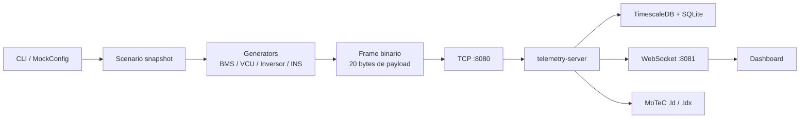

# Telemetry Edge Mock

**Objetivo**

Este documento descreve o `telemetry-edge-mock`, o simulador standalone da Jetson
usado para alimentar o `telemetry-server` com o mesmo protocolo binario usado
em pista. O foco aqui nao e mais planejar o mock. O foco e explicar o que foi
feito, por que foi feito, como a logica funciona e como rodar o processo.

O mock existe para validar a cadeia inteira sem depender da Jetson real:

- decode dos DBCs no backend;
- persistencia em TimescaleDB e SQLite;
- dashboard em tempo real;
- exportacao MoTeC `.ld` e `.ldx`;
- tracking com INS em uma volta fechada.

## 1. O que foi feito

Foi criado um crate Rust novo em `telemetry-edge-mock/` com esta divisao:

- `src/main.rs`: boot do simulador.
- `src/config.rs`: CLI e selecao de cenarios.
- `src/runtime.rs`: orquestra o ciclo de geracao e envio.
- `src/transport.rs`: conexao TCP com o servidor e reconexao.
- `src/protocol.rs`: frame binario de 20 bytes usado no envio.
- `src/scenarios/`: cenarios de simulacao.
- `src/generators/`: geracao dos frames por familia CAN.
- `src/dbc/`: leitura dos DBCs copiados para o mock.
- `assets/dbc/`: copia local dos 6 DBCs oficiais.

O projeto compila e usa o mesmo contrato de rede do edge real.

## 2. Por que isso foi feito

O objetivo pratico e tirar a Jetson da equacao sem quebrar o resto da stack.
Com isso, voce consegue:

1. rodar o servidor real em um host;
2. rodar o mock em outro notebook na mesma rede;
3. abrir o dashboard no navegador;
4. gerar sessao e exportar `.ld` e `.ldx`;
5. validar tracking e layout com dados repetiveis.

O mock nao substitui a arquitetura real. Ele substitui apenas a fonte dos frames
CAN no edge.

## 3. Como a logica funciona

O mock trabalha em tres camadas:

1. `scenario`: define o comportamento temporal do carro.
2. `generator`: converte o estado do cenario em frames CAN.
3. `transport`: envia os frames para o servidor via TCP.

### 3.1 Fluxo geral



### 3.2 O ciclo temporal

Cada familia roda em sua propria cadencia:

- `BMS`: `100 Hz`
- `INS`: `100 Hz`
- `VCU`: `50 Hz`
- `Inversores`: `50 Hz`

Em cada tick:

1. o runtime calcula o tempo relativo desde o inicio;
2. pega um snapshot do cenario;
3. gera os frames da familia;
4. coloca os frames no canal interno;
5. o transport empacota e envia ao servidor.

O timestamp enviado no frame e epoch real em segundos. Isso e importante porque
o backend calcula latencia como `agora no servidor - timestamp recebido`.

## 4. Cenario atual

O cenario padrao e `simple-enduro`.

Ele foi escolhido porque fecha uma volta e repete o percurso de forma
deterministica. A ideia nao e reproduzir a fisica real do carro com perfeicao.
A ideia e ter uma pista simples que:

- feche volta;
- passe varias vezes pelo mesmo traçado;
- gere mapa para o dashboard;
- gere trilha util para o tracking do MoTeC;
- produza aceleracao lateral, yaw rate e velocidade coerentes.

### 4.1 O que o `simple-enduro` faz

O `simple-enduro` modela uma pista fechada com forma eliptica e leve
ondulacao. Em cada instante ele estima:

- posicao implícita da volta;
- heading;
- velocidade;
- aceleracao longitudinal;
- aceleracao lateral;
- yaw rate.

Com isso, a trilha fecha naturalmente ao completar o ciclo.

### 4.2 O que isso permite

- o dashboard pode mostrar uma pista fechada;
- o tracking pode aprender e repetir a mesma linha;
- o MoTeC pode exibir uma volta fechada;
- voce pode validar se a trajetoria se repete entre voltas.

## 5. Dados gerados por familia

### 5.1 BMS

O mock usa os DBCs do BMS que ja existem no repositrio. A geracao atual cobre
os blocos mais importantes:

- tensao agregada;
- tensao por grupo de celulas;
- temperatura agregada;
- temperatura por grupo;
- estado de carga;
- energia;
- balanço.

Importante: o modelo atual ainda e uma simulacao simplificada. Ele nao gera,
na pratica, 96 tensoes individuais e 96 temperaturas individuais em um modelo
fisico completo. Ele gera sinais compatíveis com o DBC para validar a cadeia.

Se o objetivo for evoluir para 96 celulas reais no mock, isso deve virar uma
segunda etapa de refinamento do BMS generator.

### 5.2 VCU

O VCU gera um frame de saida com:

- `APS_RANGE_ERROR`
- `SAFETY_OK`
- `BRAKE`
- `VCU_STATE`
- `APPS_PERC`
- `HV_on`
- `Buzzer`
- `APPS_PERC1`

Esses valores variam conforme o cenario. Em `simple-enduro`, o acelerador e o
freio mudam ao longo da volta para parecer uma sessao real.

### 5.3 Inversores

Os inversores usam os frames de `0x18FF0DEA` e `0x18FF0EF7`.

Hoje o mock gera:

- torque;
- rpm.

Esses dois sinais sobem e descem junto com a volta e com as fases de
aceleracao/frenagem.

### 5.4 INS

O INS e a parte mais importante para tracking.

O mock gera:

- `Accel_Linear_X`
- `Accel_Linear_Y`
- `Accel_Linear_Z`
- `Velo_Angular_Z`
- `Speed_Linear_X`
- `Speed_Linear_Y`

No `simple-enduro`, esses sinais nao sao arbitrarios. Eles sao derivados de uma
trajetoria fechada:

- posicao em uma elipse;
- pequenas ondulacoes para parecer enduro;
- velocidade tangencial coerente com o trecho;
- yaw rate derivado da mudanca de heading;
- aceleracao lateral derivada da curvatura;
- aceleracao longitudinal derivada da variacao de velocidade.

Isso faz o caminho fechar e repetir a mesma volta varias vezes.

## 6. Como o mock envia para o servidor

O protocolo continua sendo o mesmo do edge real:

```text
[4 bytes] comprimento do payload
[4 bytes] CAN ID
[8 bytes] timestamp epoch em f64
[8 bytes] payload CAN bruto
```

O mock abre uma conexao TCP com o `telemetry-server` e manda frames nessa
estrutura. Se a conexao cair, ele tenta reconectar com backoff.

## 7. Como rodar

### 7.1 Build

```bash
cd telemetry-edge-mock
cargo build
```

### 7.2 Execucao basica

```bash
cargo run -- --server 143.106.207.21:8080
```

### 7.3 Execucao com cenario especifico

```bash
cargo run -- --server 143.106.207.21:8080 --scenario simple-enduro
```

### 7.4 Execucao com duracao fixa

```bash
cargo run -- --server 143.106.207.21:8080 --scenario simple-enduro --duration-secs 60
```

### 7.5 Onde mudar o IP do servidor

O IP do servidor vai no argumento `--server`.

Se o `telemetry-server` estiver no host `143.106.207.21`, use:

```bash
--server 143.106.207.21:8080
```

Se voce quiser rodar em outro host, troque somente esse valor. O IP do notebook
que executa o mock nao precisa entrar no codigo. Ele so importa para debug de
rede ou whitelist.

Para descobrir o IP do notebook:

```bash
hostname -I
```

ou:

```bash
ip a
```

## 8. Configuracao atual

Os parametros da CLI estao em `telemetry-edge-mock/src/config.rs`.

Valores principais:

- `server`: `127.0.0.1:8080` por padrao
- `dbc_dir`: `assets/dbc`
- `scenario`: `simple-enduro`
- `seed`: `12345`
- `bms_hz`: `100`
- `ins_hz`: `100`
- `vcu_hz`: `50`
- `inverter_hz`: `50`

## 9. O que acontece na pratica

1. o mock inicia;
2. ele carrega os DBCs da pasta `assets/dbc/`;
3. ele escolhe o cenario;
4. ele gera snapshots do tempo;
5. ele cria frames CAN por familia;
6. ele envia para o servidor;
7. o backend salva e distribui para o dashboard;
8. o exportador MoTeC usa os dados coletados na sessao.

## 10. Limites atuais

O mock ja serve para:

- validar o fluxo completo;
- validar o dashboard;
- validar o exportador `.ld/.ldx`;
- validar tracking simples com volta fechada;
- gerar screenshots repetiveis.

Ele ainda nao deve ser tratado como simulador fisico final do carro. Em
particular:

- o BMS ainda e simplificado em relacao a 96 celulas individuais;
- o INS e coerente para tracking, mas nao e um modelo completo de dinamica
  veicular;
- os sinais de suspensao e outros sensores que ainda nao estao nos DBCs nao
  entram nesta versao.

## 11. Recomendacao operacional

Use o `simple-enduro` quando o objetivo for:

- fechar uma pista;
- validar o tracking do dashboard;
- validar o tracking do MoTeC;
- gerar prints e capturas consistentes.

Use outros cenarios apenas quando quiser inspecionar dinamica simples de acelera
e frenagem.

## 12. Nao fazer

- nao alterar o dashboard para compensar erro do mock;
- nao inserir dados por SQL manual como fluxo principal;
- nao misturar mock e pista real na mesma execucao sem separar o host;
- nao usar o mock como substituto do BMS real sem ampliar os canais primeiro.

O `telemetry-edge-mock` existe para testar a cadeia real com uma fonte de dados
controlada. Ele deve ficar no mesmo contrato de rede da Jetson, mas sem fingir
que ja e um modelo fisico completo do carro.
