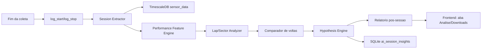

# Plano V3.0 - Virtual Pit Engineer Pos-Sessao

Este documento detalha a viabilidade, arquitetura e plano de estruturacao da IA de engenharia de pista como proximo passo da Telemetria V3.0. O foco inicial nao e alerta em tempo real. A primeira versao deve atuar **pos-sessao**, ajudando a equipe a entender performance veicular: onde o carro ganhou/perdeu tempo, quais sinais explicam esse comportamento e quais hipoteses devem ser levadas ao debrief.

## 1. Tese de viabilidade

E viavel construir uma IA de engenharia de pista no ecossistema atual porque a V2.3 ja possui a base necessaria para analise apos a coleta:

1. **Aquisicao temporal confiavel:** `sensor_data` no TimescaleDB guarda `time`, `signal_name`, `value`, `unit` e `can_id`.
2. **Sessoes nomeadas:** `telemetry_log_sessions` no SQLite cria fronteira operacional para cada treino, stint ou tentativa.
3. **Logs e downloads:** o frontend ja trata sessoes encerradas como artefatos recuperaveis para analise.
4. **Mapa e pose:** `track_map` e `track_pose` permitem transformar serie temporal em contexto espacial de pista.
5. **Equipe multidisciplinar:** ha pessoas com conhecimento complementar analisando dinamica, powertrain, eletrica, controle e pilotagem; a IA deve apoiar esse processo, nao substitui-lo.

O ponto central: a IA nao precisa ser indispensavel durante a volta para gerar valor. Inicialmente, ela vale mais como acelerador de interpretacao pos-sessao, quando ha tempo para discutir, comparar e validar hipoteses.

## 2. Dor que a IA resolve

Depois de uma sessao, a equipe costuma enfrentar um problema diferente do tempo real: ha dado demais, pouco tempo de debrief e muitas leituras possiveis. A pergunta raramente e "qual sinal esta fora do limite?". A pergunta mais valiosa e:

```text
Por que o carro andou desse jeito?
```

O Virtual Pit Engineer deve ajudar a responder:

- onde a volta rapida ganhou tempo em relacao as demais;
- onde a volta lenta perdeu tempo;
- se a perda veio de frenagem, contorno, retomada, tracao, energia, temperatura, controle ou pilotagem;
- se o comportamento se repete por setor, por volta ou por condicao de pista;
- quais sinais merecem atencao do especialista humano;
- quais hipoteses podem ser descartadas rapidamente.

Exemplo de saida desejada:

```text
Resumo da sessao:
  Melhor volta: volta 2.
  Perda principal recorrente: setor 3, saida de baixa velocidade.

Hipotese:
  Na volta 4, o piloto abre acelerador 0.42 s mais cedo,
  mas a aceleracao longitudinal demora mais para crescer.
  Ha maior variacao de yaw rate e torque traseiro menos consistente.

Pergunta para o debrief:
  Foi limitacao de tracao/controle ou aplicacao de pedal antes do carro estabilizar?
```

Valor associado: reduzir o tempo entre "baixamos o log" e "temos uma conversa tecnica boa". A IA prepara o terreno para quem tem know-how complementar.

## 3. Escopo inicial

### Dentro do escopo V3.0 inicial

- Analise automatica apos encerrar a sessao.
- Segmentacao de voltas e setores.
- Comparacao entre melhor volta, volta media e voltas ruins.
- Deteccao de trechos de perda/ganho de tempo.
- Extracao de features de performance por setor.
- Relatorio tecnico inicial em linguagem clara.
- Links para os sinais e janelas temporais que sustentam cada hipotese.
- Feedback humano: confirmar, rejeitar ou comentar uma hipotese.

### Fora do escopo inicial

- Decisao critica em tempo real.
- Recomendacao automatica para piloto durante a volta.
- Controle ativo do carro.
- Diagnostico de falha como fonte unica de verdade.
- Modelo supervisionado antes de haver dataset rotulado.

Tempo real pode existir no futuro, mas deve vir depois que a analise pos-sessao estiver confiavel.

## 4. Perguntas de performance que guiam a IA

| Area | Pergunta | Sinais/features candidatos |
| :--- | :--- | :--- |
| **Volta** | Qual volta foi melhor e por que? | tempo por volta, setores, velocidade, aceleracao |
| **Frenagem** | O piloto freou mais cedo/tarde ou por mais tempo? | brake, desaceleracao, velocidade inicial/final |
| **Contorno** | O carro carregou velocidade no meio da curva? | velocidade minima, yaw rate, aceleracao lateral |
| **Retomada** | A aceleracao veio quando o pedal abriu? | APS, aceleracao longitudinal, torque, RPM |
| **Tracao** | Houve assimetria ou perda de eficiencia de torque? | torque por motor, RPM por motor, slip estimado |
| **Energia** | A queda de tensao limitou performance? | pack voltage, vcell min/spread, corrente/potencia |
| **Termica** | Temperatura mudou comportamento entre voltas? | tcell, inversor, motor, derating se existir |
| **Controle** | O controle pareceu limitar entrega? | torque pedido vs. entregue, estados VCU/inversor |
| **Piloto** | O padrao de pedal foi repetivel? | APS, brake, velocidade, setor, delta para melhor volta |

## 5. Arquitetura proposta

A IA deve rodar como pipeline pos-sessao, disparado quando uma coleta e encerrada e os bounds do log ficam definidos.



Componentes:

- **Session Extractor:** carrega os sinais entre `log_start_unix` e `log_stop_unix`.
- **Lap/Sector Analyzer:** identifica voltas, divide setores e normaliza o tempo por distancia quando houver mapa.
- **Performance Feature Engine:** calcula features de frenagem, contorno, retomada, tracao, energia e termica.
- **Comparador de voltas:** compara melhor volta, volta media, volta pior e volta selecionada pelo usuario.
- **Hypothesis Engine:** transforma padroes em hipoteses tecnicas com evidencias.
- **Report Generator:** gera resumo textual e tabelas de apoio.
- **Feedback Store:** guarda confirmacoes/rejeicoes humanas para melhorar futuras analises.

## 6. Contrato de insight pos-sessao

Ao contrario de um alerta em tempo real, o objeto principal aqui e um `insight`: uma hipotese tecnica sustentada por dados.

```json
{
  "id": "insight_2026_07_08_session_12_sector_3_exit",
  "session_id": 12,
  "type": "performance_loss",
  "severity": "medium",
  "title": "Perda recorrente na retomada do setor 3",
  "summary": "A volta 4 perdeu 0.82 s para a melhor volta entre 412 m e 560 m. APS abriu 0.42 s mais cedo, mas a aceleracao longitudinal cresceu mais lentamente.",
  "hypothesis": "Possivel aplicacao de acelerador antes de estabilizar yaw ou limitacao de tracao/torque na saida.",
  "evidence": [
    { "signal": "APS_PERC", "window": [1783539012.1, 1783539015.6] },
    { "signal": "Accel_Linear_X", "window": [1783539012.1, 1783539015.6] },
    { "signal": "TORQUE_13A", "window": [1783539012.1, 1783539015.6] },
    { "signal": "Yaw_Rate", "window": [1783539012.1, 1783539015.6] }
  ],
  "questions_for_debrief": [
    "O piloto sentiu patinagem ou instabilidade na saida?",
    "Houve intervencao do controle de torque nesse trecho?",
    "O setup de tracao mudou entre as sessoes?"
  ],
  "confidence": 0.68,
  "source": "post_session:sector_delta:v1"
}
```

Regras para um insight ser util:

- deve comparar, nao apenas descrever;
- deve apontar janela temporal/espacial;
- deve separar dado observado de hipotese;
- deve sugerir perguntas, nao fingir certeza absoluta;
- deve permitir revisao humana.

## 7. Features iniciais recomendadas

| Grupo | Features |
| :--- | :--- |
| **Tempo** | tempo por volta, tempo por setor, delta acumulado, melhor volta teorica |
| **Frenagem** | ponto de inicio, duracao, pico de desaceleracao, release do freio |
| **Contorno** | velocidade minima, yaw rate medio/pico, aceleracao lateral |
| **Retomada** | tempo ate APS > limiar, tempo ate aceleracao crescer, torque por motor |
| **Tracao** | diferenca RPM/torque por motor, oscilacao de torque, slip estimado |
| **Energia** | queda de tensao sob carga, spread de celulas, potencia aproximada |
| **Termica** | temperatura por volta, deriva termica, possivel relacao com performance |
| **Repetibilidade** | variancia de pedal, velocidade e trajetoria por setor |

## 8. Estrategia de IA/modelos

### Fase 1: analise deterministica e estatistica

Comecar com regras, estatistica robusta e comparacao entre voltas:

```text
delta_setor = tempo_volta_alvo_setor - tempo_melhor_volta_setor
se delta_setor > 0.5 s:
  localizar trecho de maior perda
  comparar APS, brake, velocidade, accel_x, yaw_rate, torque
  gerar hipotese candidata
```

Essa fase ja entrega valor porque automatiza o trabalho repetitivo de procurar onde olhar.

### Fase 2: ranking de hipoteses

Criar um motor que prioriza hipoteses por evidencia:

- perda de tempo grande;
- repeticao em varias voltas;
- sinais coerentes entre si;
- baixa chance de ser ruido;
- relevancia para setup/piloto.

### Fase 3: aprendizado com feedback humano

Depois que especialistas classificarem insights como uteis, incorretos ou inconclusivos, treinar modelos para rankear melhor as hipoteses futuras.

### Fase 4: linguagem natural

LLM local ou template avancado pode gerar resumo pos-sessao. Importante: a IA generativa nao deve inventar diagnostico; ela deve verbalizar insights estruturados e evidencias calculadas.

## 9. Plano de estruturacao com prazos

Plano assumindo inicio em **08/07/2026** e uma equipe pequena. As datas podem ser deslocadas, mas a duracao por fase deve ser preservada.

| Fase | Periodo | Entrega | Criterio de pronto |
| :--- | :--- | :--- | :--- |
| **0. Definicao de perguntas** | 08/07/2026 - 14/07/2026 | Lista de perguntas de performance por area | dinamica, powertrain, eletrica e piloto validam o escopo |
| **1. Modelo de sessao analisavel** | 15/07/2026 - 28/07/2026 | Extrator por `log_start/log_stop` + lista de sinais-chave | carregar uma sessao encerrada e gerar dataset tabular |
| **2. Voltas e setores** | 29/07/2026 - 11/08/2026 | Segmentacao de voltas/setores e delta por trecho | comparar melhor volta vs. volta selecionada |
| **3. Feature Engine de performance** | 12/08/2026 - 25/08/2026 | Features de frenagem, contorno, retomada e tracao | tabela por volta/setor com features calculadas |
| **4. Relatorio pos-sessao MVP** | 26/08/2026 - 08/09/2026 | Resumo automatico com 3-5 insights | PDF/Markdown ou tela com evidencias e janelas |
| **5. UI de revisao** | 09/09/2026 - 22/09/2026 | Insights na aba de analise/downloads | usuario confirma/rejeita/comenta insights |
| **6. Validacao com logs reais** | 23/09/2026 - 06/10/2026 | Revisao com especialistas | medir insights uteis vs. ruido |
| **7. Ranking de hipoteses v1** | 07/10/2026 - 20/10/2026 | Priorizacao por impacto e confianca | os insights mais relevantes aparecem primeiro |
| **8. Memoria historica** | 21/10/2026 - 10/11/2026 | Comparacao entre sessoes/setups | identificar comportamento recorrente |
| **9. IA generativa controlada** | 11/11/2026 - 01/12/2026 | Sumario textual a partir de insights estruturados | texto nao inventa dado fora das evidencias |

**MVP realista ate 08/09/2026:** relatorio pos-sessao com comparacao de voltas/setores e primeiros insights explicaveis de performance. Isso ja ajuda a equipe sem depender de modelo neural.

## 10. Roadmap tecnico

Backend/Rust:

- expor endpoint para listar sessoes analisaveis;
- expor endpoint para obter dados por sessao e janela;
- persistir `ai_session_insights`;
- associar insights a `telemetry_log_sessions`;
- permitir feedback humano por insight.

Sidecar de analise:

- processo `telemetry-ai` ou `telemetry-analysis`;
- leitura de TimescaleDB por sessao encerrada;
- normalizacao temporal e, quando possivel, espacial;
- calculo de features por volta/setor;
- geracao de insights;
- persistencia dos resultados no backend.

Frontend:

- aba ou painel "Analise pos-sessao";
- resumo da sessao;
- comparador de voltas;
- lista de insights com evidencia;
- links para abrir grafico na janela temporal do insight;
- feedback: util, incorreto, inconclusivo, comentario.

Dados/validacao:

- selecionar logs reais representativos;
- definir sinais-chave por area;
- criar checklist de debrief;
- comparar insights da IA com conclusoes humanas;
- ajustar heuristicas apos cada teste.

## 11. Metricas de sucesso

| Metrica | Meta MVP |
| :--- | :--- |
| Tempo para gerar relatorio apos fim da sessao | < 2 min |
| Insights uteis no debrief | >= 50% no MVP |
| Insights sem evidencia rastreavel | 0 permitido |
| Comparacao melhor volta vs. volta selecionada | funcional no MVP |
| Feedback humano registrado | > 80% dos insights revisados |
| Dependencia de ML supervisionado | 0 no MVP |

## 12. Riscos principais

- **Voltas/setores mal segmentados:** compromete toda comparacao de performance.
- **Falta de sinais de piloto/controle:** pode limitar conclusoes sobre causa.
- **Hipotese forte demais:** a IA deve sugerir, nao decretar.
- **Excesso de insights:** se o relatorio trouxer 40 achados, ninguem usa.
- **Pouco feedback humano:** sem revisao, a IA nao aprende o que e relevante para a equipe.
- **Comparar sessoes incompativeis:** pista, setup, piloto e condicao precisam virar contexto.

## 13. Conclusao

A melhor primeira versao do Virtual Pit Engineer e pos-sessao: um analista de performance que organiza o log, compara voltas, aponta trechos de ganho/perda e prepara perguntas para os especialistas. O tempo real pode ser um desdobramento futuro, mas o valor inicial esta em acelerar o debrief e transformar telemetria em aprendizado acumulado sobre o carro.
