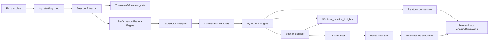

# Plano V3.0 - Virtual Pit Engineer, DIL e IA de Controle

Este documento detalha a viabilidade, arquitetura e plano de estruturacao da IA de engenharia de pista como proximo passo da Telemetria V3.0. A V3 deve ser tratada como um projeto de aproximadamente **6 meses**, com ambicao suficiente para integrar analise pos-sessao, geracao de cenarios para o DIL (Driver-in-the-Loop), treinamento/evaluacao de politicas em simulacao e retorno das melhores hipoteses para teste real.

O foco operacional continua sendo seguro: a IA nao toma decisao critica em tempo real no carro. Mas, com o DIL em desenvolvimento e GPUs disponiveis para treino, a V3 pode ir alem do relatorio pos-sessao. O objetivo passa a ser fechar um ciclo de aprendizado:

```text
Log real -> insight -> scenario DIL -> simulacao -> politica/hipotese -> teste real -> novo log
```

O Virtual Pit Engineer deixa de ser apenas um analista de dados e passa a ser a ponte entre telemetria real, simulacao e desenvolvimento de controle.

## 1. Tese de viabilidade

E viavel construir uma IA de engenharia de pista no ecossistema atual porque a V2.3 ja possui a base necessaria para analise apos a coleta:

1. **Aquisicao temporal confiavel:** `sensor_data` no TimescaleDB guarda `time`, `signal_name`, `value`, `unit` e `can_id`.
2. **Sessoes nomeadas:** `telemetry_log_sessions` no SQLite cria fronteira operacional para cada treino, stint ou tentativa.
3. **Logs e downloads:** o frontend ja trata sessoes encerradas como artefatos recuperaveis para analise.
4. **Mapa e pose:** `track_map` e `track_pose` permitem transformar serie temporal em contexto espacial de pista.
5. **Equipe multidisciplinar:** ha pessoas com conhecimento complementar analisando dinamica, powertrain, eletrica, controle e pilotagem; a IA deve apoiar esse processo, nao substitui-lo.
6. **DIL em desenvolvimento:** a equipe ja trabalha em ambiente Driver-in-the-Loop, que pode receber cenarios extraidos dos logs reais e permitir teste seguro de estrategias de controle.
7. **Capacidade de GPU:** ha infraestrutura para treinar modelos temporais, modelos de percepcao e politicas em simulacao sem depender apenas de heuristicas manuais.

O ponto central: a IA nao precisa ser indispensavel durante a volta para gerar valor. Na V3, ela deve acelerar a interpretacao pos-sessao e transformar achados reais em cenarios reproduziveis no DIL. Isso permite testar variacoes de controle, setup e pilotagem em ambiente seguro antes de gastar tempo de pista.

## 2. Dor que a IA resolve

Depois de uma sessao, a equipe costuma enfrentar um problema diferente do tempo real: ha dado demais, pouco tempo de debrief e muitas leituras possiveis. A pergunta raramente e "qual sinal esta fora do limite?". A pergunta mais valiosa e:

```text
Por que o carro andou desse jeito?
```

O Virtual Pit Engineer deve ajudar a responder:

- onde a volta rapida ganhou tempo em relacao as demais;
- onde a volta lenta perdeu tempo;
- se a perda veio de frenagem, contorno, retomada, tracao, energia, temperatura, controle ou pilotagem;
- se o comportamento se repete por setor, por volta ou por condicao de pista;
- quais sinais merecem atencao do especialista humano;
- quais hipoteses podem ser descartadas rapidamente.

Exemplo de saida desejada:

```text
Resumo da sessao:
  Melhor volta: volta 2.
  Perda principal recorrente: setor 3, saida de baixa velocidade.

Hipotese:
  Na volta 4, o piloto abre acelerador 0.42 s mais cedo,
  mas a aceleracao longitudinal demora mais para crescer.
  Ha maior variacao de yaw rate e torque traseiro menos consistente.

Pergunta para o debrief:
  Foi limitacao de tracao/controle ou aplicacao de pedal antes do carro estabilizar?
```

Valor associado: reduzir o tempo entre "baixamos o log" e "temos uma conversa tecnica boa". A IA prepara o terreno para quem tem know-how complementar.

## 3. Escopo da V3.0

### Dentro do escopo V3.0

- Analise automatica apos encerrar a sessao.
- Segmentacao de voltas e setores.
- Comparacao entre melhor volta, volta media e voltas ruins.
- Deteccao de trechos de perda/ganho de tempo.
- Extracao de features de performance por setor.
- Relatorio tecnico inicial em linguagem clara.
- Links para os sinais e janelas temporais que sustentam cada hipotese.
- Feedback humano: confirmar, rejeitar ou comentar uma hipotese.
- Construcao de `scenario` a partir de eventos reais para reproducao no DIL.
- Exportacao de estado inicial, trilha de entrada do piloto e restricoes para simulacao.
- Avaliacao offline de politicas de controle no DIL.
- Uso de RL ou otimizacao em simulacao para estrategias de torque, tracao, regen e controle.
- Comparacao entre politica baseline e politica candidata antes de qualquer teste no carro.
- Registro de resultado de simulacao junto ao insight original.

### Fora do escopo V3.0

- Decisao critica em tempo real.
- Recomendacao automatica para piloto durante a volta.
- Controle ativo do carro.
- Diagnostico de falha como fonte unica de verdade.
- Deploy automatico de politica treinada no carro sem revisao humana.
- RL treinado diretamente no carro real.
- Alteracao de parametros de VCU/inversor sem procedimento de validacao.

Tempo real pode existir no futuro, mas deve vir depois que a analise pos-sessao, o DIL e os criterios de seguranca estiverem confiaveis.

## 4. Perguntas de performance que guiam a IA

| Area | Pergunta | Sinais/features candidatos |
| :--- | :--- | :--- |
| **Volta** | Qual volta foi melhor e por que? | tempo por volta, setores, velocidade, aceleracao |
| **Frenagem** | O piloto freou mais cedo/tarde ou por mais tempo? | brake, desaceleracao, velocidade inicial/final |
| **Contorno** | O carro carregou velocidade no meio da curva? | velocidade minima, yaw rate, aceleracao lateral |
| **Retomada** | A aceleracao veio quando o pedal abriu? | APS, aceleracao longitudinal, torque, RPM |
| **Tracao** | Houve assimetria ou perda de eficiencia de torque? | torque por motor, RPM por motor, slip estimado |
| **Energia** | A queda de tensao limitou performance? | pack voltage, vcell min/spread, corrente/potencia |
| **Termica** | Temperatura mudou comportamento entre voltas? | tcell, inversor, motor, derating se existir |
| **Controle** | O controle pareceu limitar entrega? | torque pedido vs. entregue, estados VCU/inversor |
| **Piloto** | O padrao de pedal foi repetivel? | APS, brake, velocidade, setor, delta para melhor volta |
| **Simulacao** | Este evento real pode ser reproduzido no DIL? | estado inicial, track window, entradas do piloto, modelo de pneu/aderencia |
| **Controle/DIL** | Uma politica alternativa melhora o trecho sem violar restricoes? | torque pedido/entregue, slip, yaw, temperatura, tensao, tempo de trecho |

## 5. Arquitetura proposta

A IA deve rodar como pipeline pos-sessao, disparado quando uma coleta e encerrada e os bounds do log ficam definidos.



Componentes:

- **Session Extractor:** carrega os sinais entre `log_start_unix` e `log_stop_unix`.
- **Lap/Sector Analyzer:** identifica voltas, divide setores e normaliza o tempo por distancia quando houver mapa.
- **Performance Feature Engine:** calcula features de frenagem, contorno, retomada, tracao, energia e termica.
- **Comparador de voltas:** compara melhor volta, volta media, volta pior e volta selecionada pelo usuario.
- **Hypothesis Engine:** transforma padroes em hipoteses tecnicas com evidencias.
- **Report Generator:** gera resumo textual e tabelas de apoio.
- **Feedback Store:** guarda confirmacoes/rejeicoes humanas para melhorar futuras analises.
- **Scenario Builder:** converte um evento real de perda/ganho em um cenario reproduzivel no DIL.
- **DIL Connector:** envia cenarios para o simulador e recebe traces simulados.
- **Policy Evaluator:** compara baseline vs. politicas candidatas sob objetivos e restricoes.

## 6. Contrato de insight pos-sessao

Ao contrario de um alerta em tempo real, o objeto principal aqui e um `insight`: uma hipotese tecnica sustentada por dados.

```json
{
  "id": "insight_2026_07_08_session_12_sector_3_exit",
  "session_id": 12,
  "type": "performance_loss",
  "severity": "medium",
  "title": "Perda recorrente na retomada do setor 3",
  "summary": "A volta 4 perdeu 0.82 s para a melhor volta entre 412 m e 560 m. APS abriu 0.42 s mais cedo, mas a aceleracao longitudinal cresceu mais lentamente.",
  "hypothesis": "Possivel aplicacao de acelerador antes de estabilizar yaw ou limitacao de tracao/torque na saida.",
  "evidence": [
    { "signal": "APS_PERC", "window": [1783539012.1, 1783539015.6] },
    { "signal": "Accel_Linear_X", "window": [1783539012.1, 1783539015.6] },
    { "signal": "TORQUE_13A", "window": [1783539012.1, 1783539015.6] },
    { "signal": "Yaw_Rate", "window": [1783539012.1, 1783539015.6] }
  ],
  "questions_for_debrief": [
    "O piloto sentiu patinagem ou instabilidade na saida?",
    "Houve intervencao do controle de torque nesse trecho?",
    "O setup de tracao mudou entre as sessoes?"
  ],
  "confidence": 0.68,
  "source": "post_session:sector_delta:v1"
}
```

Regras para um insight ser util:

- deve comparar, nao apenas descrever;
- deve apontar janela temporal/espacial;
- deve separar dado observado de hipotese;
- deve sugerir perguntas, nao fingir certeza absoluta;
- deve permitir revisao humana.

## 7. Features iniciais recomendadas

| Grupo | Features |
| :--- | :--- |
| **Tempo** | tempo por volta, tempo por setor, delta acumulado, melhor volta teorica |
| **Frenagem** | ponto de inicio, duracao, pico de desaceleracao, release do freio |
| **Contorno** | velocidade minima, yaw rate medio/pico, aceleracao lateral |
| **Retomada** | tempo ate APS > limiar, tempo ate aceleracao crescer, torque por motor |
| **Tracao** | diferenca RPM/torque por motor, oscilacao de torque, slip estimado |
| **Energia** | queda de tensao sob carga, spread de celulas, potencia aproximada |
| **Termica** | temperatura por volta, deriva termica, possivel relacao com performance |
| **Repetibilidade** | variancia de pedal, velocidade e trajetoria por setor |

## 8. Estrategia de IA/modelos

O uso mais intenso de IA deve aparecer antes da linguagem natural. O ponto mais valioso nao e pedir para um modelo "comentar a sessao", mas construir um agente de investigacao que recebe uma pergunta de engenharia, busca evidencias no log, testa explicacoes concorrentes e devolve uma hipotese auditavel.

### 8.1 Metodo escolhido: pipeline hibrido, nao LLM solto

O metodo proposto e um pipeline hibrido:

1. **Extracao deterministica de dados:** SQL + interpolacao temporal para transformar o log em tabelas analisaveis.
2. **Analise numerica explicavel:** segmentacao de voltas/setores, calculo de delta por distancia e features por trecho.
3. **Motor de hipoteses baseado em regras e scores:** regras tecnicas geram hipoteses candidatas e calculam evidencia pro/contra.
4. **Ranking aprendido com feedback humano:** modelo leve aprende quais hipoteses costumam ser uteis para a equipe.
5. **LLM com ferramentas:** modelo generativo apenas consulta artefatos estruturados e escreve o relatorio; ele nao inventa sinais nem calcula fisica.

Decisao de arquitetura: **a verdade vem do feature engine; o LLM e interface de raciocinio e explicacao.**

### 8.2 Artefatos de entrada e saida

Entrada minima por sessao:

| Artefato | Origem | Uso |
| :--- | :--- | :--- |
| `telemetry_log_sessions` | SQLite | bounds da sessao, nome, piloto, setup se existir |
| `sensor_data` | TimescaleDB | series temporais por sinal |
| `track_pose` | banco/mapa atual | posicao, distancia percorrida, volta estimada |
| `track_map` | backend atual | geometria de pista e normalizacao espacial |
| DBC/CAN map | backend | nomes, unidades e semantica dos sinais |

Saidas persistidas:

| Artefato | Formato | Finalidade |
| :--- | :--- | :--- |
| `analysis_dataset` | parquet/csv temporario ou tabela cache | sinais alinhados por tempo/distancia |
| `lap_segments` | tabela SQLite/Postgres | voltas, setores, inicio/fim, qualidade da segmentacao |
| `sector_features` | tabela SQLite/Postgres | features por volta/setor/trecho |
| `ai_session_insights` | SQLite | hipoteses, evidencias, score, feedback |
| `dil_scenarios` | SQLite/JSON | cenarios extraidos de eventos reais |
| `policy_eval_runs` | SQLite/JSON | resultados de simulacao no DIL |
| relatorio | Markdown/HTML/PDF | resumo de debrief |

### 8.3 Normalizacao temporal e espacial

O primeiro problema real e comparar voltas que nao tem amostras nos mesmos timestamps. O metodo:

1. Carregar sinais-chave entre `log_start_unix` e `log_stop_unix`.
2. Reamostrar para uma grade temporal comum, por exemplo `50 Hz` para MVP.
3. Aplicar filtro mediano curto em sinais ruidosos (`3 a 5` amostras) sem apagar transientes.
4. Calcular distancia acumulada usando `track_pose` quando disponivel.
5. Converter cada volta para uma grade espacial comum, por exemplo `0..100%` da volta ou bins de `5 m`.

Comparacao principal deve ser por **distancia**, nao por tempo. Se a volta lenta for comparada por timestamp, os eventos ficam desalinhados exatamente onde ha perda de tempo. Por distancia, a IA compara o carro no mesmo trecho da pista.

```text
session_id
  -> sinais brutos por tempo
  -> sinais reamostrados em 50 Hz
  -> sinais alinhados por distancia
  -> voltas comparaveis ponto a ponto
```

### 8.4 Segmentacao de voltas e setores

MVP:

- usar `track_pose` para detectar cruzamento de linha de chegada;
- se nao houver linha confiavel, usar volta por distancia acumulada/mapa aprendido;
- descartar voltas com baixa cobertura de dados, parada em pista ou velocidade media anomala;
- dividir setores por percentual de volta ou marcos manuais configuraveis.

Implementacao sugerida:

```text
lap_id = detectar_passagens_start_finish(track_pose)
sector_id = floor(progress_pct / sector_width_pct)
quality = cobertura_dados * consistencia_velocidade * confianca_pose
```

Uma volta so entra na comparacao se `quality >= 0.8`. Isso evita insight bonito em cima de volta quebrada.

### 8.5 Delta por trecho: onde procurar causa

Antes de perguntar "por que", o sistema precisa achar "onde". O metodo:

1. Escolher volta de referencia: melhor volta valida ou melhor setor teorico.
2. Para cada volta alvo, calcular `delta_t` acumulado por distancia.
3. Encontrar janelas onde a derivada do delta cresce mais.
4. Agrupar janelas proximas para formar eventos de perda/ganho.

```text
delta_t(s) = tempo_volta_alvo_ate_distancia_s - tempo_volta_ref_ate_distancia_s
perda_local(s) = derivada_suavizada(delta_t)

se perda_local > percentil_90 e janela > 25 m:
  criar evento candidato de perda
```

Isso gera objetos como:

```json
{
  "event_id": "loss_lap4_s412_560",
  "lap_id": 4,
  "reference_lap_id": 2,
  "distance_window_m": [412, 560],
  "time_loss_s": 0.82,
  "sector": 3
}
```

### 8.6 Feature engine por tipo de evento

Cada evento de perda chama extratores especializados. O sistema nao calcula tudo de forma generica; ele usa "lentes" de engenharia.

| Lente | Features calculadas | Sinais candidatos |
| :--- | :--- | :--- |
| **Frenagem** | inicio de freada, pressao/pedal medio, pico de desaceleracao, release, velocidade no inicio/fim | brake, accel_x, speed |
| **Entrada/contorno** | velocidade minima, yaw rate pico/RMS, accel_y, estabilidade de volante se existir | speed, yaw_rate, accel_y |
| **Retomada** | tempo APS>limiar, atraso ate accel_x subir, torque pedido/entregue, RPM | APS, accel_x, torque, RPM |
| **Tracao** | oscilacao de torque, diferenca RPM por roda/motor, slip estimado, variancia de yaw | torque, RPM, speed, yaw_rate |
| **Energia** | queda de pack voltage sob carga, corrente, potencia estimada, vcell min/spread | pack_voltage, current, vcell |
| **Termica** | temperatura antes/depois, deriva por volta, proximidade de limite, derating se houver | motor_temp, inverter_temp, tcell |
| **Repetibilidade** | variancia de pedal, velocidade e linha entre voltas | APS, brake, speed, track_pose |

Exemplo de feature calculada:

```json
{
  "event_id": "loss_lap4_s412_560",
  "feature_group": "retomada",
  "aps_cross_35_delta_s": -0.42,
  "accel_x_response_delta_s": 0.38,
  "torque_rms_variation_delta_pct": 18.5,
  "yaw_rate_rms_delta_pct": 22.1
}
```

### 8.7 Motor de hipoteses

O motor de hipoteses deve ser implementado como um conjunto de regras declarativas versionadas. Cada regra recebe features e devolve:

- hipotese candidata;
- evidencias a favor;
- evidencias contra;
- sinais/janelas que sustentam a conclusao;
- score de confianca;
- pergunta de debrief;
- proximo teste sugerido.

Exemplo de regra:

```yaml
id: traction_or_early_throttle_exit_v1
trigger:
  event_type: performance_loss
  phase: corner_exit
conditions:
  - aps_cross_35_delta_s < -0.20
  - accel_x_response_delta_s > 0.20
  - yaw_rate_rms_delta_pct > 15
evidence_for:
  - "APS abriu mais cedo que na volta de referencia"
  - "aceleracao longitudinal demorou mais a crescer"
  - "yaw rate mais oscilatorio na saida"
evidence_against:
  - "queda de pack voltage semelhante a referencia"
hypothesis: "Possivel aplicacao de acelerador antes do carro estabilizar ou limitacao de tracao/controle."
question: "O piloto sentiu patinagem ou instabilidade na saida?"
next_test: "Repetir o trecho com abertura de APS mais progressiva e comparar torque entregue vs solicitado."
```

Score inicial:

```text
confidence =
  0.35 * impacto_tempo_normalizado +
  0.25 * coerencia_entre_sinais +
  0.20 * recorrencia_em_outras_voltas +
  0.10 * qualidade_da_volta +
  0.10 * completude_dos_sinais
```

Esse score deve ser salvo junto com `source_rule_id` e `source_rule_version`. Assim, quando uma regra mudar, fica claro qual log foi analisado com qual criterio.

### 8.8 Onde entra machine learning de verdade

ML supervisionado nao deve ser usado para diagnostico no MVP, porque ainda nao ha dataset rotulado. O primeiro uso bom de ML e **ranking**, nao causa raiz.

Dataset de treino acumulado ao longo da V3:

```text
X = features do insight + contexto da sessao
y = feedback humano
    util / incorreto / inconclusivo
    comentario_area
    acao tomada no carro
```

Modelos candidatos:

| Modelo | Uso | Por que faz sentido |
| :--- | :--- | :--- |
| Logistic Regression | baseline de utilidade do insight | simples, explicavel, treina com poucos dados |
| Random Forest / XGBoost | ranking com interacoes nao lineares | bom para features tabulares |
| kNN/embeddings de sessoes | recuperar sessoes parecidas | util para memoria historica |
| HDBSCAN/Isolation Forest | achar comportamento anomalo | bom quando nao ha rotulos |

O produto esperado nao e "IA acertou o diagnostico". O produto esperado e: **a IA colocou no topo da lista os 3 achados que os especialistas realmente discutiram no debrief.**

### 8.9 Outras abordagens de IA relevantes para a V3

Como a equipe tem GPU e ambicao de integrar DIL, vale adicionar abordagens alem de LLM e RL. Elas podem entrar em paralelo ao pipeline explicavel, desde que sempre produzam evidencias auditaveis.

| Abordagem | Onde usar | Por que vale a pena |
| :--- | :--- | :--- |
| **Self-supervised learning temporal** | aprender embeddings de voltas, setores e eventos sem rotulo manual | usa muitos logs brutos e cria busca por comportamento parecido |
| **Modelos transformer/TCN para series temporais** | detectar fases de curva, anomalias e padroes de instabilidade | bom para dados sequenciais de alta frequencia |
| **Multimodal video + telemetria** | sincronizar camera/ZED com sinais CAN/IMU | adiciona evidencia visual de linha, correcao, saida de pista e trafego |
| **Causal inference** | diferenciar correlacao de causa provavel | ajuda a nao confundir "temperatura alta" com causa quando e so consequencia |
| **Active learning** | escolher quais eventos pedir para especialistas rotularem | reduz esforco humano e acelera dataset util |
| **Uncertainty estimation** | medir confianca/calibracao das hipoteses | evita recomendacao forte quando dado ou modelo esta incerto |
| **Surrogate models** | aproximar o DIL para varrer parametros mais rapido | permite explorar mapas de controle antes de rodar simulacao pesada |
| **Bayesian optimization** | otimizar parametros de controle/setup com poucas simulacoes | mais eficiente que grid search e mais explicavel que RL puro |
| **System identification neural/hibrido** | ajustar parametros do modelo do carro a partir de logs reais | melhora o DIL e reduz erro sim-to-real |
| **Physics-informed ML** | combinar equacoes fisicas com redes neurais | aprende residuos do modelo sem jogar fora conhecimento de dinamica veicular |
| **Imitation learning** | aprender padroes de piloto/controle a partir das melhores voltas | cria baseline de comportamento rapido antes de RL |
| **Offline RL** | aprender politica usando logs ja coletados, sem interagir com o carro | aproveita historico real com mais seguranca que RL online |
| **Differentiable simulation** | tornar partes do simulador diferenciaveis para otimizar parametros | acelera ajuste de modelo e controle quando o DIL permitir |
| **Safe learning / control shields** | colocar camada de seguranca sobre politica aprendida | impede a IA de sugerir acao fora de limites fisicos/operacionais |
| **Knowledge graph tecnico** | conectar sessoes, setups, falhas, sensores, pilotos e decisoes | transforma memoria da equipe em base consultavel pela IA |

Uso recomendado na V3:

1. **Embeddings temporais de volta/setor:** treinar modelo self-supervised para transformar cada trecho em vetor. Isso habilita busca do tipo "mostre eventos parecidos com esta perda de retomada".
2. **Anomaly detection com incerteza:** detectar eventos que fogem do padrao normal do carro e marcar se a confianca e baixa.
3. **Active learning no debrief:** quando o modelo estiver incerto, pedir rotulo humano so dos eventos mais informativos.
4. **Surrogate do DIL:** treinar modelo rapido que aproxima saida do simulador para explorar parametros antes de rodar o DIL completo.
5. **Bayesian optimization para parametros:** buscar rampa de torque, limite de slip ou nivel de regen que melhora o objetivo com poucas avaliacoes.
6. **System identification hibrido:** usar logs reais para estimar parametros de pneu, atraso de torque, resistencia, massa efetiva, eficiencia e resposta termica.
7. **Imitation learning das melhores voltas:** aprender uma politica de referencia a partir das melhores execucoes humanas antes de tentar RL.
8. **Offline RL com restricoes:** usar historico de telemetria para propor politicas candidatas sem exploracao no carro real.
9. **Knowledge graph da equipe:** ligar "setup usado", "insight gerado", "teste feito", "resultado observado" e "decisao tomada" para criar memoria tecnica pesquisavel.

Essas abordagens sao particularmente boas para um projeto build-to-learn porque geram artefatos reutilizaveis: embeddings, datasets rotulados, estimativas de incerteza e modelos aproximados do carro/simulador.

Prioridade recomendada:

| Prioridade | Abordagem | Motivo |
| :--- | :--- | :--- |
| **Alta** | system identification hibrido | melhora o DIL, que e a base para RL confiavel |
| **Alta** | embeddings temporais + busca por eventos parecidos | gera valor rapido em logs reais |
| **Alta** | uncertainty estimation | reduz risco de insight ou politica superconfiante |
| **Media** | imitation learning | cria baseline de comportamento a partir das melhores voltas |
| **Media** | surrogate + Bayesian optimization | acelera exploracao de parametros no DIL |
| **Media** | knowledge graph tecnico | aumenta memoria institucional e rastreabilidade |
| **Baixa ate validar DIL** | offline RL / safe RL | poderoso, mas depende de dados e simulador bem validados |

### 8.10 Decisao recomendada: o que integrar de verdade

Para uma V3 de longo prazo e build-to-learn, a melhor arquitetura nao e escolher uma unica "IA vencedora". O caminho mais plausivel e integrar quatro camadas que se reforcam:

```text
Camada A - Analise explicavel:
  features, delta por distancia, regras, evidencias, incerteza.

Camada B - Representacao aprendida:
  embeddings temporais, busca por eventos parecidos, anomaly detection.

Camada C - Simulacao e calibracao:
  scenario builder, DIL, system identification, surrogate model.

Camada D - Otimizacao segura:
  Bayesian optimization, imitation learning, policy evaluator,
  RL/offline RL apenas depois de sim-to-real aceitavel.
```

O que faz mais sentido integrar como nucleo:

| Prioridade | Integrar | Papel no sistema |
| :--- | :--- | :--- |
| **Nucleo V3** | feature engine + hypothesis engine | base auditavel; sem isso a IA vira opiniao |
| **Nucleo V3** | uncertainty estimation | impede confianca artificial e melhora priorizacao |
| **Nucleo V3** | scenario builder DIL | transforma insight real em experimento simulavel |
| **Nucleo V3** | system identification hibrido | calibra o DIL com dado real; pre-condicao para RL serio |
| **Nucleo V3** | embeddings temporais | cria memoria operacional e busca por eventos parecidos |

O que faz sentido integrar como acelerador:

| Prioridade | Integrar | Papel no sistema |
| :--- | :--- | :--- |
| **Acelerador** | active learning | escolhe o que pedir para especialistas rotularem |
| **Acelerador** | knowledge graph tecnico | organiza memoria de sessoes, setups, decisoes e resultados |
| **Acelerador** | surrogate model do DIL | permite varrer parametros antes de simulacao completa |
| **Acelerador** | Bayesian optimization | acha bons parametros com poucas avaliacoes |
| **Acelerador** | multimodal video + telemetria | adiciona evidencia visual, especialmente linha/correcao/trafego |

O que deve entrar com cautela:

| Prioridade | Integrar | Condicao |
| :--- | :--- | :--- |
| **Condicional** | imitation learning | quando houver voltas boas suficientes e sinais de entrada/estado bem alinhados |
| **Condicional** | offline RL | quando houver dataset grande, restricoes claras e avaliador DIL confiavel |
| **Condicional** | PPO/SAC | quando o ambiente DIL estiver estavel, rapido e validado contra log real |
| **Condicional** | differentiable simulation | se a arquitetura do DIL permitir ou se algum subsistema puder ser diferenciado |

O que nao deve ser caminho critico:

- LLM decidindo diagnostico sem features estruturadas.
- RL treinado direto no carro.
- Politica aprendida indo para pista sem policy evaluator, constraints e rollback.
- Modelo multimodal sem sincronizacao forte entre video, CAN, IMU e pose.

Sequencia recomendada de integracao:

1. **Explicar bem o log:** feature engine, delta por distancia, regras, incerteza.
2. **Criar memoria aprendida:** embeddings de eventos e busca por casos parecidos.
3. **Fechar ponte com DIL:** scenario builder e validacao sim-to-real.
4. **Calibrar simulador:** system identification hibrido por subsistema.
5. **Explorar parametros:** surrogate + Bayesian optimization.
6. **Aprender comportamento:** imitation learning a partir de boas voltas.
7. **Otimizar politica:** offline RL/RL somente em cenarios onde DIL ja reproduz o real.

Essa sequencia e completa sem ser irresponsavel: ela usa GPU, usa DIL, permite pesquisa real, mas preserva rastreabilidade e seguranca.

### 8.11 LLM com ferramentas

O LLM entra como orquestrador e redator, com ferramentas limitadas:

| Ferramenta | Entrada | Saida |
| :--- | :--- | :--- |
| `get_session_summary(session_id)` | sessao | voltas, setores, melhor volta, qualidade |
| `get_loss_events(session_id)` | sessao | eventos de perda/ganho por distancia |
| `get_event_features(event_id)` | evento | features calculadas |
| `get_insight_evidence(insight_id)` | insight | sinais, janelas, graficos |
| `search_similar_sessions(context)` | setup/piloto/trecho | sessoes parecidas |
| `build_dil_scenario(event_id)` | evento real | cenario para simulacao |
| `get_policy_eval(policy_eval_id)` | avaliacao DIL | resultado baseline vs. candidato |

Regras de seguranca do LLM:

- nao citar sinal que nao esteja na evidencia;
- nao afirmar causa quando a regra marcou `inconclusivo`;
- sempre separar `observado`, `hipotese` e `proximo teste`;
- sempre incluir janelas temporais/espaciais;
- se faltar sinal essencial, declarar a limitacao.

### 8.12 Sequencia de execucao do job pos-sessao

Quando uma sessao e encerrada, o backend deve criar um job assincrono:

```text
POST /api/sessions/:id/analyze
  -> cria analysis_job
  -> sidecar carrega dados
  -> gera datasets/features/insights
  -> persiste resultados
  -> frontend mostra status e relatorio
```

Ordem do job:

1. `load_session_bounds`: obtem inicio/fim e metadados.
2. `load_signal_manifest`: define sinais obrigatorios e opcionais.
3. `extract_timeseries`: consulta TimescaleDB por chunks.
4. `resample_timeseries`: cria grade comum de 50 Hz.
5. `build_distance_index`: alinha amostras por distancia/progresso de volta.
6. `segment_laps`: detecta voltas/setores e calcula qualidade.
7. `compute_delta`: compara volta alvo vs. referencia por distancia.
8. `detect_loss_events`: acha janelas de ganho/perda.
9. `compute_features`: roda extratores por lente de engenharia.
10. `generate_hypotheses`: aplica regras versionadas.
11. `rank_insights`: ordena por impacto/confianca/recorrencia.
12. `build_candidate_scenarios`: gera cenarios DIL para eventos relevantes.
13. `run_policy_eval`: opcionalmente avalia baseline vs. politica candidata no DIL.
14. `render_report`: gera Markdown/HTML.
15. `persist_results`: salva insights, features, cenarios e referencias de evidencia.

### 8.13 Estrutura de modulos sugerida

Implementacao recomendada como sidecar `telemetry-analysis`, para nao misturar carga analitica com ingestao em tempo real.

```text
telemetry-analysis/
  src/
    main.rs
    jobs.rs
    extract/
      timescale.rs
      sessions.rs
      signal_manifest.rs
    normalize/
      resample.rs
      distance_index.rs
      filters.rs
    laps/
      segment.rs
      sectors.rs
      quality.rs
    features/
      braking.rs
      cornering.rs
      exit.rs
      traction.rs
      energy.rs
      thermal.rs
      repeatability.rs
    hypotheses/
      engine.rs
      rules_loader.rs
      scoring.rs
      rules/
        traction_or_early_throttle_exit_v1.yaml
        braking_point_loss_v1.yaml
        voltage_sag_power_loss_v1.yaml
    dil/
      scenario_builder.rs
      connector.rs
      policy_eval.rs
      rewards.rs
      constraints.rs
    learning/
      embeddings.rs
      ranking.rs
      active_learning.rs
      uncertainty.rs
      surrogate_model.rs
      system_identification.rs
      imitation_learning.rs
      offline_rl.rs
      knowledge_graph.rs
      rl_policy_interface.rs
    report/
      markdown.rs
      llm_summary.rs
    storage/
      insights.rs
      feedback.rs
      scenarios.rs
      policy_runs.rs
```

O primeiro MVP pode ser feito sem LLM: `report/markdown.rs` gera texto por template a partir dos insights estruturados. O LLM entra depois em `report/llm_summary.rs`, lendo exatamente os mesmos objetos.

### 8.14 Integracao com DIL: Scenario Builder

O DIL deve receber cenarios pequenos, derivados de eventos reais, nao uma sessao inteira sem curadoria. Cada cenario representa uma janela de pista onde houve perda, ganho, instabilidade ou comportamento tecnico relevante.

Contrato inicial de `scenario`:

```json
{
  "scenario_id": "scenario_session12_lap4_s412_560",
  "source_session_id": 12,
  "source_event_id": "loss_lap4_s412_560",
  "track_window_m": [412, 560],
  "reference_lap_id": 2,
  "target_lap_id": 4,
  "initial_state": {
    "speed_mps": 10.6,
    "yaw_rate_rps": 0.31,
    "accel_x_mps2": 0.4,
    "accel_y_mps2": 0.8,
    "pack_voltage_v": 392.4,
    "inverter_temp_c": 54.0,
    "motor_temp_c": 48.0
  },
  "driver_input_trace": {
    "signals": ["APS_PERC", "BRAKE_PERC"],
    "sampling_hz": 50,
    "source": "real_log"
  },
  "baseline_control_policy": "vcu_baseline_2026_07",
  "objective": "minimize_segment_time_without_instability",
  "constraints": {
    "max_slip_ratio": 0.12,
    "max_yaw_rate_rms_delta_pct": 15,
    "max_inverter_temp_c": 80,
    "min_pack_voltage_v": 330
  }
}
```

O `Scenario Builder` deve preencher tres blocos:

- **Estado inicial:** estado dinamico, energetico e termico no inicio da janela.
- **Entrada exogena:** pedal/freio do piloto ou perfil sintetico de piloto.
- **Objetivo/restricoes:** o que otimizar e quais limites nao podem ser violados.

### 8.15 Reinforcement Learning dentro da V3

RL faz sentido na V3 porque o DIL fornece o ambiente onde o agente pode errar com baixo custo. Mesmo assim, o uso correto nao e "treinar uma IA para dirigir o carro inteiro" no primeiro ciclo. O uso correto e treinar ou avaliar politicas em cenarios curtos e tecnicamente bem definidos.

Casos de uso prioritarios:

| Caso | Acao do agente | Recompensa | Restricoes |
| :--- | :--- | :--- | :--- |
| **Controle de tracao em saida** | ajustar limite/rampa de torque | menor tempo no trecho + menor slip | yaw estavel, slip maximo, torque suave |
| **Torque vectoring** | distribuir torque entre motores | maior aceleracao com menor instabilidade | temperatura, corrente, yaw, slip |
| **Regen por setor** | escolher nivel de regen | recuperar energia sem piorar estabilidade/tempo | tensao, corrente, aderencia, brake feel |
| **Mapa de torque por condicao** | selecionar parametros de mapa | reduzir perda recorrente em eventos parecidos | limites de inversor, drivability |

Loop de treino/evaluacao:

```text
eventos reais -> scenarios DIL -> baseline rollout
              -> politica candidata rollout
              -> comparacao por metricas
              -> insight de simulacao
              -> revisao humana
              -> teste real controlado
```

Recompensa inicial para saida de curva:

```text
reward =
  - tempo_no_trecho
  - 2.0 * penalidade_slip
  - 1.5 * penalidade_yaw_instavel
  - 1.0 * penalidade_torque_oscilatorio
  - 0.5 * penalidade_termica
```

Importante: na V3, o RL deve produzir **politicas candidatas para simulacao e discussao**, nao deploy automatico. Uma politica so pode virar parametro de teste real se:

- melhora o baseline em varios cenarios parecidos;
- nao viola nenhuma restricao de seguranca;
- e robusta a variacoes de aderencia, temperatura e estado de carga;
- a equipe de controle consegue explicar o comportamento;
- existe plano de teste com rollback.

Modelos/algoritmos candidatos:

| Metodo | Onde usar | Observacao |
| :--- | :--- | :--- |
| PPO/SAC | politica continua de torque/regen em simulacao | bom para controle continuo, exige ambiente estavel |
| MPC + otimizacao bayesiana | ajuste de parametros de controle | mais explicavel que RL puro |
| Contextual bandits | escolher proximo teste ou insight | simples, aprende com feedback humano |
| World model temporal | prever resposta do carro | ajuda a validar simulador e gerar "e se?" |
| Surrogate + Bayesian optimization | varrer parametros de controle com poucas simulacoes DIL | bom quando simulacao completa e cara |

### 8.16 Validacao sim-to-real

O maior risco de RL/DIL e otimizar comportamento que so existe no simulador. Por isso a V3 precisa medir sim-to-real desde o inicio.

Metricas de validacao:

| Metrica | Como medir | Uso |
| :--- | :--- | :--- |
| erro de velocidade | simulado vs. log real na mesma janela | validar dinamica longitudinal |
| erro de yaw rate | simulado vs. log real | validar estabilidade/rotacao |
| erro de accel_x/accel_y | simulado vs. log real | validar resposta dinamica |
| torque pedido vs. entregue | simulador vs. inversores/log | validar controle/powertrain |
| tensao/corrente | simulado vs. BMS | validar modelo energetico |
| temperatura | simulado vs. log | validar modelo termico |

Antes de treinar politica, o DIL deve conseguir reproduzir um evento real com erro aceitavel. Se o simulador nao reproduz a perda real, RL naquele cenario nao deve ser usado para recomendacao.

### 8.17 Exemplo fim a fim

```text
Input:
  session_id = 12
  referencia = melhor volta valida
  alvo = volta 4

Delta:
  volta 4 perdeu 0.82 s entre 412 m e 560 m.

Features:
  APS cruzou 35% 0.42 s mais cedo que a referencia.
  accel_x demorou 0.38 s a subir apos APS.
  yaw_rate RMS foi 22% maior.
  pack voltage nao teve queda anormal.

Hipoteses avaliadas:
  freada antecipada: rejeitada
  queda de tensao: pouco provavel
  temperatura/derating: inconclusiva
  tracao ou acelerador cedo demais: provavel

Insight:
  A perda parece concentrada na fase de retomada.
  O piloto pediu aceleracao cedo, mas o carro nao converteu isso
  em aceleracao longitudinal na mesma taxa da melhor volta.

Proximo teste:
  repetir trecho com abertura de pedal mais progressiva e comparar
  torque solicitado vs. torque entregue.

Scenario DIL:
  exportar janela 412-560 m com estado inicial real.
  rodar baseline VCU 2026_07.
  rodar politica candidata de rampa de torque.

Resultado simulado:
  politica candidata reduz 0.21 s no trecho,
  reduz oscilacao de yaw em 9%,
  nao aumenta slip acima de 0.12.

Conclusao:
  candidata boa para teste controlado em pista,
  com rollback para baseline e monitoramento de yaw/slip/temperatura.
```

## 9. Plano de estruturacao com prazos

Plano assumindo inicio em **08/07/2026** e horizonte de aproximadamente 6 meses. As datas podem ser deslocadas, mas a sequencia deve ser preservada: primeiro medir e explicar, depois reproduzir no DIL, depois otimizar em simulacao, depois validar com teste real controlado.

| Fase | Periodo | Entrega | Criterio de pronto |
| :--- | :--- | :--- | :--- |
| **0. Definicao de perguntas** | 08/07/2026 - 14/07/2026 | Lista de perguntas de performance por area | dinamica, powertrain, eletrica e piloto validam o escopo |
| **1. Modelo de sessao analisavel** | 15/07/2026 - 28/07/2026 | Extrator por `log_start/log_stop` + lista de sinais-chave | carregar uma sessao encerrada e gerar dataset tabular |
| **2. Voltas e setores** | 29/07/2026 - 11/08/2026 | Segmentacao de voltas/setores e delta por trecho | comparar melhor volta vs. volta selecionada |
| **3. Feature Engine de performance** | 12/08/2026 - 25/08/2026 | Features de frenagem, contorno, retomada e tracao | tabela por volta/setor com features calculadas |
| **4. Relatorio pos-sessao MVP** | 26/08/2026 - 08/09/2026 | Resumo automatico com 3-5 insights | PDF/Markdown ou tela com evidencias e janelas |
| **5. UI de revisao** | 09/09/2026 - 22/09/2026 | Insights na aba de analise/downloads | usuario confirma/rejeita/comenta insights |
| **6. Validacao com logs reais** | 23/09/2026 - 06/10/2026 | Revisao com especialistas | medir insights uteis vs. ruido |
| **7. Scenario Builder DIL** | 07/10/2026 - 27/10/2026 | Exportar eventos reais como `dil_scenarios` | DIL reproduz pelo menos 3 eventos reais |
| **8. Validacao sim-to-real** | 28/10/2026 - 17/11/2026 | Metricas de erro simulado vs. log real | erro aceitavel em velocidade, yaw e accel nos cenarios selecionados |
| **9. Policy Evaluator** | 18/11/2026 - 08/12/2026 | Comparar baseline vs. politica candidata no DIL | relatorio mostra ganho/perda e violacoes de restricao |
| **10. RL/otimizacao em cenarios curtos** | 09/12/2026 - 05/01/2027 | Treino/eval em saidas de curva ou regen | politica candidata supera baseline em simulacao sem violar limites |
| **11. Memoria historica e ranking** | 06/01/2027 - 19/01/2027 | Comparacao entre sessoes/setups e ranking com feedback | top insights/testes refletem debrief humano |
| **12. IA generativa controlada** | 20/01/2027 - 31/01/2027 | Sumario textual a partir de insights e simulacoes estruturadas | texto nao inventa dado fora das evidencias |

**Marco ate 08/09/2026:** relatorio pos-sessao com comparacao de voltas/setores e primeiros insights explicaveis.

**Marco ate 27/10/2026:** eventos reais exportados para o DIL como cenarios reproduziveis.

**Marco ate 05/01/2027:** primeira politica candidata avaliada no DIL contra baseline, com restricoes e criterios de sim-to-real.

## 10. Roadmap tecnico

Backend/Rust:

- `GET /api/analysis/sessions`: listar sessoes analisaveis com status (`not_started`, `running`, `done`, `failed`).
- `POST /api/analysis/sessions/:session_id/run`: disparar job pos-sessao.
- `GET /api/analysis/jobs/:job_id`: consultar progresso por etapa.
- `GET /api/analysis/sessions/:session_id/summary`: retornar voltas, setores, melhor volta e qualidade dos dados.
- `GET /api/analysis/sessions/:session_id/insights`: listar insights rankeados.
- `GET /api/analysis/insights/:insight_id/evidence`: retornar sinais, janelas e pontos para grafico.
- `POST /api/analysis/insights/:insight_id/feedback`: salvar `util`, `incorreto`, `inconclusivo` e comentario.
- `POST /api/analysis/events/:event_id/scenario`: gerar cenario DIL a partir de evento real.
- `GET /api/analysis/scenarios/:scenario_id`: retornar contrato do cenario.
- `POST /api/analysis/scenarios/:scenario_id/evaluate-policy`: disparar avaliacao DIL.
- `GET /api/analysis/policy-runs/:run_id`: retornar comparacao baseline vs. candidato.
- persistir `analysis_jobs`, `lap_segments`, `sector_features`, `ai_session_insights`, `ai_insight_feedback`, `dil_scenarios` e `policy_eval_runs`.

Sidecar de analise:

- processo `telemetry-analysis` separado do servidor de ingestao;
- leitura de TimescaleDB em chunks por sessao encerrada;
- reamostragem temporal em 50 Hz;
- alinhamento espacial por `track_pose`/distancia;
- segmentacao de voltas e setores com score de qualidade;
- calculo de delta por distancia;
- deteccao de eventos de perda/ganho;
- feature engine por lentes de engenharia;
- motor de regras YAML versionadas;
- ranking inicial por score deterministico;
- geracao de relatorio Markdown sem LLM no MVP;
- scenario builder para DIL;
- connector para executar ou acionar simulacoes DIL;
- avaliador baseline vs. politica candidata;
- modulo de recompensas e restricoes;
- embeddings temporais de voltas/setores para busca por eventos parecidos;
- active learning para escolher eventos que merecem rotulo humano;
- estimativa de incerteza para calibrar confianca de insights e politicas;
- surrogate model do DIL para varredura rapida de parametros;
- system identification hibrido para calibrar o DIL com logs reais;
- imitation learning das melhores voltas para criar baseline de politica;
- offline RL restrito a logs/simulacao, sem exploracao no carro real;
- knowledge graph tecnico ligando setup, sessao, insight, teste e decisao;
- otimizacao bayesiana para mapas/parametros antes de simulacao completa;
- camada final da V3: LLM com ferramentas para resumo narrativo.

Frontend:

- aba "Analise pos-sessao" dentro de Downloads/Sessoes;
- botao "Analisar sessao" e indicador de progresso do job;
- cards de resumo: melhor volta, volta media, voltas descartadas, qualidade dos dados;
- comparador de voltas por setor;
- lista de insights rankeados com severidade, confianca e tipo;
- painel de evidencia abrindo sinais na janela temporal/espacial do insight;
- botao "Exportar para DIL" em eventos elegiveis;
- visualizacao de resultado DIL: baseline vs. politica candidata;
- badge de restricoes violadas ou aprovadas;
- botoes de feedback: util, incorreto, inconclusivo e comentario;
- export Markdown/PDF do relatorio.

Dados/validacao:

- selecionar 5 a 10 logs reais representativos;
- definir manifesto de sinais obrigatorios por lente (`APS`, `brake`, `speed`, `accel_x`, `accel_y`, `yaw_rate`, `torque`, `RPM`, `pack_voltage`, temperaturas);
- criar dataset dourado com 2 ou 3 sessoes revisadas manualmente;
- comparar insights gerados com conclusoes humanas;
- medir precisao util: quantos dos top 3 insights entraram no debrief;
- selecionar cenarios DIL representativos: saida lenta, frenagem forte, queda de tensao, temperatura alta, baixa aderencia;
- medir sim-to-real antes de usar RL para recomendacao;
- comparar politica candidata contra baseline em cenarios variados;
- ajustar thresholds e regras apos cada teste.

## 11. Metricas de sucesso

| Metrica | Meta V3 |
| :--- | :--- |
| Tempo para gerar relatorio apos fim da sessao | < 2 min |
| Insights uteis no debrief | >= 50% no MVP |
| Insights sem evidencia rastreavel | 0 permitido |
| Comparacao melhor volta vs. volta selecionada | funcional no MVP |
| Feedback humano registrado | > 80% dos insights revisados |
| Cenarios DIL gerados a partir de eventos reais | >= 10 no ciclo V3 |
| Eventos reais reproduzidos no DIL com erro aceitavel | >= 3 no ciclo V3 |
| Politica candidata avaliada contra baseline | >= 1 no ciclo V3 |
| Busca por eventos parecidos via embeddings | funcional em dataset historico |
| Eventos priorizados por active learning | revisados em debrief |
| Insights com incerteza/calibracao explicita | presentes nos relatorios V3 |
| Parametros do DIL ajustados por system identification | pelo menos 1 subsistema calibrado |
| Knowledge graph tecnico | sessoes, setups, insights e decisoes conectados |
| Violacao de restricao em politica recomendada para teste | 0 permitido |
| Deploy automatico no carro | 0 permitido |

## 12. Riscos principais

- **Voltas/setores mal segmentados:** compromete toda comparacao de performance.
- **Falta de sinais de piloto/controle:** pode limitar conclusoes sobre causa.
- **Hipotese forte demais:** a IA deve sugerir, nao decretar.
- **Excesso de insights:** se o relatorio trouxer 40 achados, ninguem usa.
- **Pouco feedback humano:** sem revisao, a IA nao aprende o que e relevante para a equipe.
- **Comparar sessoes incompativeis:** pista, setup, piloto e condicao precisam virar contexto.
- **Simulador otimista demais:** politica parece boa no DIL mas falha no carro real.
- **Reward mal definido:** RL aprende a reduzir tempo violando estabilidade, temperatura ou dirigibilidade.
- **Modelo confiante demais:** sem incerteza calibrada, a IA pode apresentar achado fraco como se fosse forte.
- **Surrogate enganoso:** modelo rapido aproxima mal o DIL e direciona otimizacao para regioes irreais.
- **Rotulo humano inconsistente:** active learning depende de feedback com criterio comum entre especialistas.
- **Imitation learning copiando erro humano:** melhores voltas ainda podem conter habitos ruins ou compensacoes de setup.
- **Offline RL fora da distribuicao:** politica pode sugerir acao em regiao pouco representada nos logs.
- **Knowledge graph desatualizado:** memoria tecnica so ajuda se sessoes, setups e decisoes forem registrados com disciplina.
- **Acoplamento excessivo com ingestao:** analise pesada nao pode afetar telemetria em tempo real.
- **Politica opaca demais:** controle precisa entender por que uma politica candidata parece melhor.

## 13. Conclusao

A V3 do Virtual Pit Engineer deve ser mais que um relatorio pos-sessao. A primeira camada organiza o log, compara voltas, aponta trechos de ganho/perda e prepara perguntas para os especialistas. A segunda camada transforma esses trechos em cenarios reproduziveis no DIL. A terceira camada avalia politicas e estrategias alternativas em simulacao, com restricoes claras, antes de qualquer teste real.

Esse caminho usa IA de forma intensa sem perder disciplina de engenharia: dados reais geram hipoteses; hipoteses viram cenarios; cenarios alimentam DIL; DIL permite RL/otimizacao; e somente resultados robustos voltam para pista como proposta de teste controlado. O objetivo final da V3 e transformar a telemetria em um sistema fechado de aprendizado entre carro real, simulacao e controle.
