# Planejamento de Features — E-Racing Ultra Blaster UNICAMP
## TelemetriaV2.2 · Exportação MoTeC `.ld` | TelemetriaV2.3 · Dashboard Blue Team

> **Projeto:** Telemetria V2 — E-Racing Ultra Blaster  
> **Instituição:** UNICAMP — Faculdade de Engenharia Mecânica  
> **Competição:** SAE Brasil Formula SAE Elétrico  
> **Stack atual:** Rust (servidor + edge) · SolidJS (frontend) · TimescaleDB + SQLite · Jetson AGX Xavier · Ubuntu 22.04  
> **Data de criação:** Junho de 2026  

---

## Índice

1. [Visão Geral do Projeto](#1-visão-geral-do-projeto)
2. [Arquitetura Atual (V2.1)](#2-arquitetura-atual-v21)
3. [TelemetriaV2.2 — Exportação MoTeC `.ld`](#3-telemetriav22--exportação-motec-ld)
4. [TelemetriaV2.3 — Dashboard Blue Team](#4-telemetriav23--dashboard-blue-team)
5. [Ordem de Implementação Integrada](#5-ordem-de-implementação-integrada)
6. [Riscos e Mitigações](#6-riscos-e-mitigações)

---

## 1. Visão Geral do Projeto

### 1.1 Roadmap completo de versões

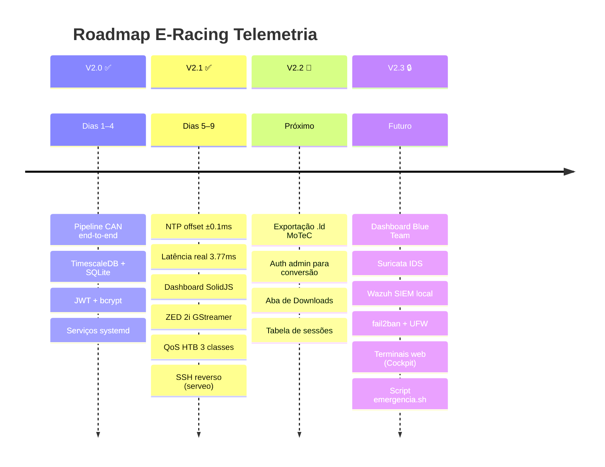

### 1.2 Contexto dos dois cenários de operação

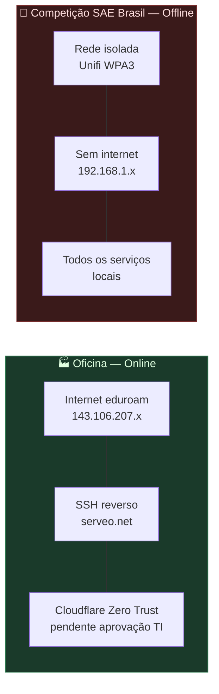

> **Regra de ouro:** qualquer feature que for para a competição **deve funcionar 100% offline**, ser leve o suficiente para não disputar CPU com a telemetria, e ter valor real contra vetores de ataque locais.

---

## 2. Arquitetura Atual (V2.1)

### 2.1 Topologia de rede

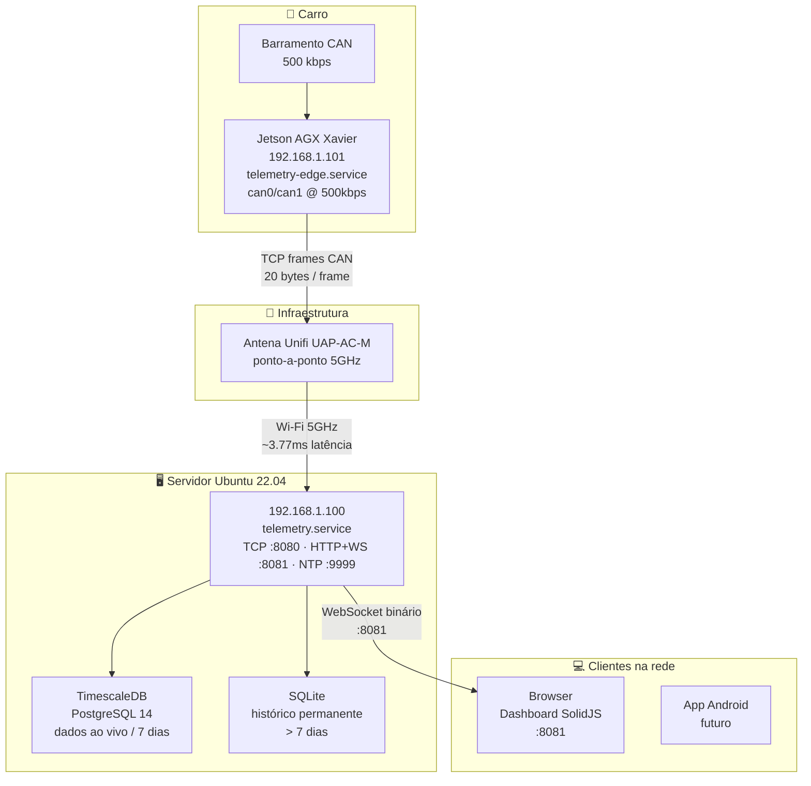

### 2.2 Fluxo de dados atual

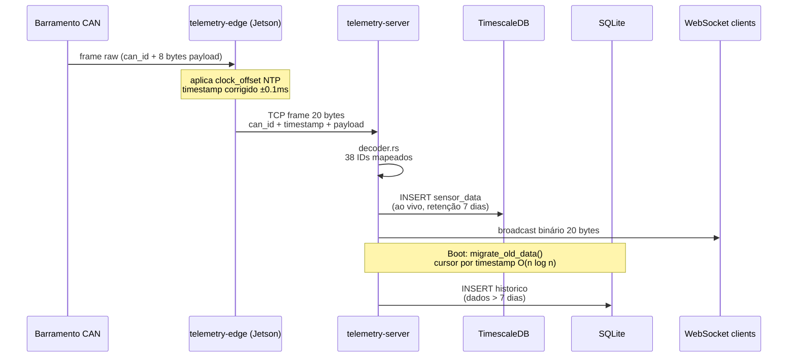

### 2.3 Status dos serviços systemd

| Nodo | Serviço | Função | Status |
|------|---------|--------|--------|
| Servidor | `telemetry.service` | TCP:8080 + HTTP/WS:8081 + NTP:9999 | ✅ |
| Servidor | `postgresql@14-main` | TimescaleDB | ✅ |
| Servidor | `serveo-tunnel.service` | SSH reverso global | ✅ |
| Servidor | `eracing-qos.service` | QoS HTB 3 classes | ✅ |
| Servidor | `mediamtx.service` | WebRTC :8555 | ✅ |
| Servidor | `udp-to-rtsp.service` | ffmpeg UDP→RTSP | ✅ |
| Servidor | `video-backup.service` | Grava MKV 5min | ✅ |
| Jetson | `can-interfaces.service` | can0/can1/vcan0/vcan1 UP | ✅ |
| Jetson | `can-replay.service` | canplayer loop log real | ✅ |
| Jetson | `telemetry-edge.service` | Rust aarch64 → TCP:8080 | ✅ |
| Jetson | `zed-stream.service` | ZED 2i → UDP :5601 | ✅ |
| Jetson | `serveo-tunnel.service` | SSH reverso global | ✅ |

---

## 3. TelemetriaV2.2 — Exportação MoTeC `.ld`

### 3.1 Visão geral e motivação

Os engenheiros da equipe precisam analisar dados de voltas passadas no **MoTeC i2** — software profissional de análise de telemetria automotiva, padrão no motorsport. O MoTeC i2 só aceita arquivos no formato binário `.ld` (com arquivo de metadados `.ldx` em XML).

Hoje todos os dados estão no SQLite (histórico permanente) e no TimescaleDB (últimos 7 dias). A V2.2 adiciona uma pipeline: **banco de dados → encoder binário → arquivo `.ld` para download**.

### 3.2 Arquitetura da feature

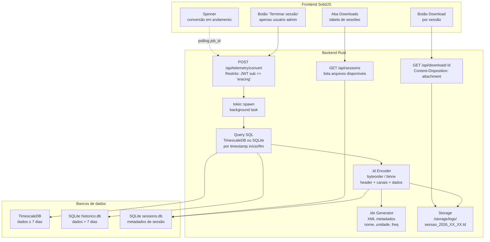

### 3.3 O formato binário `.ld` do MoTeC

> **Esta é a pesquisa mais crítica da V2.2.** O formato não tem especificação pública oficial. Antes de escrever uma linha de código, pesquise no GitHub por `motec ld format`, `motec-ld`, `python-motec` e `racedatatools`.

#### 3.3.1 Estrutura geral do arquivo

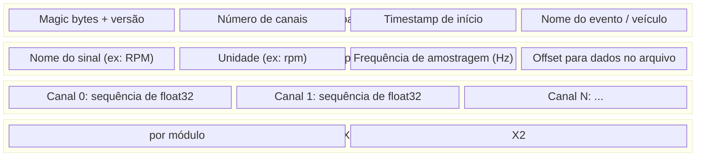

#### 3.3.2 Crates Rust para pesquisar

| Crate | Uso | Link |
|-------|-----|------|
| `binrw` | Leitura/escrita binária com anotações em struct | docs.rs/binrw |
| `byteorder` | Controle de endianness (little/big endian) | docs.rs/byteorder |
| `quick-xml` | Geração do `.ldx` XML | docs.rs/quick-xml |

> **Dica prática:** O MoTeC espera little-endian em todos os campos numéricos. Se o header estiver desalinhado por **1 byte sequer**, o i2 não reconhece o arquivo — sem mensagem de erro clara.

### 3.4 Plano de implementação por fases

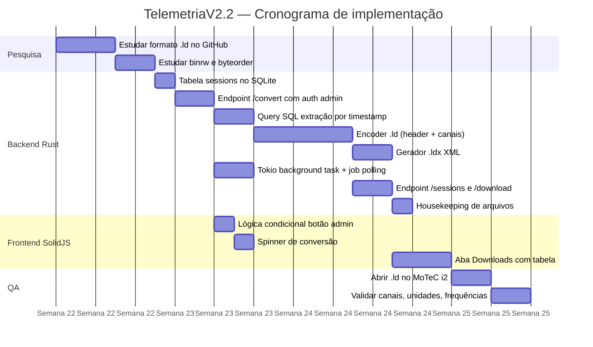

### 3.5 Fase 1 — Banco de dados: tabela `sessions`

```sql
-- SQLite: nova tabela de metadados de sessão
CREATE TABLE IF NOT EXISTS sessions (
    id          INTEGER PRIMARY KEY AUTOINCREMENT,
    nome_sessao TEXT    NOT NULL,           -- "Treino 1", "Corrida", etc.
    start_time  REAL    NOT NULL,           -- Unix epoch f64
    end_time    REAL,                       -- NULL enquanto em andamento
    file_path   TEXT,                       -- NULL até conversão concluir
    status      TEXT    DEFAULT 'recording',-- recording | converting | done | error
    created_at  TEXT    DEFAULT (datetime('now'))
);

CREATE INDEX IF NOT EXISTS idx_sessions_status ON sessions (status);
```

### 3.6 Fase 2 — Endpoint `/api/telemetry/convert`

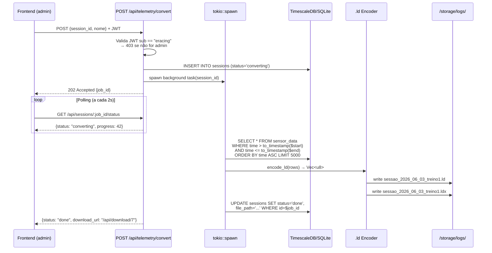

### 3.7 Fase 3 — Motor de conversão `.ld` em Rust

```rust
// Esboço da estrutura do header MoTeC .ld
// Pesquisar valores exatos no GitHub antes de implementar

use binrw::binwrite;
use byteorder::{LittleEndian, WriteBytesExt};

#[binwrite]
#[bw(little)]
struct LdHeader {
    magic:          [u8; 4],      // bytes mágicos do MoTeC
    version:        u32,
    channel_count:  u32,
    start_time:     f64,          // Unix epoch
    event_name:     [u8; 64],     // null-padded UTF-8
    vehicle_id:     [u8; 64],
    // ... outros campos do header
}

#[binwrite]
#[bw(little)]
struct ChannelDescriptor {
    name:           [u8; 32],
    unit:           [u8; 8],
    sample_rate:    f32,          // Hz
    data_offset:    u32,          // offset no arquivo
    data_count:     u32,          // número de amostras
    data_type:      u16,          // 0=float32, 1=int16, etc.
}
```

> **Atenção:** Os valores exatos dos campos mágicos, tamanhos de campo e tipos de dados **devem ser obtidos por engenharia reversa** de arquivos `.ld` reais. Abra um arquivo gerado pelo MoTeC i2 num editor hex (como `xxd`) e compare com implementações de referência no GitHub.

### 3.8 Fase 4 — Frontend: restrições e aba de downloads

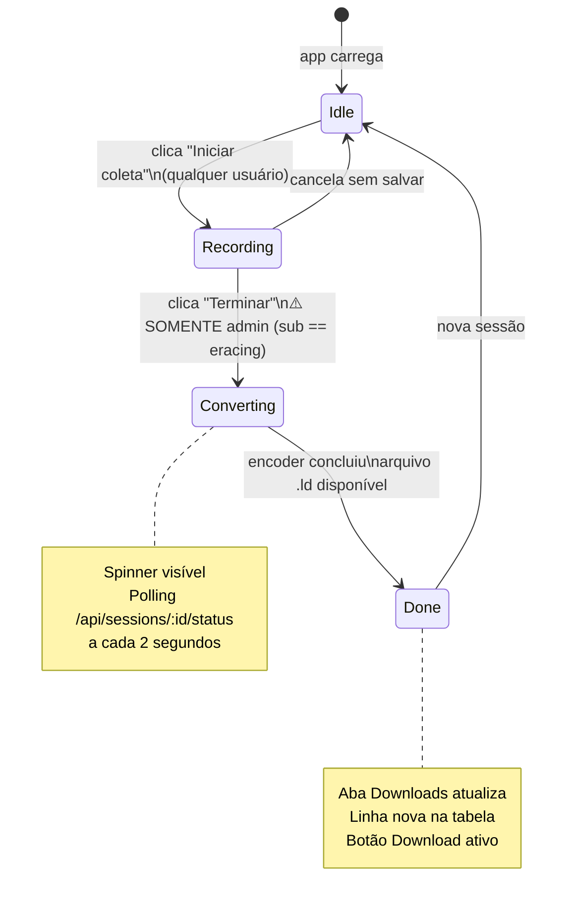

#### Tabela de downloads — colunas sugeridas

| # | Data/Hora | Nome da Sessão | Duração | Tamanho | Ação |
|---|-----------|----------------|---------|---------|------|
| 7 | 03/06/2026 14:32 | Treino 1 | 8m 42s | 2.1 MB | ⬇ Download |
| 6 | 03/06/2026 11:15 | Aquecimento | 3m 10s | 890 KB | ⬇ Download |

### 3.9 Fase 5 — QA: validação no MoTeC i2

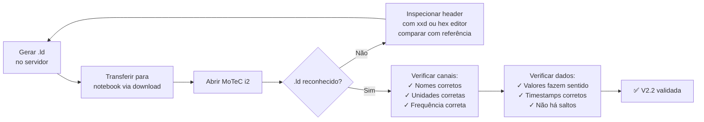

### 3.10 Checklist completo V2.2

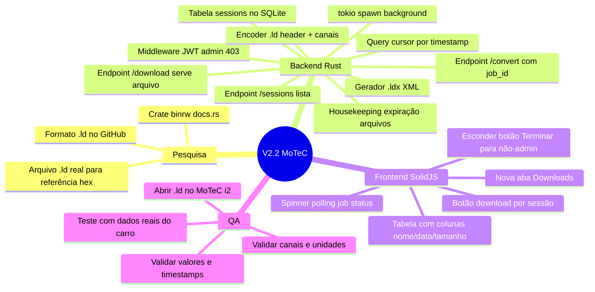

---

## 4. TelemetriaV2.3 — Dashboard Blue Team

### 4.1 Visão geral e motivação

A V2.3 adiciona uma camada completa de monitoramento, segurança e resposta a incidentes ao sistema. O objetivo é duplo: proteger o sistema de telemetria durante a competição (cenário offline) e criar um laboratório de aprendizado real de Blue Team para a equipe (cenário oficina).

### 4.2 Os dois cenários de segurança

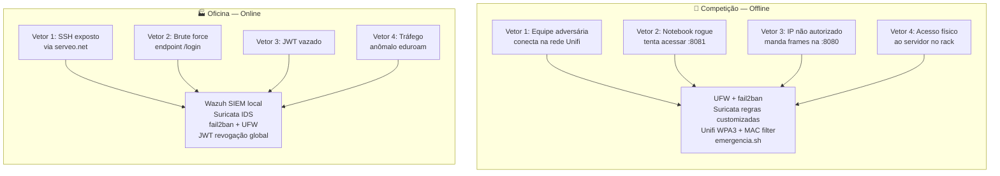

### 4.3 Stack de segurança por cenário

| Ferramenta | Competição (offline) | Oficina (online) | Aprende |
|------------|---------------------|------------------|---------|
| **UFW** | ✅ Essencial | ✅ Essencial | Firewall Linux |
| **fail2ban** | ✅ Essencial | ✅ Essencial | Proteção brute-force |
| **Suricata** | ✅ Regras customizadas | ✅ Regras + emerging threats | IDS/IPS real |
| **Script Unifi API** | ✅ Essencial | ✅ Útil | Detecção rogue |
| **Wazuh Manager** | ⚠️ Se RAM permitir | ✅ Essencial | SIEM real |
| **Cockpit** | ✅ Terminais web | ✅ Terminais web | Admin Linux |
| **Netdata** | ✅ Leve | ✅ + exporters HTB | Observabilidade |
| **emergencia.sh** | ✅ Crítico | ✅ Útil | Resposta a incidentes |
| **OSSIM** | ❌ Pesado demais | ⚠️ VM separada | Laboratório SOC |
| **pfSense** | ❌ Hardware extra | ⚠️ VM separada | Firewall avançado |
| **Splunk** | ❌ Free tier limitado | ❌ Substituído por Wazuh | — |

> **Nota sobre Wazuh na competição:** mede o consumo de RAM com `free -h` rodando Wazuh Manager + TimescaleDB + telemetry-server juntos. Se sobrar margem (o servidor tem 16–32GB), leva. Se disputar CPU, fica na oficina.

### 4.4 Arquitetura do painel completo

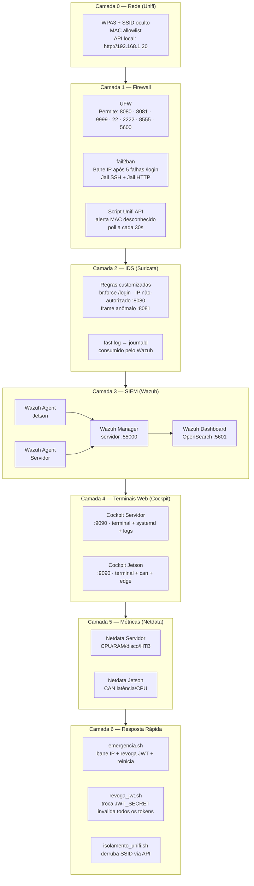

### 4.5 Tipos de alertas do painel

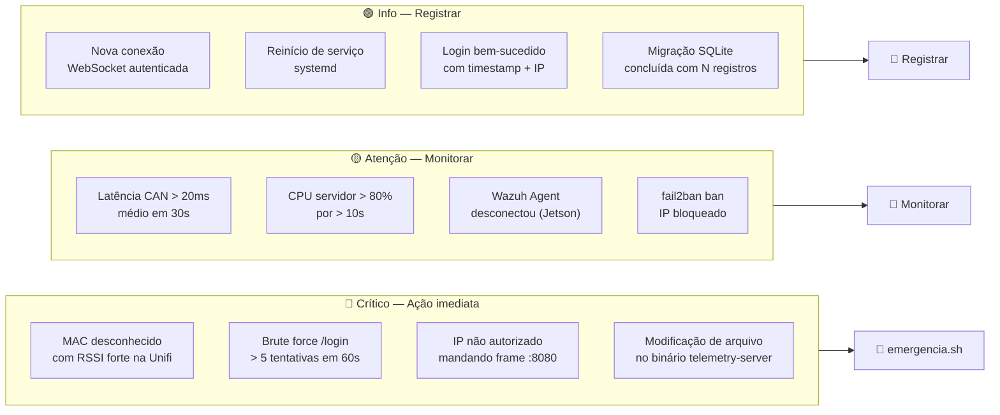

### 4.6 Plano de implementação por fases

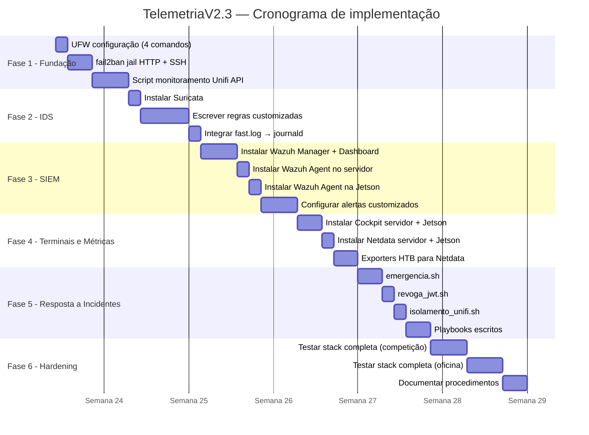

### 4.7 Fase 1 — Fundação: UFW + fail2ban

#### UFW — os 4 comandos pendentes desde o Dia 4

```bash
sudo ufw default deny incoming
sudo ufw default allow outgoing
sudo ufw allow 22/tcp    # SSH (ou 2222/tcp se já migrado)
sudo ufw allow 2222/tcp  # SSH alternativo
sudo ufw allow 8080/tcp  # TCP CAN frames (Jetson → servidor)
sudo ufw allow 8081/tcp  # HTTP + WebSocket dashboard
sudo ufw allow 9999/tcp  # NTP server
sudo ufw allow 5600/udp  # RTP vídeo ZED 2i
sudo ufw allow 8554/tcp  # RTSP
sudo ufw allow 8555/tcp  # WebRTC mediamtx
sudo ufw enable
sudo ufw status verbose
```

#### fail2ban — jail customizada para o servidor Rust

```ini
# /etc/fail2ban/jail.local

[telemetry-http]
enabled  = true
port     = 8081
filter   = telemetry-login
logpath  = /home/eracing/logs/server.log
maxretry = 5
findtime = 60
bantime  = 3600

[sshd]
enabled  = true
maxretry = 3
bantime  = 86400
```

```ini
# /etc/fail2ban/filter.d/telemetry-login.conf
[Definition]
failregex = .*LOGIN_FAILED.*ip=<HOST>.*
ignoreregex =
```

> O servidor Rust precisa logar tentativas de login falhas com o IP do cliente no formato acima. Adicionar ao `main.rs`: `warn!("LOGIN_FAILED ip={} user={}", peer_addr, username);`

### 4.8 Fase 2 — Suricata: regras customizadas

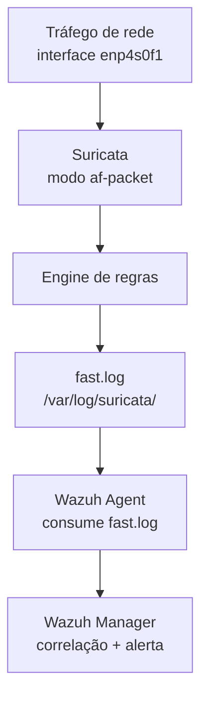

#### Regras customizadas para o protocolo E-Racing

```
# /etc/suricata/rules/eracing.rules

# Regra 1: Brute force no endpoint /login
# Alerta se mais de 5 POST /login em 10 segundos do mesmo IP
alert http any any -> 192.168.1.100 8081 \
  (msg:"ERACING brute force /login detectado"; \
   content:"POST"; http_method; \
   content:"/login"; http_uri; \
   threshold: type threshold, track by_src, count 5, seconds 10; \
   classtype:attempted-user; sid:1000001; rev:1;)

# Regra 2: IP não autorizado mandando frames CAN
# Apenas a Jetson (192.168.1.101) deve enviar frames na porta 8080
alert tcp !192.168.1.101 any -> 192.168.1.100 8080 \
  (msg:"ERACING frame CAN de IP nao autorizado"; \
   classtype:policy-violation; sid:1000002; rev:1;)

# Regra 3: Frame WebSocket com tamanho anômalo
# Frame CAN deve ter exatamente 20 bytes de payload
alert tcp any any -> 192.168.1.100 8081 \
  (msg:"ERACING frame WebSocket com tamanho anomalo"; \
   dsize:!20; \
   content:"|82|"; offset:0; depth:1; \
   classtype:protocol-command-decode; sid:1000003; rev:1;)

# Regra 4: Scan de portas (NMAP ou similar)
alert tcp any any -> 192.168.1.100 any \
  (msg:"ERACING possivel port scan detectado"; \
   flags:S; \
   threshold: type threshold, track by_src, count 15, seconds 5; \
   classtype:network-scan; sid:1000004; rev:1;)
```

### 4.9 Fase 3 — Wazuh SIEM local

```mermaid
graph TB
    subgraph WAZUH["Wazuh Stack (no servidor)"]
        WM["Wazuh Manager\n:55000 API\n:1514 agents"]
        OSD["OpenSearch\n:9200"]
        DASH["Wazuh Dashboard\n:5601"]
        WM --> OSD --> DASH
    end

    subgraph AGENTS["Wazuh Agents"]
        AS["Agent Servidor\n192.168.1.100"]
        AJ["Agent Jetson\n192.168.1.101"]
    end

    subgraph SOURCES["Fontes de log"]
        JD1["journald\ntelemetry.service"]
        JD2["journald\ntelemetry-edge.service"]
        SL["Suricata fast.log"]
        F2["fail2ban.log"]
        AUTH["auth.log\nSSH attempts"]
    end

    JD1 & SL & F2 & AUTH --> AS
    JD2 --> AJ
    AS & AJ --> WM

    style WAZUH fill:#1a2a3a,stroke:#2d5a7a
    style AGENTS fill:#1a3a1a,stroke:#2d7a2d
    style SOURCES fill:#3a1a1a,stroke:#7a2d2d
```

#### O que o Wazuh faz offline que o Grafana não faz

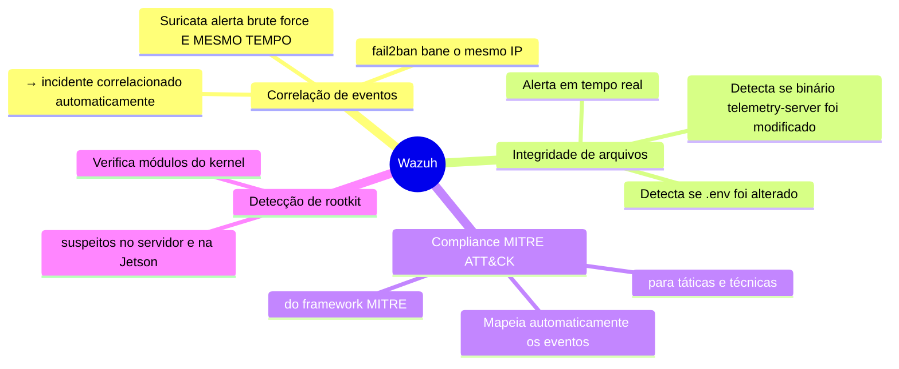

### 4.10 Fase 4 — Terminais web (Cockpit) e métricas (Netdata)

#### Cockpit — terminais web para servidor e Jetson

```bash
# Servidor
sudo apt install cockpit cockpit-networkmanager
sudo systemctl enable --now cockpit.socket
# Acesso: https://192.168.1.100:9090

# Jetson
sudo apt install cockpit
sudo systemctl enable --now cockpit.socket
# Acesso: https://192.168.1.101:9090
```

O Cockpit fornece: terminal bash no browser, status de serviços systemd (iniciar/parar/ver logs), gráficos de CPU/RAM/rede básicos, e gestão de usuários. É o substituto direto de abrir dois terminais SSH.

#### Netdata — métricas em tempo real

```bash
# Instalação com um script (funciona offline se baixar antes)
bash <(curl -Ss https://my-netdata.io/kickstart.sh)
# Acesso: http://192.168.1.100:19999
```

Para visualizar as classes HTB no Netdata, habilitar o plugin de rede:

```yaml
# /etc/netdata/go.d/tc.conf
jobs:
  - name: enp4s0f1
    interface: enp4s0f1
```

### 4.11 Fase 5 — Scripts de resposta rápida

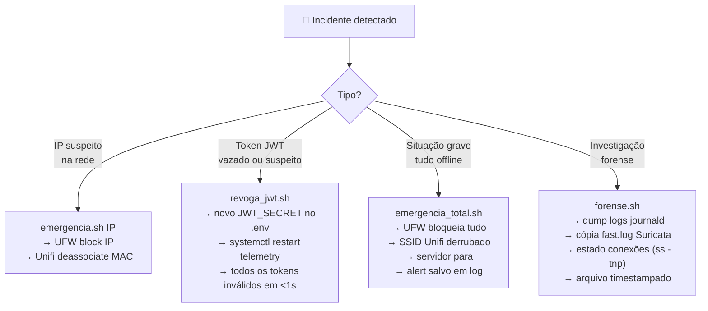

```bash
#!/bin/bash
# /etc/eracing/emergencia.sh
# Uso: sudo ./emergencia.sh [IP_PARA_BANIR]

IP_ALVO="$1"
TIMESTAMP=$(date +%Y%m%d_%H%M%S)
LOG="/var/log/eracing/emergencia_${TIMESTAMP}.log"

echo "=== EMERGÊNCIA E-RACING ${TIMESTAMP} ===" | tee $LOG

# 1. Banir IP no UFW (se fornecido)
if [ -n "$IP_ALVO" ]; then
    sudo ufw insert 1 deny from $IP_ALVO to any
    echo "✅ IP $IP_ALVO banido no UFW" | tee -a $LOG
fi

# 2. Revogar todos os tokens JWT
NEW_SECRET=$(python3 -c "import secrets; print(secrets.token_hex(32))")
sudo sed -i "s/JWT_SECRET=.*/JWT_SECRET=$NEW_SECRET/" \
    /home/eracing/TelemetriaV2.0/telemetry-server/.env
echo "✅ JWT_SECRET rotacionado" | tee -a $LOG

# 3. Reiniciar servidor (invalida todos os tokens)
sudo systemctl restart telemetry.service
echo "✅ telemetry.service reiniciado" | tee -a $LOG

echo "=== FIM DA EMERGÊNCIA ===" | tee -a $LOG
```

### 4.12 Fase 6 — Hardening final

#### Checklist de hardening antes da competição

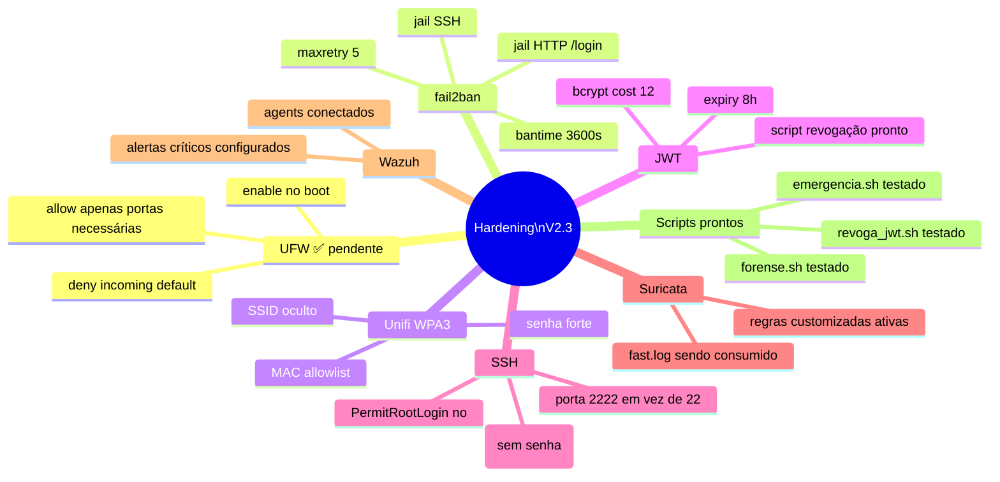

### 4.13 Checklist completo V2.3

```mermaid
mindmap
  root((V2.3 Blue Team))
    Fundação
      UFW 4 comandos
      fail2ban jails
      Script Unifi API MAC watch
    IDS Suricata
      Instalação af-packet
      Regras customizadas E-Racing
      Integração journald
      Teste das regras
    SIEM Wazuh
      Manager no servidor
      Agent servidor
      Agent Jetson
      Dashboard OpenSearch
      Alertas MITRE ATT&CK
      Correlação Suricata+fail2ban
    Terminais e Métricas
      Cockpit servidor :9090
      Cockpit Jetson :9090
      Netdata servidor :19999
      Netdata Jetson :19999
      Plugin HTB classes
    Resposta a Incidentes
      emergencia.sh
      revoga_jwt.sh
      isolamento_unifi.sh
      forense.sh
      Playbooks escritos e testados
    Hardening
      UFW produção
      SSH porta 2222
      PermitRootLogin no
      bcrypt cost auditado
      Teste simulação de ataque
```

---

## 5. Ordem de Implementação Integrada

```mermaid
flowchart TD
    START(["🚀 Início\napós V2.1 estável"]) --> A

    subgraph V22["📦 TelemetriaV2.2 — Exportação MoTeC"]
        A["Pesquisa formato .ld\nGitHub + hex editor\n(3 dias)"]
        B["Encoder Rust\nbinrw / byteorder\n(5 dias)"]
        C["Tabela sessions\n+ endpoint /convert\n(3 dias)"]
        D["Background task\ntokio::spawn\n(2 dias)"]
        E["Frontend\nbotão admin + downloads\n(3 dias)"]
        F["QA MoTeC i2\n(2 dias)"]
        A --> B --> C --> D --> E --> F
    end

    subgraph V23["🔒 TelemetriaV2.3 — Blue Team"]
        G["UFW + fail2ban\n(2 dias)"]
        H["Script Unifi API\nMAC watch\n(2 dias)"]
        I["Suricata\nregras customizadas\n(4 dias)"]
        J["Wazuh Manager\n+ Agents\n(5 dias)"]
        K["Cockpit + Netdata\n(3 dias)"]
        L["Scripts resposta\nemergencia.sh etc\n(3 dias)"]
        M["Hardening\n+ testes\n(3 dias)"]
        G --> H --> I --> J --> K --> L --> M
    end

    F --> G
    M --> END(["✅ V2.3 completa\nPronta para competição"])

    style V22 fill:#1a3a1a,stroke:#2d7a2d
    style V23 fill:#1a1a3a,stroke:#2d2d7a
```

### Dependências entre as features

| Dependência | Motivo |
|-------------|--------|
| V2.2 precisa de V2.1 estável | O endpoint `/convert` lê do TimescaleDB e SQLite que já existem na V2.1 |
| UFW (V2.3) antes de qualquer coisa | Toda V2.3 sem firewall ativo é insegura por design |
| Suricata antes de Wazuh | O Wazuh consome logs do Suricata — sem Suricata os alertas são incompletos |
| emergencia.sh depende de UFW | O script bane IPs via UFW |

---

## 6. Riscos e Mitigações

```mermaid
quadrantChart
    title Riscos por Impacto × Probabilidade
    x-axis Baixa Probabilidade --> Alta Probabilidade
    y-axis Baixo Impacto --> Alto Impacto
    quadrant-1 Crítico — Mitigar agora
    quadrant-2 Importante — Planejar
    quadrant-3 Baixo — Monitorar
    quadrant-4 Médio — Preparar

    Formato .ld incompatível com MoTeC i2: [0.5, 0.9]
    Wazuh Manager usa RAM demais: [0.6, 0.7]
    HD Toshiba falha (como o WD): [0.2, 0.9]
    Suricata falsos positivos: [0.7, 0.4]
    Jetson sem clock no boot: [0.8, 0.3]
    Serveo.net cai na competição: [0.3, 0.5]
    fail2ban bane IP legítimo: [0.5, 0.5]
```

| Risco | Probabilidade | Impacto | Mitigação |
|-------|--------------|---------|-----------|
| **Formato `.ld` incompatível** | Média | Alto | Pesquisar referências no GitHub antes de implementar. Usar arquivo `.ld` real como referência hex. Testar no MoTeC i2 a cada iteração do encoder. |
| **Wazuh usa RAM demais na competição** | Média | Alto | Medir consumo com `free -h` antes de levar. Se disputar recursos com telemetria, desabilitar Wazuh Manager apenas no systemd e manter só fail2ban + Suricata. |
| **Suricata falsos positivos** | Alta | Médio | Testar todas as regras customizadas antes da corrida. Usar `threshold` nas regras para evitar alertas a cada frame. |
| **fail2ban bane IP legítimo** | Média | Médio | Adicionar IPs da equipe na whitelist. Script para verificar antes da corrida: `fail2ban-client status`. |
| **Jetson perde clock no boot** | Alta | Baixo | Script no dispatcher NetworkManager que pega data via `curl HTTP` (sem UDP). Documentado no Dia 9. |
| **HD falha durante corrida** | Baixa | Alto | Backup SQLite edge na própria Jetson. Verificar SMART do Toshiba antes da competição: `smartctl -a /dev/sda`. |

---

> **Nota final:** Este planejamento é um documento vivo. À medida que as features forem implementadas, atualizar os diagramas de status (✅/🔄/❌) e registrar no relatório do dia correspondente (Dia 10, 11, etc.) seguindo o padrão estabelecido nos Dias 1–9.

---

*Documento criado em Junho de 2026 — E-Racing Ultra Blaster Telemetria V2*  
*UNICAMP — Faculdade de Engenharia Mecânica*  
*TelemetriaV2.2 + V2.3 — Planejamento completo*
